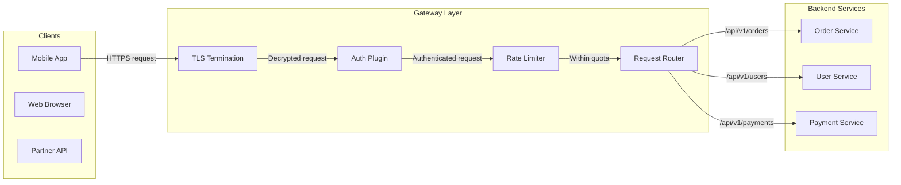
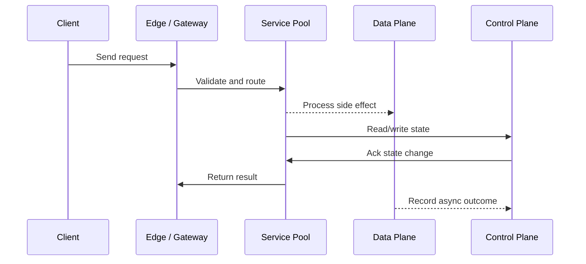

# API Gateway - Routing, Auth & Rate Limiting

Source: `src/modules/topics/sysdesign/sd-api-gateway.js`
Tag: `Gateway`
Doc path: `docs/system-design/sd-api-gateway.md`

## Concept
An **API Gateway** is the single entry point for all client requests. It handles cross-cutting concerns so individual services don't have to.

**Core responsibilities:**
1. **Request routing** - path/header/method matching -> upstream service
2. **Auth/AuthZ** - JWT validation, OAuth2 token introspection, API key lookup
3. **Rate limiting** - per-user/per-IP/per-plan token buckets or sliding windows
4. **SSL termination** - decrypt TLS once at the edge; internal traffic plain HTTP or mTLS
5. **Request transformation** - header injection, payload rewriting, protocol translation (REST<->gRPC)
6. **Observability** - access logs, metrics (latency p99, error rate), distributed trace propagation
7. **Circuit breaking** - fail fast when upstream unhealthy

**Popular implementations:**
- **Kong** - Nginx-based, plugin ecosystem, declarative config
- **Envoy** - C++ proxy, xDS API, used as sidecar in Istio
- **AWS API Gateway** - managed, Lambda integration, usage plans
- **nginx** - manual config, high performance, battle-tested
- **Traefik** - cloud-native, auto-discovers K8s services

## Production Architecture
Without a gateway, every service must implement auth, rate-limiting, and logging independently - 10 services x 3 concerns = 30 implementations that drift. The gateway centralises this into one audited, consistent implementation.

## Architecture Checklist
- Clients / Mobile App: iOS / Android
- Clients / Web Browser: SPA / SSR
- Clients / Partner API: B2B integrations
- Gateway Layer / TLS Termination: All HTTPS traffic decrypted here. Internal traffic uses mTLS or plain HTTP depending on trust model.
- Gateway Layer / Auth Plugin: Validates token signature, checks expiry, extracts claims (userId, roles). Rejects 401 before hitting any service.
- Gateway Layer / Rate Limiter: Per-consumer counters in Redis. 429 returned with Retry-After. Prevents abuse and cost overruns.
- Gateway Layer / Request Router: Route table maps path prefixes to upstream services. Supports canary (5% -> new version) and A/B routing.
- Backend Services / Order Service: Handles order creation, fulfillment, status updates.
- Backend Services / User Service: Profile, preferences, authentication data.
- Backend Services / Payment Service: PCI-DSS scoped service - minimal external surface.

## Mermaid Architecture

## UML Sequence

## Animation Plan
Interactive app sections for this concept:

- Flow lab: highlights request path step by step.
- UML sequence simulation: animates actor-to-actor messages.
- Architecture map: clickable nodes and sync/async links.
- Canvas visual: existing topic-specific live diagram remains available in app.

Flow steps:

1. Enter system - Request crosses trust boundary and gets normalized before core handling.
2. Execute core path - Gateway routes to owning capability with timeout, auth context, and trace id.
3. Offload slow work - Async path absorbs retries, fanout, indexing, notifications, or heavy processing.
4. Persist state - System writes durable state, cache entries, offsets, or audit evidence.
5. Return or recover - Response returns when sync work succeeds; failure path uses retry, fallback, or replay.

## Interview Drills
1. How would you implement rate limiting in an API gateway for distributed servers?
   **Token bucket algorithm** per user/IP stored in **Redis** (atomic INCR + EXPIRE).
   
   Steps:
   1. On each request, INCR a Redis key like `ratelimit:{userId}:{window}`
   2. If count > limit, return 429 Too Many Requests with Retry-After header
   3. Key expires after window duration - no cleanup needed
   
   **Challenge:** race condition between check and increment. Solve with **Lua script** (atomic execution in Redis) or **Redis cell module** (token bucket native).
   
   **Sliding window** more accurate than fixed window (avoids burst at window boundary) - store timestamps in a Redis Sorted Set, expire old entries, count remaining.
   Follow-ups: What is the difference between token bucket and leaky bucket?; How do you handle rate limiting across multiple gateway instances?

2. What is the difference between an API Gateway and a load balancer?
   **Load balancer (L4/L7):** distributes traffic across identical instances of the same service. L4 = TCP/UDP level (no HTTP awareness). L7 = HTTP-aware (can route by path/host).
   
   **API Gateway:** sits above the LB. Knows about your business services, auth schemes, and API contracts. Routes different paths to different services, enforces auth/rate-limit, transforms requests.
   
   Typical stack: Client -> CDN -> L4 LB -> API Gateway -> L7 LB per service -> service instances.
   Follow-ups: When would you use an API Gateway vs a service mesh?

## Trade-offs
Pros:
- Single enforcement point for auth/rate-limit/logging
- Decouples clients from service topology
- Enables zero-downtime schema evolution via versioned routes

Cons:
- Single point of failure if not HA deployed
- Adds 1-5ms latency per hop
- Complex plugin chains are hard to debug
- Fat gateway can become a bottleneck

When to use:
Always use for external-facing APIs. For pure internal service-to-service traffic consider service mesh (mTLS + observability) instead of gateway.

## Gotchas
_No gotchas yet._

