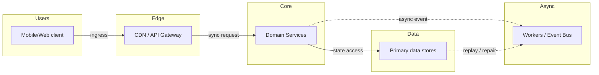
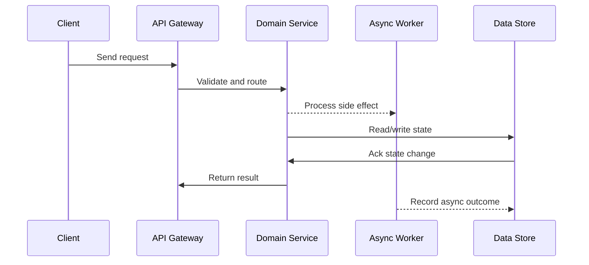

# Case Study: Payment System (Stripe / PayPal)

Source: `src/modules/topics/sysdesign/sd-case-payment-system.js`
Tag: `Case Study`
Doc path: `docs/system-design/sd-case-payment-system.md`

## Concept
**Requirements:** Process payments reliably, prevent double charges, handle network timeouts, reconcile ledger, support refunds and partial failures.

**The core problem:** Network is unreliable. A payment API call to Stripe can succeed but your response can get lost. If you retry naively, you charge the customer twice. Solution: idempotency.

**Idempotency key pattern:**
- Client generates a UUID (idempotency key) before the first request.
- Sends it as a header: `Idempotency-Key: abc-123-xyz`.
- Server stores the key + result in a Redis/DB cache for 24 hours.
- On retry with the same key -> server returns the stored result WITHOUT re-executing.
- Stripe uses this exact pattern. AWS APIs call it "client token."

**Payment flow architecture:**

1. **Client** -> POST /payments with idempotency key.
2. **Payment Service** -> checks idempotency store (Redis).
   - If key exists -> return cached result (no-op).
   - If not -> proceed.
3. **Payment Service** -> write to **Outbox table** (same DB transaction):
   - Insert payment record (status=PENDING).
   - Insert outbox event (publish=false).
4. **Payment Service** -> call Stripe API.
   - Success -> update payment to COMPLETED, mark outbox event for publish.
   - Failure -> update payment to FAILED.
5. **Outbox Relay** -> polls outbox table -> publishes to Kafka -> Order Service, Inventory Service react.

**Why outbox pattern?** Prevents "payment succeeded but event never published" - the DB write and event are atomic (same transaction). The relay handles publishing asynchronously.

**Saga vs 2PC:**
- 2-Phase Commit: locks DB across services -> huge latency, not suitable for external APIs.
- **Saga (choreography):** each service does its step and emits an event. On failure -> compensating transactions (refund, release inventory). No distributed locks.

**Reconciliation:**
- Async batch job (runs every hour): fetch all transactions from Stripe API -> compare against internal ledger -> flag mismatches -> alert ops team.
- Prevents silent data inconsistencies over time.

## Production Architecture
Payment systems appear in FAANG interviews constantly. They force you to think about failure modes, idempotency (the most important concept in distributed payments), atomic writes + event publishing (outbox), and the limits of distributed transactions.

## Architecture Checklist
- Users / Mobile/Web client: Captures user intent, auth token, device context, and retry id.
- Edge / CDN / API Gateway: Terminates TLS, verifies token, applies rate limits, and routes to domain services.
- Core / Domain Services: Owns domain logic, validates invariants, and writes authoritative state.
- Async / Workers / Event Bus: Decouples slow work such as notifications, indexing, media processing, or settlement.
- Data / Primary data stores: Stores metadata, hot cache entries, immutable blobs, and audit history.

## Mermaid Architecture

## UML Sequence

## Animation Plan
Interactive app sections for this concept:

- Flow lab: highlights request path step by step.
- UML sequence simulation: animates actor-to-actor messages.
- Architecture map: clickable nodes and sync/async links.
- Canvas visual: existing topic-specific live diagram remains available in app.

Flow steps:

1. Enter system - Request crosses trust boundary and gets normalized before core handling.
2. Execute core path - Gateway routes to owning capability with timeout, auth context, and trace id.
3. Offload slow work - Async path absorbs retries, fanout, indexing, notifications, or heavy processing.
4. Persist state - System writes durable state, cache entries, offsets, or audit evidence.
5. Return or recover - Response returns when sync work succeeds; failure path uses retry, fallback, or replay.

## Interview Drills
1. How do you prevent double charging?
   Idempotency keys. The client generates a UUID before the first request and includes it in every retry. The server stores a mapping of idempotency_key -> result in Redis (or a DB table) with a 24-hour TTL. On any retry with the same key, the server returns the stored result without re-executing the payment logic. Crucially, we also pass the idempotency key to Stripe - so even if our server calls Stripe twice, Stripe deduplicates on their end too. This gives us double protection.
   Follow-ups: What if the Redis that stores idempotency keys goes down between the Stripe call and the key storage?; How do you handle idempotency for refunds?; What's the TTL for idempotency keys and why?

2. What happens if the payment API call succeeds but your DB write fails?
   This is the split-brain problem. Stripe has the charge, your DB doesn't know about it. Solutions: (1) Write to DB FIRST with status=PENDING, then call Stripe. If Stripe succeeds, update to COMPLETED. If Stripe returns timeout, the retry with the same idempotency key is safe. (2) Reconciliation job: runs hourly, fetches all Stripe charges and compares against internal ledger. Any charge in Stripe without a matching COMPLETED record in DB -> alert ops team for manual review. (3) Webhook from Stripe: Stripe sends charge.succeeded events -> your service updates DB asynchronously.
   Follow-ups: How do you handle the case where your webhook receiver is also down?; How do you ensure the reconciliation job itself doesn't double-process records?; Design the schema for a payment ledger.

3. How do you handle partial failures in distributed payment flow?
   Use the Saga pattern (choreography style). Payment service charges card -> emits payment.completed event. Order service listens -> reserves inventory -> emits inventory.reserved. If inventory reservation fails -> emit inventory.failed -> payment service listens -> issues refund (compensating transaction). Each step is a local transaction. No distributed locks. The key is: every step must be idempotent (safe to retry) and every failure must have a defined compensating action. Use a saga log to track the current state of each saga instance for debugging.
   Follow-ups: What's the difference between choreography and orchestration sagas?; How do you handle a compensating transaction that also fails (refund fails)?; How do you ensure exactly-once processing in the saga steps?

4. Design a ledger for Stripe.
   A ledger is an immutable, append-only log of financial transactions. Schema: ledger_entry(id, account_id, amount, currency, type[DEBIT/CREDIT], reference_id, description, created_at). Never UPDATE or DELETE entries. Corrections = new compensating entry. Balance = SUM(credits) - SUM(debits) for an account_id - computed on read or cached in a balance table (updated by triggers). Use event sourcing: the ledger IS the source of truth. Partition Cassandra table by account_id. For auditing: each entry has an immutable hash linking to previous entry (chain integrity). Reconciliation: daily balance snapshot + incremental from last snapshot.
   Follow-ups: How do you handle currency conversion in the ledger?; How do you make balance queries fast on a ledger with 10 years of data?; How do you handle regulatory requirements to keep data in specific regions?

## Trade-offs
Pros:
- Idempotency keys make retries safe - eliminates the double-charge problem completely
- Outbox pattern ensures atomicity between DB write and event publish - no silent event loss
- Saga avoids distributed locks - each service owns its own data and compensates on failure
- Reconciliation provides a safety net for any edge cases that slip through

Cons:
- Idempotency key storage has a 24h TTL - after that, stale retries can re-execute (must detect via other means)
- Outbox relay adds latency to event publishing (not synchronous) - downstream services see eventual consistency
- Saga compensation is complex to implement correctly - compensating transactions must also be idempotent
- Reconciliation only catches issues retroactively (hours later) - real-time mismatches require additional monitoring

When to use:
Any financial transaction system. If you're moving money, idempotency + outbox pattern is non-negotiable. The only exception: internal account transfers within a single DB (use a DB transaction instead).

## Gotchas
- NEVER call an external payment API inside a DB transaction - the transaction holds locks while waiting for a slow HTTP call (seconds). Write to DB first, then call API outside the transaction.
- Idempotency key must be client-generated, not server-generated - the client needs the key before the first attempt to use it on retries
- Stripe's idempotency keys are scoped to the endpoint - a key used for POST /charges cannot be reused for POST /refunds
- The outbox relay must read committed data only - use READ COMMITTED isolation to avoid reading events for transactions that rolled back
- Test your failure scenarios with chaos engineering: kill the network after Stripe responds but before your DB write - ensure reconciliation catches it
- Currency is an integer (cents) not a float - floating point arithmetic loses money at scale (0.1 + 0.2 0.3 in IEEE 754)

