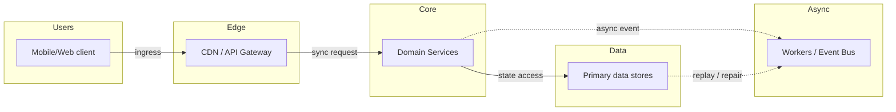
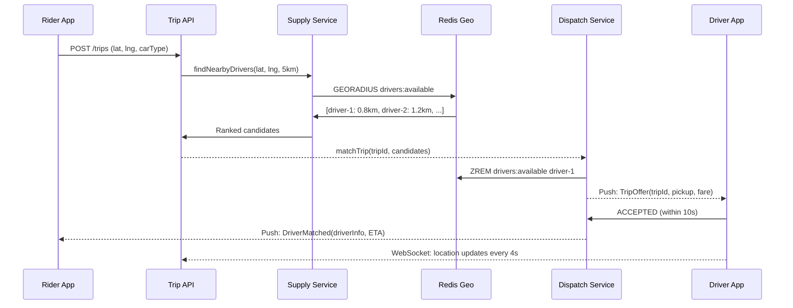

# Case Study: Ride Sharing (Uber / Lyft)

Source: `src/modules/topics/sysdesign/sd-case-ride-sharing.js`
Tag: `Case Study`
Doc path: `docs/system-design/sd-case-ride-sharing.md`

## Concept
**Requirements:** 5M trips/day, real-time driver location updates (every 4s), sub-5s match time, surge pricing.

**Core challenges:**
1. **Location tracking** - drivers send GPS coordinates every 4 seconds. ~500K active drivers = 125K updates/second.
2. **Nearby driver search** - given rider location, find available drivers within 5km in <100ms.
3. **Matching** - assign the best driver (ETA + rating + car type) to rider.
4. **Real-time communication** - push trip status updates to both rider and driver.

**Geospatial indexing:**
- **Geohash** - encode lat/lng into a base32 string. Nearby locations share a prefix. 7-char geohash  150m x 150m cell. Query: find drivers in same geohash + 8 neighbors.
- **H3 (Uber's hexagonal grid)** - hexagonal cells at multiple resolutions. Hexagons tile uniformly - no distortion at cell boundaries. Used for surge pricing regions.
- **S2 (Google)** - spherical geometry, quadtree-based. Used by Google Maps.
- **PostGIS / Redis GEOADD** - store points, radius search with GEORADIUS command.

**Architecture:**
- **Location service** - receives WebSocket/HTTP stream of driver positions. Updates Redis GEOADD (lng,lat per driver). Each driver position = 1 Redis geo write/4s.
- **Supply service** - GEORADIUS search on Redis. Returns drivers within 5km. Filter: available, correct car type, not in trip.
- **Dispatch/matching** - ranks candidates by ETA (computed by routing engine). Sends offer to best driver. Driver accepts/declines in 10s. On decline, next candidate offered.
- **Trip service** - manages trip state machine (REQUESTED -> ACCEPTED -> PICKUP -> IN_PROGRESS -> COMPLETED).
- **Surge pricing** - H3 hexagon aggregation. If demand/supply ratio > threshold in a hex -> surge multiplier applied.

**Communication:** WebSocket for real-time push (driver location on map). SSE as fallback.

## Production Architecture
Uber's architecture covers geospatial, real-time matching, state machines, and event-driven design - touching nearly every system design concept in one problem.

## Architecture Checklist
- Users / Mobile/Web client: Captures user intent, auth token, device context, and retry id.
- Edge / CDN / API Gateway: Terminates TLS, verifies token, applies rate limits, and routes to domain services.
- Core / Domain Services: Owns domain logic, validates invariants, and writes authoritative state.
- Async / Workers / Event Bus: Decouples slow work such as notifications, indexing, media processing, or settlement.
- Data / Primary data stores: Stores metadata, hot cache entries, immutable blobs, and audit history.

## Mermaid Architecture

## UML Sequence

## Animation Plan
Interactive app sections for this concept:

- Flow lab: highlights request path step by step.
- UML sequence simulation: animates actor-to-actor messages.
- Architecture map: clickable nodes and sync/async links.
- Canvas visual: existing topic-specific live diagram remains available in app.

Flow steps:

1. Enter system - Request crosses trust boundary and gets normalized before core handling.
2. Execute core path - Gateway routes to owning capability with timeout, auth context, and trace id.
3. Offload slow work - Async path absorbs retries, fanout, indexing, notifications, or heavy processing.
4. Persist state - System writes durable state, cache entries, offsets, or audit evidence.
5. Return or recover - Response returns when sync work succeeds; failure path uses retry, fallback, or replay.

## Interview Drills
1. How would you design the surge pricing system?
   **Goal:** Dynamically increase prices in areas where demand > supply to incentivise drivers.
   
   **Design:**
   1. **H3 hexagonal grid** - divide city into ~1km hexagonal cells (resolution 8). Hexagons tile uniformly - no distortion.
   2. **Demand signal** - count trip requests per cell in last 5 minutes (Redis ZADD with sliding window).
   3. **Supply signal** - count available drivers per cell (Redis GEORADIUS count per cell centroid).
   4. **Surge multiplier** - if demand/supply ratio > 2 -> 1.5x surge. > 5 -> 2x surge. Capped at 3x (brand protection).
   5. **Cache + refresh** - surge multipliers computed every 60s by a cron job. Cached in Redis per H3 cell ID.
   6. **Display** - rider app fetches surge multiplier for their H3 cell before booking. Shows surge warning.
   7. **Feedback loop** - higher prices -> more drivers enter area -> supply increases -> surge decreases (Uber intentionally shows driver earnings in surge zones).
   Follow-ups: How do you prevent drivers from colluding to artificially create surge?; How would you handle the matching algorithm when multiple riders request simultaneously?

## Trade-offs
Pros:
- Redis GEORADIUS: sub-millisecond nearby driver search
- Geohash/H3: efficient spatial partitioning
- WebSocket: real-time location updates without polling overhead

Cons:
- Redis is in-memory: 500K driver positions x 64 bytes = 32MB - easily fits but requires HA
- WebSocket: sticky sessions or pub-sub backplane required
- Matching race conditions: need atomic claim (ZREM) to prevent double-assignment

When to use:
This pattern (Redis geo + WebSocket + event-driven matching) applies to any real-time location-aware service: food delivery, logistics tracking, peer-to-peer marketplace.

## Gotchas
_No gotchas yet._

