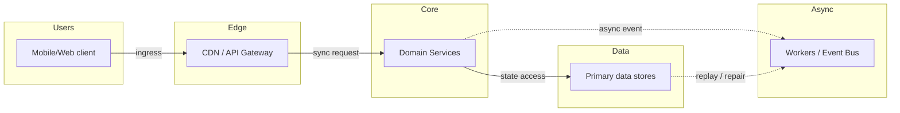
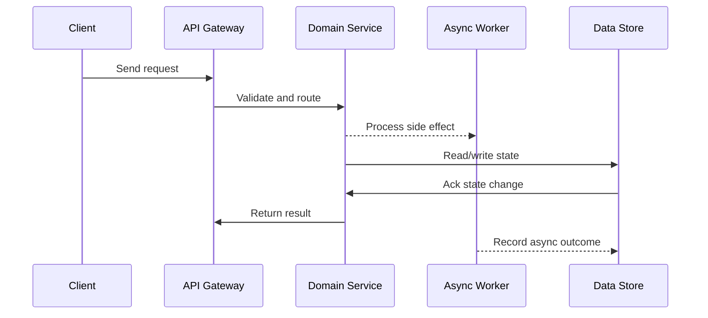

# Case Study: Search Autocomplete (Google Typeahead)

Source: `src/modules/topics/sysdesign/sd-case-search-autocomplete.js`
Tag: `Case Study`
Doc path: `docs/system-design/sd-case-search-autocomplete.md`

## Concept
**Requirements:** Sub-100ms suggestions for every keystroke, 100K QPS, top-10 globally trending completions, personalization, multilingual support.

**Core challenges:**
1. **Latency** - each keystroke triggers a query. Must return in <100ms including network.
2. **Scale** - 100K QPS peak. A naive DB LIKE query cannot handle this.
3. **Freshness** - trending searches ("breaking news") should appear quickly.
4. **Personalization** - blend your search history with global trends.
5. **Multilingual** - Unicode prefix matching, RTL languages, CJK character handling.

**Architecture:**

**Data collection pipeline:**
- Every search query is logged -> Kafka topic `search-queries`.
- Hadoop MapReduce/Spark batch job (runs hourly): aggregate query counts per prefix -> top-10 per prefix.
- Results written to Redis: key = prefix (e.g. "app"), value = JSON array of top-10 suggestions with scores.
- Real-time stream (Flink/Kafka Streams): updates scores for fast-trending queries within minutes.

**Trie structure (offline):**
- Build full Trie from top-N queries. Each node stores: char, children map, top-K list (precomputed by DFS).
- Trie is serialized and distributed to serving nodes.
- Trie serves as fallback; Redis serves hot prefixes from memory.

**Serving layer:**
- **CDN caching** - cache responses for common 1-3 char prefixes (high hit rate, low personalization needed).
- **Redis** - stores top-10 per prefix. Key format: `autocomplete:{lang}:{prefix}`. O(1) lookup.
- **Application tier** - on Redis miss: traverse in-memory Trie. Merge with user history from profile service.
- **Personalization** - `score = 0.7 x global_score + 0.3 x user_history_score`.

**Prefix size optimization:**
- Only store prefixes from length 1 to 20 chars.
- For length > 5: results barely change - extend last stored prefix's results.
- Total keys in Redis: avg 200K unique prefixes x 10 results x 50 bytes  100MB (fits in RAM easily).

**Multilingual:**
- Index queries by `{lang}:{prefix}` key. Tokenize CJK by character (not word boundary).
- Use Unicode normalization (NFC) before indexing.
- RTL (Arabic/Hebrew): reverse prefix direction for Trie traversal.

## Production Architecture
Typeahead is asked in every FAANG interview. It cleanly demonstrates: Trie data structures, Redis for in-memory key-value, CDN caching strategy, batch vs stream processing pipelines, and personalization blending - all in one compact problem.

## Architecture Checklist
- Users / Mobile/Web client: Captures user intent, auth token, device context, and retry id.
- Edge / CDN / API Gateway: Terminates TLS, verifies token, applies rate limits, and routes to domain services.
- Core / Domain Services: Owns domain logic, validates invariants, and writes authoritative state.
- Async / Workers / Event Bus: Decouples slow work such as notifications, indexing, media processing, or settlement.
- Data / Primary data stores: Stores metadata, hot cache entries, immutable blobs, and audit history.

## Mermaid Architecture

## UML Sequence

## Animation Plan
Interactive app sections for this concept:

- Flow lab: highlights request path step by step.
- UML sequence simulation: animates actor-to-actor messages.
- Architecture map: clickable nodes and sync/async links.
- Canvas visual: existing topic-specific live diagram remains available in app.

Flow steps:

1. Enter system - Request crosses trust boundary and gets normalized before core handling.
2. Execute core path - Gateway routes to owning capability with timeout, auth context, and trace id.
3. Offload slow work - Async path absorbs retries, fanout, indexing, notifications, or heavy processing.
4. Persist state - System writes durable state, cache entries, offsets, or audit evidence.
5. Return or recover - Response returns when sync work succeeds; failure path uses retry, fallback, or replay.

## Interview Drills
1. How would you design autocomplete for Google Search?
   Two-layer architecture: (1) Offline pipeline - Spark job aggregates query logs hourly, computes top-10 per prefix, stores in Redis keyed by prefix. (2) Serving - on each keystroke, check CDN cache (for short common prefixes), then Redis O(1) lookup. On miss, traverse in-memory Trie. Personalization layer blends user history (Redis sorted set) with global results at 70/30 ratio. Cache-Control headers allow CDN to cache non-personalized responses for 1 char prefix like "a" = millions of QPS absorbed by CDN.
   Follow-ups: How would you handle real-time trending queries (Taylor Swift going viral)?; How does your design handle 50 different languages?; Should you index every prefix or just prefixes of top-N queries?

2. How do you handle 100K QPS on prefix search?
   CDN handles the first line - short 1-2 char prefixes like "a", "th" are queried millions of times. Cache with TTL=60s absorbs >80% of traffic. Remaining traffic hits Redis: O(1) GET on precomputed key. Redis can handle 100K ops/sec per node; shard by first char of prefix (26 shards for English). In-memory Trie on app servers handles cache misses. With Redis cluster + CDN, 100K QPS is comfortably handled with <5ms p99 at serving layer.
   Follow-ups: How do you keep CDN caches fresh when trending queries change?; How do you handle the thundering herd when CDN cache expires for 'th'?; What's the memory footprint of storing top-10 for all prefixes?

3. How often do you update the trie / Redis data?
   Two update frequencies: (1) Batch (hourly) - Spark job processes last hour of query logs, recomputes top-10 per prefix for stable queries. Updates Redis with new data. (2) Real-time stream (Flink, lag ~5 minutes) - detects sudden spikes in query frequency (viral events, breaking news) and injects those into Redis immediately with a short TTL=10 minutes so they expire if the trend dies. The Trie is rebuilt nightly from the full dataset and hot-reloaded on serving nodes without downtime (atomic pointer swap).
   Follow-ups: How do you detect a 'trending' query vs a one-off spike?; How do you hot-reload the Trie without downtime?; How do you handle malicious query injection to manipulate suggestions?

4. How do you handle multilingual support?
   Namespace Redis keys by language: `autocomplete:{lang}:{prefix}`. Tokenization differs: Latin languages - lowercase + strip diacritics. CJK (Chinese/Japanese/Korean) - each character is a unit (no spaces), prefix = first N characters. Arabic/Hebrew (RTL) - store and match on visual order; normalize using Unicode BiDi algorithm. Apply Unicode NFC normalization before indexing. Separate Trie per language (memory is cheap). For languages with very small corpora, fall back to English cross-lingual suggestions.
   Follow-ups: How do you handle typos and fuzzy matching in autocomplete?; How would you support voice search (speech-to-text prefix)?; How do you filter offensive suggestions?

## Trade-offs
Pros:
- Redis O(1) prefix lookup - predictable sub-millisecond latency regardless of Trie depth
- CDN absorbs massive traffic for short common prefixes (huge cost saving)
- Precomputing top-K at index time shifts complexity to offline pipeline (Spark), not serving
- Batch + stream dual pipeline balances freshness vs stability

Cons:
- Precomputed top-K means personalization requires a merge step at serve time
- Redis memory grows with vocabulary - need prefix pruning for long-tail queries
- Batch hourly updates mean truly real-time trending (within seconds) is harder
- Cache invalidation: CDN cached 'a' prefix with 10 results - invalidating efficiently across PoPs is non-trivial

When to use:
Any product with a search box and >10K QPS needs this pattern. For <1K QPS, a simple DB LIKE query with an index works fine.

## Gotchas
- Don't store every prefix - limit to top-10M queries. Store prefixes only up to length 20. Beyond that, results are identical to the trimmed prefix.
- CDN caching breaks personalization - serve non-personalized results from CDN, inject personalization client-side from a separate lightweight API call
- Trie memory can be huge - 10M unique queries x avg 8 chars = 80M nodes. Use DAWG (Directed Acyclic Word Graph) to share suffixes and reduce memory 5-10x
- Ranking matters more than completeness - a wrong top-3 frustrates users. Weight recency + click-through rate + query volume, not just raw count
- Filter offensive/illegal suggestions via a blocklist applied at Redis write time (not serve time - don't waste latency on filtering)

