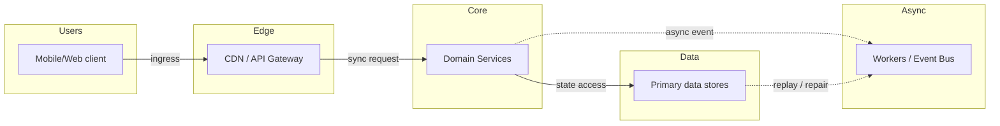
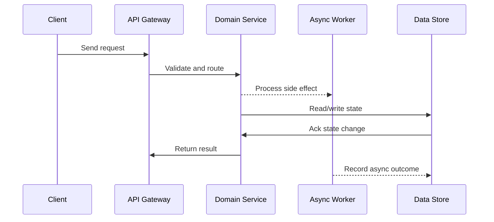

# Case Study: Social Media Feed (Twitter / Instagram)

Source: `src/modules/topics/sysdesign/sd-case-social-feed.js`
Tag: `Case Study`
Doc path: `docs/system-design/sd-case-social-feed.md`

## Concept
**Requirements:** Generate a ranked feed of posts from followed users. 500M DAU, 500M tweets/day, 500B feed reads/day.

**Two approaches:**

**Fanout-on-write (push model):**
When user A posts, immediately push to every follower's feed cache.
- Read: O(1) - pre-computed feed in Redis sorted set
- Write: O(followers) - slow for celebrities (Lady Gaga = 50M followers -> 50M Redis writes per tweet)
- Celebrity problem: async fan-out with Kafka; celeb writes go to separate queue

**Fanout-on-read (pull model):**
On feed load, fetch posts from all followed users, merge, rank.
- Write: O(1) - just save the tweet
- Read: O(N accounts followed x posts/account) - slow; requires many DB lookups
- Scales poorly for users following many accounts

**Twitter's hybrid approach:**
- Fanout-on-write for regular users (< 1M followers)
- Fanout-on-read for celebrities (> 1M followers)
- At read time: merge pre-computed feed + real-time fetch of celebrity tweets

**Feed storage:**
Redis sorted set per user: `ZADD feed:{userId} score tweetId`
Score = publish timestamp (or ranking signal: engagement + freshness + relevance).
Keep only last 800 tweets in feed cache; older tweets fetched from DB.

**Ranking:** ML model. Features: author relationship strength, tweet freshness, engagement rate, user interests. Served by a ranking service per request.

**Storage:** Tweets in Cassandra (write-heavy, time-series). User -> followers mapping in graph DB or adjacency list in Cassandra. Media in S3 + CDN.

## Production Architecture
Feed design is asked at Twitter, Instagram, Facebook. Fanout-on-write vs read trade-off demonstrates understanding of the space-time trade-off at scale.

## Architecture Checklist
- Users / Mobile/Web client: Captures user intent, auth token, device context, and retry id.
- Edge / CDN / API Gateway: Terminates TLS, verifies token, applies rate limits, and routes to domain services.
- Core / Domain Services: Owns domain logic, validates invariants, and writes authoritative state.
- Async / Workers / Event Bus: Decouples slow work such as notifications, indexing, media processing, or settlement.
- Data / Primary data stores: Stores metadata, hot cache entries, immutable blobs, and audit history.

## Mermaid Architecture

## UML Sequence

## Animation Plan
Interactive app sections for this concept:

- Flow lab: highlights request path step by step.
- UML sequence simulation: animates actor-to-actor messages.
- Architecture map: clickable nodes and sync/async links.
- Canvas visual: existing topic-specific live diagram remains available in app.

Flow steps:

1. Enter system - Request crosses trust boundary and gets normalized before core handling.
2. Execute core path - Gateway routes to owning capability with timeout, auth context, and trace id.
3. Offload slow work - Async path absorbs retries, fanout, indexing, notifications, or heavy processing.
4. Persist state - System writes durable state, cache entries, offsets, or audit evidence.
5. Return or recover - Response returns when sync work succeeds; failure path uses retry, fallback, or replay.

## Interview Drills
1. How do you handle the celebrity problem in a social feed?
   **Problem:** A celebrity with 50M followers posts a tweet. Fanout-on-write = 50M Redis writes in seconds. Redis cluster saturated. Regular fan-outs of normal users starved.
   
   **Solutions:**
   1. **Async batching:** Don't fan-out immediately. Kafka consumer groups process fan-outs over minutes in priority queues. But feed is stale for minutes - unacceptable for real-time.
   2. **Hybrid (Twitter's approach):** Set threshold (1M followers). Regular users -> fanout-on-write. Celebrities -> no precomputed fan-out. At read time, check which celebrities user follows (usually <10), fetch their last 20 tweets, merge with pre-computed feed in real time. Only 10 DB lookups per feed request.
   3. **Sharded fan-out:** Shard celebrity followers into 1000-user batches. Kafka partitions. 50K parallel workers each handle 1000 followers -> complete fan-out in 5 seconds vs 50 seconds sequentially.
   Follow-ups: How does Instagram rank posts in its feed?; How would you implement infinite scroll pagination for a feed?

## Trade-offs
Pros:
- Fanout-on-write: O(1) reads - excellent user experience
- Redis sorted set for feed: sorted by score, O(log N) insert, O(1) read

Cons:
- Fanout-on-write: write amplification for high-follower accounts
- Feed cache must be invalidated on unlike/delete (complex)

When to use:
Always hybrid for social feeds at scale. Fan-out threshold tuned based on follower count. Start with fanout-on-read for simplicity; migrate to write when read latency becomes unacceptable.

## Gotchas
_No gotchas yet._

