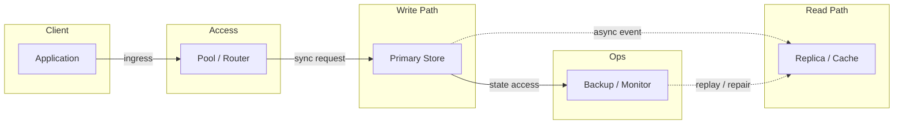
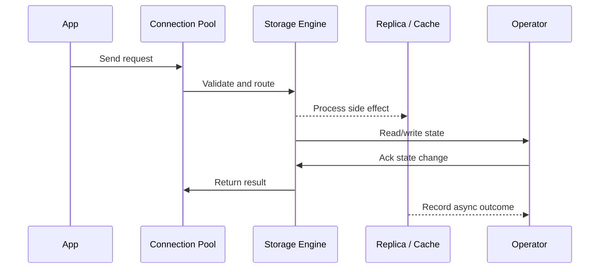

# CAP Theorem, Consistency Models & PACELC

Source: `src/modules/topics/sysdesign/sd-db-cap.js`
Tag: `Database`
Doc path: `docs/system-design/sd-db-cap.md`

## Concept
**CAP Theorem** (Brewer 2000): A distributed system can guarantee at most **2 of 3**:
- **C**onsistency - every read returns the most recent write (linearisability)
- **A**vailability - every request receives a response (not necessarily latest data)
- **P**artition tolerance - system continues despite network partitions

**In practice:** Partitions happen (network failures are real). So you choose **CP or AP**:
- **CP** (Zookeeper, HBase, etcd, RDBMS with sync replication): sacrifice availability during partition - refuse requests rather than return stale data
- **AP** (Cassandra, CouchDB, DynamoDB default): sacrifice consistency - return potentially stale data, reconcile later

**Consistency spectrum (weakest -> strongest):**
1. **Eventual** - given no new updates, all replicas converge eventually (DNS, shopping cart)
2. **Monotonic read** - once you read value X, you'll never read an older value
3. **Read-your-writes** - after you write, you always see your own write
4. **Session** - consistency guarantees within a session (read-your-writes + monotonic)
5. **Causal** - causally related operations are seen in order by all nodes
6. **Linearisable** - strongest; operations appear instantaneous to all observers (Spanner, etcd)

**PACELC extension:** Even without partition, there's a trade-off between **Latency** and **Consistency**. A quorum write to 3 replicas is consistent but slower than writing to 1.

## Production Architecture
CAP and consistency models appear in nearly every system design interview. Choosing wrong consistency model costs money (over-engineered) or correctness (data loss/anomalies).

## Architecture Checklist
- Client / Application: Builds request, sets timeout, and chooses read/write path.
- Access / Pool / Router: Bounds concurrency, selects shard or replica, and prevents connection storms.
- Write Path / Primary Store: Applies transactions, indexes data, and appends durable log before ack.
- Read Path / Replica / Cache: Absorbs read traffic with replicas, materialized views, or cache entries.
- Ops / Backup / Monitor: Tracks lag, lock waits, slow queries, saturation, and restore readiness.

## Mermaid Architecture

## UML Sequence

## Animation Plan
Interactive app sections for this concept:

- Flow lab: highlights request path step by step.
- UML sequence simulation: animates actor-to-actor messages.
- Architecture map: clickable nodes and sync/async links.
- Canvas visual: existing topic-specific live diagram remains available in app.

Flow steps:

1. Enter system - Request crosses trust boundary and gets normalized before core handling.
2. Execute core path - Gateway routes to owning capability with timeout, auth context, and trace id.
3. Offload slow work - Async path absorbs retries, fanout, indexing, notifications, or heavy processing.
4. Persist state - System writes durable state, cache entries, offsets, or audit evidence.
5. Return or recover - Response returns when sync work succeeds; failure path uses retry, fallback, or replay.

## Interview Drills
1. Explain the CAP theorem with a real-world example.
   During a network partition in a multi-datacenter setup (east <-> west data centers lose connectivity):
   
   **CP choice (e.g., Zookeeper):** The isolated DC refuses writes/reads until the partition heals. Users see errors but data stays consistent. Safe for distributed locks, configuration, leader election.
   
   **AP choice (e.g., Cassandra):** Both DCs accept writes independently. A user writes an order in east; another reads in west - they might see stale data. After partition heals, conflict resolution runs (last-write-wins or CRDTs). Acceptable for shopping carts, user preferences.
   Follow-ups: What are CRDTs and when do you use them?; How does DynamoDB handle conflicts in global tables?

2. What is linearisability and why is it expensive?
   Linearisability means every operation appears to take effect instantaneously at a single point in time between its invocation and response. All observers see the same order of operations.
   
   It's expensive because:
   1. Every read must contact a quorum of replicas to ensure it sees the latest write
   2. Adds cross-node network round trips
   3. During partition, must sacrifice availability
   
   Alternatives with weaker but often sufficient guarantees: sequential consistency, causal consistency, session consistency - each allows more concurrency with some trade-offs.
   Follow-ups: How does Google Spanner achieve external consistency (linearisability) globally?

## Trade-offs
Pros:
- Framework clarifies trade-offs before choosing a DB
- Consistency levels let you tune per-operation

Cons:
- CAP oversimplifies - network partitions are not binary
- PACELC is more practical for latency-conscious systems

When to use:
Choose CP for: financial transactions, distributed locks, config management. Choose AP for: social feeds, shopping carts, notifications, analytics.

## Gotchas
_No gotchas yet._

