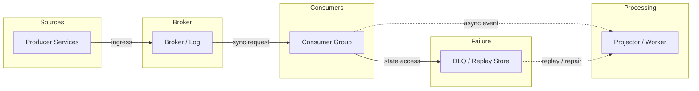
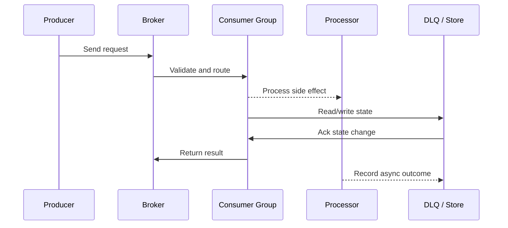

# Event-Driven Architecture - EDA, CQRS & Event Sourcing

## Quick Facts
- Area: System Design
- Tag: Architecture
- Source: `src/modules/topics/sysdesign/sd-event-driven.js`
- Tags: `eda`, `cqrs`, `event sourcing`, `event store`, `projection`, `read model`, `axon`, `domain events`
- Visual coverage: live visual, flow lab, UML lab, architecture map

## Concept
**Event-Driven Architecture (EDA):** Services communicate by publishing and consuming events. No direct coupling - publisher doesn't know about consumers.

**Event types:**
- **Domain event** - something that happened (OrderPlaced, PaymentProcessed). Immutable fact.
- **Command** - intent to change state (PlaceOrder). Can be rejected.
- **Query** - read request. No side effects.

**CQRS (Command Query Responsibility Segregation):**
Separate write model (commands -> aggregates -> events) from read model (projections optimised for queries).
- Write side: normalised, event-sourced, strongly consistent
- Read side: denormalised, eventually consistent, optimised for specific views

**Event Sourcing:** Store state as a sequence of events rather than current state.
```
Events: [OrderCreated, ItemAdded, ItemAdded, OrderConfirmed, PaymentFailed, Retried, PaymentSuccess]
Current state = apply(all events) = {status: PAID, items: [...], total: 99.99}
```

**Benefits:** Complete audit trail, temporal queries ("what was the state on Tuesday?"), replay to fix bugs, event-driven integration is natural.

**Challenges:** Event schema evolution (upcasters), eventual consistency, projections can lag, complex debugging.

**Snapshot optimization:** After N events, store a snapshot of current state. Rebuild from snapshot + events since snapshot.

## Why It Matters
CQRS+ES appears in DDD-heavy organizations (banking, insurance, logistics). Understanding it separates architects from developers in senior interviews.

## Architecture / Mental Model


## Runtime / Sequence


## Animation Plan
- Flow lab available: step-by-step path highlighting.
- UML sequence simulation available: actor messages animate in order.
- Architecture map available: clickable nodes and sync/async links.
- Live visual exists in app: topic-specific canvas/ReactViz animation.

Flow steps:

1. Send command - Client sends PlaceOrderCommand. Command bus routes to OrderCommandHandler.
2. Command handled - Aggregate validates business rules. If valid, emits OrderPlacedEvent.
3. Persist event - Event appended to event store. Immutable - never updated or deleted.
4. Event triggers projection - Projection handler subscribes to event store. Rebuilds read model on each new event.
5. Update read model - Denormalised view updated in read DB (e.g. Elasticsearch or PostgreSQL view).
6. Query read model - Client queries via query bus. Handler reads from fast, denormalised read DB.
7. Return projection - Read model returned. No joining - pre-computed view.

## Example
```java
// Event Sourcing with Axon Framework
@Aggregate
public class OrderAggregate {
    @AggregateIdentifier private String orderId;
    private OrderStatus status;
    private List<OrderItem> items = new ArrayList<>();

    // Command handler - validates and emits event
    @CommandHandler
    public OrderAggregate(CreateOrderCommand cmd) {
        AggregateLifecycle.apply(new OrderCreatedEvent(
            cmd.getOrderId(), cmd.getCustomerId()));
    }

    @CommandHandler
    public void handle(AddItemCommand cmd) {
        if (status != OrderStatus.DRAFT)
            throw new IllegalStateException("Cannot modify confirmed order");
        AggregateLifecycle.apply(new ItemAddedEvent(
            orderId, cmd.getProductId(), cmd.getQuantity(), cmd.getPrice()));
    }

    // Event sourcing handler - rebuilds state from events
    @EventSourcingHandler
    public void on(OrderCreatedEvent event) {
        this.orderId = event.getOrderId();
        this.status = OrderStatus.DRAFT;
    }

    @EventSourcingHandler
    public void on(ItemAddedEvent event) {
        this.items.add(new OrderItem(event.getProductId(),
                                     event.getQuantity(), event.getPrice()));
    }
}

// Projection - builds read model from events
@Component
@ProcessingGroup("order-summary-projection")
public class OrderSummaryProjection {

    @Autowired private OrderSummaryRepository repository;

    @EventHandler
    public void on(OrderCreatedEvent event) {
        repository.save(new OrderSummary(event.getOrderId(),
                                         event.getCustomerId(), OrderStatus.DRAFT));
    }

    @EventHandler
    public void on(ItemAddedEvent event) {
        OrderSummary summary = repository.findById(event.getOrderId()).orElseThrow();
        summary.addItem(event.getProductId(), event.getQuantity(), event.getPrice());
        repository.save(summary);
    }

    // Query handler - serves read model
    @QueryHandler
    public OrderSummary handle(GetOrderSummaryQuery query) {
        return repository.findById(query.getOrderId()).orElseThrow();
    }
}
```

Notes:
Axon stores events in its Event Store. Projections are rebuilt by replaying all events - allows fixing bugs in projections without touching source data.

## Complexity And Performance
- Time/space complexity depends on input size, data volume, and implementation choices.
- Track latency, throughput, memory, saturation, error rate, and correctness invariants.

## Interview Drills
1. What are the downsides of event sourcing?
   Answer: 1. **Eventual consistency** - projections (read models) lag behind the event store. Reads may return stale data.
   2. **Schema evolution** - once an event is stored, you can't change its structure without upcasters (migration functions that transform old events to new shape).
   3. **Query complexity** - you can't do ad-hoc SQL queries on event store; must build projections for every query pattern.
   4. **Performance** - rebuilding state from 10,000 events per aggregate is slow without snapshots.
   5. **Mental model shift** - team must think in events, not CRUD. High learning curve.
   6. **Debugging** - a bug manifests across many events; hard to reason about current state.
   Follow-ups: What is an upcaster in event sourcing?; When would you NOT use event sourcing?

## Trade-offs
Pros:
- Complete audit trail (built-in compliance)
- Replay events to fix bugs or build new projections
- Natural fit for event-driven integration

Cons:
- Eventual consistency complexity
- Schema evolution requires upcasters
- Overkill for simple CRUD applications

When to use:
Use for: complex domains with audit requirements (finance, healthcare), workflows with many state transitions, systems where historical data replay has value. Avoid for: simple CRUD, small teams without DDD experience.

## Gotchas
_No gotchas configured._

