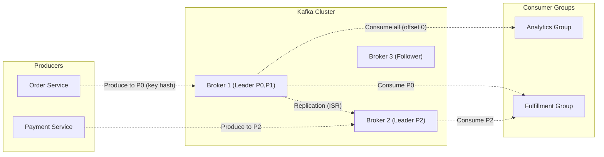
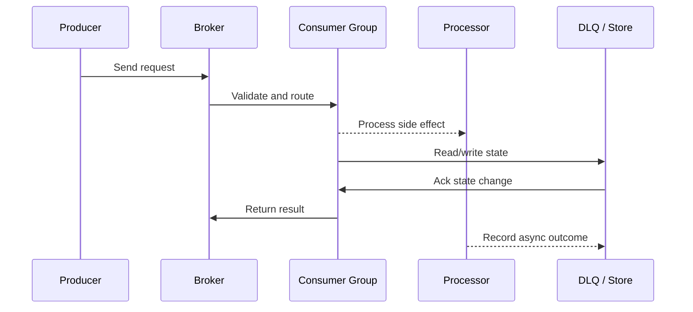

# Apache Kafka - Internals, Partitions & Consumer Groups

Source: `src/modules/topics/sysdesign/sd-kafka-arch.js`
Tag: `Messaging`
Doc path: `docs/system-design/sd-kafka-arch.md`

## Concept
**Kafka** is a distributed commit log optimised for high-throughput, durable, ordered event streaming.

**Core concepts:**
- **Topic** - logical stream name. Partitioned for parallelism.
- **Partition** - ordered, immutable log. Each message gets an offset. Stored on disk (not memory).
- **Broker** - Kafka server. A cluster has N brokers; each partition has one leader + (replication-factor - 1) followers.
- **Producer** - writes to a partition leader. Partitioning by key ensures ordered delivery for a key.
- **Consumer Group** - logical subscriber. Each partition assigned to exactly one consumer in the group. Multiple groups -> each gets all messages (pub-sub behaviour).
- **Offset** - consumer tracks position per partition. Committed to `__consumer_offsets` topic.

**ISR (In-Sync Replicas):** The set of replicas fully caught up with the leader. `acks=all` waits for all ISR before producer gets ACK - strongest guarantee.

**Exactly-once semantics (EOS):**
1. Producer idempotence (`enable.idempotence=true`) - deduplicates retries via sequence numbers
2. Transactions - atomic write across multiple partitions + commit offset

**Log compaction:** Kafka retains only the latest value per key (useful for change-data-capture CDC).

**Throughput numbers:** Single Kafka cluster handles 10M+ messages/second at LinkedIn, 7M at Twitter.

## Production Architecture
Kafka is the backbone of event-driven architectures. Understanding partitioning and consumer groups is critical for designing scalable async systems.

## Architecture Checklist
- Producers / Order Service: Produces OrderCreated events
- Producers / Payment Service: Produces PaymentCompleted events
- Kafka Cluster / Broker 1 (Leader P0,P1): Broker 1 is leader for partitions 0 and 1. Producers write to leader. Followers (Broker 2,3) replicate.
- Kafka Cluster / Broker 2 (Leader P2): Broker 2 is leader for partition 2. Also follower for P0 and P1.
- Kafka Cluster / Broker 3 (Follower): Broker 3 is follower for all partitions. Elected leader if Broker 1 or 2 fail.
- Consumer Groups / Fulfillment Group: 3 consumer instances, each handling 1 partition. Max parallelism = partition count (3).
- Consumer Groups / Analytics Group: Analytics consumer group reads all events independently. Kafka fan-out: multiple groups each get full stream.

## Mermaid Architecture

## UML Sequence

## Animation Plan
Interactive app sections for this concept:

- Flow lab: highlights request path step by step.
- UML sequence simulation: animates actor-to-actor messages.
- Architecture map: clickable nodes and sync/async links.
- Canvas visual: existing topic-specific live diagram remains available in app.

Flow steps:

1. Enter system - Request crosses trust boundary and gets normalized before core handling.
2. Execute core path - Gateway routes to owning capability with timeout, auth context, and trace id.
3. Offload slow work - Async path absorbs retries, fanout, indexing, notifications, or heavy processing.
4. Persist state - System writes durable state, cache entries, offsets, or audit evidence.
5. Return or recover - Response returns when sync work succeeds; failure path uses retry, fallback, or replay.

## Interview Drills
1. How do you ensure ordering of messages in Kafka?
   Kafka guarantees ordering **within a partition**. Cross-partition ordering is not guaranteed.
   
   **To ensure ordered processing for a logical entity:**
   1. **Partition by entity key** - all events for orderId=42 go to the same partition (hash of key mod partitions). Same partition -> single consumer -> ordered.
   2. **Single partition** - extreme: 1 partition = total order, but 1 consumer max throughput.
   3. **Application-side ordering** - use sequence numbers in events; consumer buffers and reorders.
   
   **Gotcha:** If a consumer fails and rebalance occurs, a new consumer picks up mid-stream. With at-least-once delivery, ensure idempotent processing.
   Follow-ups: What happens when a Kafka consumer is slow and lags behind?; Explain the differences between at-most-once, at-least-once, and exactly-once delivery.

## Trade-offs
Pros:
- 10M+ msg/s throughput
- Durable - disk-backed, replicated
- Replay - consumers can re-read old events
- Fan-out - multiple consumer groups each see all messages

Cons:
- Operational complexity (ZooKeeper/KRaft, schema registry)
- No built-in message filtering - consumers must filter
- Rebalancing pauses all consumers in a group (improvement: static membership)

When to use:
Use Kafka for: event sourcing, audit logs, cross-service async communication, stream processing (Kafka Streams / Flink). For simple task queues, consider RabbitMQ or SQS.

## Gotchas
_No gotchas yet._

