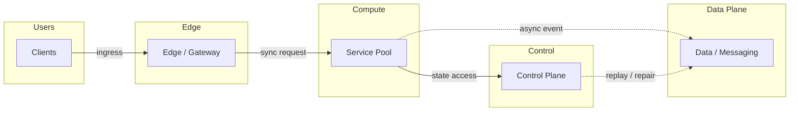
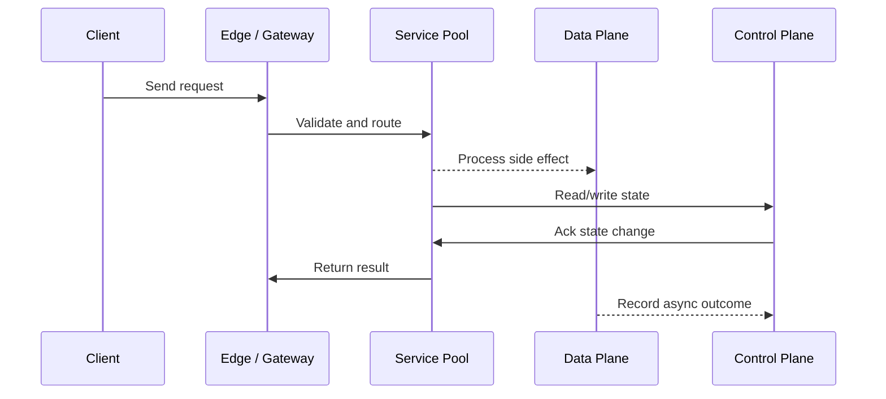

# Kubernetes in Production - Pods, HPA & Rolling Deploys

Source: `src/modules/topics/sysdesign/sd-kubernetes-prod.js`
Tag: `Compute`
Doc path: `docs/system-design/sd-kubernetes-prod.md`

## Concept
**Core Kubernetes objects:**

**Pod** - smallest deployable unit. One or more containers sharing network namespace and volumes. Ephemeral - never SSH into a pod.

**Deployment** - manages a ReplicaSet (N pod replicas). Handles rolling updates and rollbacks.

**Service** - stable virtual IP + DNS name for a set of pods. Types: ClusterIP (internal), NodePort, LoadBalancer (cloud LB), ExternalName.

**Ingress** - L7 HTTP routing rule (path/host -> Service). Implemented by ingress controllers (nginx, Traefik, ALB Ingress).

**ConfigMap + Secret** - externalise configuration. Secrets base64-encoded (not encrypted by default - use Sealed Secrets or External Secrets Operator with AWS Secrets Manager).

**HPA (Horizontal Pod Autoscaler)** - scales Deployment replica count based on CPU/memory/custom metrics (via KEDA for queue depth).

**Rolling deploy strategy:**
```
maxSurge: 1      # Allow 1 extra pod during update
maxUnavailable: 0 # Keep all pods available (zero downtime)
```
New pods start -> pass readiness probe -> added to service endpoints -> old pods terminated.

**Probes:**
- **Liveness** - is pod alive? Failure -> container restart.
- **Readiness** - is pod ready to receive traffic? Failure -> removed from service endpoints (but not restarted).
- **Startup** - for slow-starting apps. Disables liveness until started.

## Production Architecture
K8s is the industry standard for container orchestration. Interview questions cover deployments, scaling, networking, and troubleshooting. Understanding probes alone can save hours of incident debugging.

## Architecture Checklist
- Users / Clients: Browsers, apps, jobs, or services send requests with latency budgets.
- Edge / Edge / Gateway: Terminates TLS, applies routing, rate limits, and health-aware forwarding.
- Compute / Service Pool: Runs stateless instances, containers, pods, or functions across zones.
- Data Plane / Data / Messaging: Persists state, caches hot keys, and buffers async work.
- Control / Control Plane: Runs discovery, autoscaling, config rollout, telemetry, and failover.

## Mermaid Architecture


## UML Sequence


## Animation Plan
Interactive app sections for this concept:

- Flow lab: highlights request path step by step.
- UML sequence simulation: animates actor-to-actor messages.
- Architecture map: clickable nodes and sync/async links.
- Canvas visual: existing topic-specific live diagram remains available in app.

Flow steps:

1. Enter system - Request crosses trust boundary and gets normalized before core handling.
2. Execute core path - Gateway routes to owning capability with timeout, auth context, and trace id.
3. Offload slow work - Async path absorbs retries, fanout, indexing, notifications, or heavy processing.
4. Persist state - System writes durable state, cache entries, offsets, or audit evidence.
5. Return or recover - Response returns when sync work succeeds; failure path uses retry, fallback, or replay.

## Interview Drills
1. What happens when a pod fails its liveness probe?
   The kubelet on the node restarts the container (not the pod). The pod itself stays - it retains its IP, volumes, and resource reservation. The container's process is killed and restarted according to the pod's `restartPolicy` (default: Always).
   
   **Key distinction from readiness:** A failed readiness probe removes the pod from Service endpoints (no traffic) but doesn't restart it. A failed liveness probe restarts the container.
   
   **Common pitfall:** Setting liveness probe path same as a heavyweight health endpoint. If liveness probe itself causes load -> cascade. Use a simple fast endpoint for liveness (`/live`) separate from deep health check.
   Follow-ups: What is pod disruption budget and why is it important?; How does K8s handle node failure?

## Trade-offs
Pros:
- Self-healing (pod restart, node replacement)
- Declarative - desired state reconciled automatically
- Rich ecosystem: Helm, Kustomize, ArgoCD, KEDA

Cons:
- Steep learning curve
- etcd is a critical single point - must be HA
- Networking complexity (CNI, service mesh)

When to use:
K8s for anything running more than a handful of microservices in production. Use managed K8s (EKS, GKE, AKS) - running your own control plane is expensive.

## Gotchas
_No gotchas yet._

