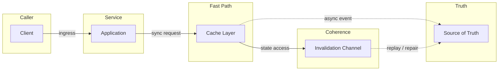
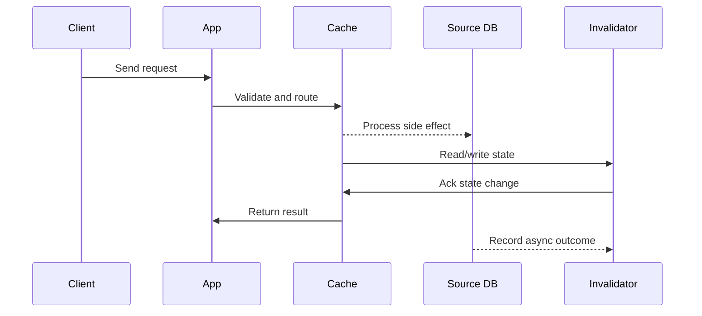

# LLD: LRU & LFU Cache - O(1) Get and Put

Source: `src/modules/topics/sysdesign/sd-lld-cache.js`
Tag: `LLD`
Doc path: `docs/system-design/sd-lld-cache.md`

## Concept
**LRU (Least Recently Used):** Evict the item that was accessed longest ago.

**O(1) LRU implementation:** HashMap + Doubly Linked List.
- HashMap: key -> node (O(1) lookup)
- DLL: nodes in access-time order (head = most recent, tail = least recent)
- Get: O(1) - lookup in map, move node to head
- Put: O(1) - add to head; if capacity exceeded, remove tail and map entry

**Java:** LinkedHashMap with accessOrder=true is a built-in LRU cache.

**LFU (Least Frequently Used):** Evict the item accessed fewest times. On tie, evict LRU among those.

**O(1) LFU implementation:** Three maps:
1. `keyToVal` - key -> value
2. `keyToFreq` - key -> frequency count
3. `freqToKeys` - frequency -> LinkedHashSet of keys (LRU order within same freq)
Track `minFreq`. On evict: remove oldest key from `freqToKeys[minFreq]`.

**When to use LRU vs LFU:**
- LRU: general web cache. Recent access = likely to be accessed again.
- LFU: media libraries, CDN content. Popular items (high freq) should stay regardless of recent access.
- LRU simpler to implement; LFU resists scan pollution better.

## Production Architecture
LRU cache implementation is one of the most common coding interview questions. Every caching layer internally uses one of these algorithms.

## Architecture Checklist
- Caller / Client: Requests hot data with cacheable keys and freshness tolerance.
- Service / Application: Computes cache key, handles miss, fills cache, and returns response.
- Fast Path / Cache Layer: Keeps frequently accessed data near users with TTL and eviction policy.
- Truth / Source of Truth: Serves misses and remains authoritative for writes.
- Coherence / Invalidation Channel: Publishes delete/update events to reduce stale reads after writes.

## Mermaid Architecture

## UML Sequence

## Animation Plan
Interactive app sections for this concept:

- Flow lab: highlights request path step by step.
- UML sequence simulation: animates actor-to-actor messages.
- Architecture map: clickable nodes and sync/async links.
- Canvas visual: existing topic-specific live diagram remains available in app.

Flow steps:

1. Enter system - Request crosses trust boundary and gets normalized before core handling.
2. Execute core path - Gateway routes to owning capability with timeout, auth context, and trace id.
3. Offload slow work - Async path absorbs retries, fanout, indexing, notifications, or heavy processing.
4. Persist state - System writes durable state, cache entries, offsets, or audit evidence.
5. Return or recover - Response returns when sync work succeeds; failure path uses retry, fallback, or replay.

## Interview Drills
1. Implement a thread-safe LRU cache in Java.
   Wrap LinkedHashMap with synchronized methods (as shown above) for simplicity. For production:
   - Use `Collections.synchronizedMap` around LinkedHashMap - coarse-grained lock
   - For better concurrency: use ConcurrentHashMap + ConcurrentLinkedDeque (approximate LRU with lower contention)
   - For high-performance: Caffeine library uses a window TinyLFU algorithm - lock-free, SLRU, ~10x faster than synchronizedLinkedHashMap
   
   Caffeine is what Spring Boot uses internally when you add `@Cacheable` with Caffeine configuration.
   Follow-ups: What is the Window TinyLFU algorithm used by Caffeine?; When is LFU strictly better than LRU?

## Trade-offs
Pros:
- LRU: simple, O(1), handles temporal locality
- LFU: resists cache pollution from one-time scans
- Both: bounded memory, automatic eviction

Cons:
- LRU: scan can evict popular items
- LFU: frequency counts inflate for old items (frequency aging needed)
- Both: no awareness of item size - small and large items treated equally

When to use:
LRU for general application caches (HTTP responses, DB query results). LFU for content libraries (videos, images) where popularity matters more than recency.

## Gotchas
_No gotchas yet._

