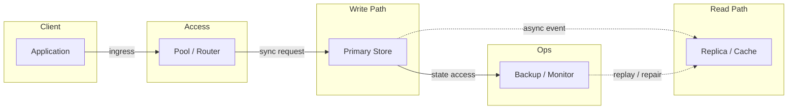
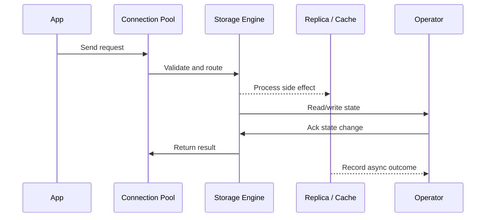

# LLD: Rate Limiter - Token Bucket & Sliding Window

Source: `src/modules/topics/sysdesign/sd-lld-rate-limiter.js`
Tag: `LLD`
Doc path: `docs/system-design/sd-lld-rate-limiter.md`

## Concept
**Rate limiter** controls the rate of requests to protect services from overload and abuse.

**Algorithm comparison:**

**Fixed Window Counter:**
```
Window: [0s - 60s] -> counter=100 -> reset at 60s
Problem: 100 requests at :59, 100 more at :61 -> 200 in 2 seconds
```

**Sliding Window Log:**
Store timestamp of each request in sorted set. Count entries in [now-window, now].
Accurate but O(N) memory per user.

**Sliding Window Counter (hybrid):**
Two fixed windows. current_count + previous_count x (1 - overlap).
~1% error, O(1) memory. Used by Cloudflare.

**Token Bucket (most common):**
- Bucket holds capacity C tokens. Refilled at rate R tokens/second.
- Each request consumes 1 token. If empty -> reject (429).
- Allows bursts up to C. Smooth average of R.

**Leaky Bucket:**
- Requests queued. Processed at fixed rate (leaks). Smooths bursts.
- Output always at constant rate (good for downstream protection).

**Distributed rate limiting with Redis:**
- Store counters/timestamps in Redis (shared across all app instances)
- Use Lua script for atomic check-and-increment
- Key: `ratelimit:{userId}:{window}`

**Token bucket in Redis:**
`INCR` + `EXPIRE` for fixed window. For token bucket: store {tokens, last_refill} in Redis hash, Lua script calculates tokens since last refill.

## Production Architecture
Rate limiter is the single most common LLD problem. Interviewers expect algorithm knowledge, distributed implementation, and Redis usage.

## Architecture Checklist
- Client / Application: Builds request, sets timeout, and chooses read/write path.
- Access / Pool / Router: Bounds concurrency, selects shard or replica, and prevents connection storms.
- Write Path / Primary Store: Applies transactions, indexes data, and appends durable log before ack.
- Read Path / Replica / Cache: Absorbs read traffic with replicas, materialized views, or cache entries.
- Ops / Backup / Monitor: Tracks lag, lock waits, slow queries, saturation, and restore readiness.

## Mermaid Architecture


## UML Sequence


## Animation Plan
Interactive app sections for this concept:

- Flow lab: highlights request path step by step.
- UML sequence simulation: animates actor-to-actor messages.
- Architecture map: clickable nodes and sync/async links.
- Canvas visual: existing topic-specific live diagram remains available in app.

Flow steps:

1. Enter system - Request crosses trust boundary and gets normalized before core handling.
2. Execute core path - Gateway routes to owning capability with timeout, auth context, and trace id.
3. Offload slow work - Async path absorbs retries, fanout, indexing, notifications, or heavy processing.
4. Persist state - System writes durable state, cache entries, offsets, or audit evidence.
5. Return or recover - Response returns when sync work succeeds; failure path uses retry, fallback, or replay.

## Interview Drills
1. Design a rate limiter for an API that allows 100 requests per minute per user.
   **Requirements clarification:**
   - Per user (not global)
   - Distributed (multiple API servers)
   - Algorithm: Token bucket (allows burst up to 100, refills 100/min = 1.67/sec)
   
   **Design:**
   1. **Storage:** Redis hash per user: `{tokens: 95.2, lastRefill: 1701234567890}`
   2. **Algorithm:** On each request, Lua script: calculate elapsed since lastRefill -> add tokens at rate 1.67/s -> if tokens >= 1 -> decrement -> allow; else -> 429
   3. **Headers:** Return `X-RateLimit-Limit: 100`, `X-RateLimit-Remaining: 45`, `X-RateLimit-Reset: 1701234620`
   4. **Scale:** Redis Cluster handles millions of users. Each key is tiny (~50 bytes).
   5. **Edge cases:** Clock skew across servers -> use Redis server time (TIME command). Redis unavailable -> fail open (allow) or fail closed (reject).
   
   **Capacity:** 10M users x 50 bytes/user = 500MB Redis memory. Single Redis node handles 100K ops/s.
   Follow-ups: How do you handle rate limiting across multiple regions?; What are the trade-offs between token bucket and leaky bucket?

## Trade-offs
Pros:
- Token bucket: allows bursts, smooth average
- Sliding window: accurate, prevents boundary burst
- Redis Lua: atomic, no race conditions

Cons:
- Distributed clocks add complexity
- Redis becomes a dependency - must be HA
- Too strict limits frustrate legitimate users

When to use:
Rate limit at: API gateway (global), per user, per IP. Use token bucket for API rate limiting. Leaky bucket for queue-based downstream protection.

## Gotchas
_No gotchas yet._

