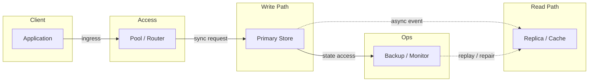
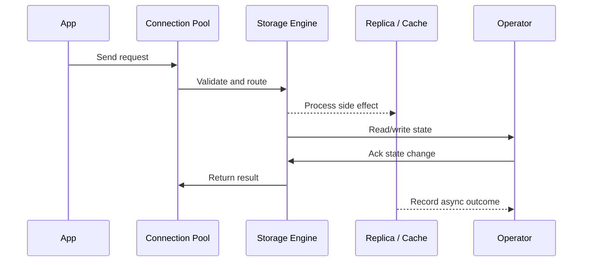

# LLD: Distributed Task Queue (Celery / BullMQ / Sidekiq)

Source: `src/modules/topics/sysdesign/sd-lld-task-queue.js`
Tag: `LLD`
Doc path: `docs/system-design/sd-lld-task-queue.md`

## Concept
**Requirements:** Enqueue tasks, at-least-once execution, retry on failure, priority queues, dead letter queue (DLQ), autoscale workers.

**Core components:**

**1. Producer**
Enqueues a task with: payload (job data), priority (0-10, higher = first), retry policy (max retries, backoff), TTL (task expires if not picked up within N seconds).

**2. Broker (Redis or RabbitMQ)**
Stores task queues. With Redis:
- `ZADD priority_queue <priority_score> <task_json>` - sorted set = priority queue.
- Worker polls: `ZPOPMAX priority_queue` (highest priority first).
- Or subscribe to keyspace events for push-based consumption.

**3. Worker pool**
- Workers are stateless processes. Horizontally scalable.
- Each worker: ZPOPMAX -> execute task -> ACK (delete from in-flight set).
- Heartbeat: worker updates `worker:{id}:heartbeat` every 10s in Redis.
- Dead worker detection: if heartbeat expires -> re-enqueue the task from in-flight set.

**4. Retry with exponential backoff**
On failure: task re-enqueued with delay = `base_delay x 2^(retry_count)`.
Example: 1s -> 2s -> 4s -> 8s (max 3 retries). Implemented via Redis ZADD with a future timestamp as score on a `delayed_queue`. A scheduler process moves tasks from delayed_queue to active queue when their timestamp arrives.

**5. Dead Letter Queue (DLQ)**
After max retries (e.g., 3): task moved to `dlq` sorted set with error info attached. Ops team can inspect, fix, and re-enqueue manually.

**6. Autoscaling workers**
Monitor queue depth (ZCARD priority_queue). If depth > threshold (e.g., 10) -> spawn new worker pod (K8s Horizontal Pod Autoscaler or custom signal). If depth < low threshold -> scale down.

**7. At-least-once vs exactly-once**
- **At-least-once** (default): task may be executed more than once on worker crash mid-execution. Tasks must be idempotent.
- **Exactly-once**: use distributed lock (Redis SETNX) keyed on task_id before executing. If lock acquired -> execute. Else -> skip. Lock expires after task timeout.

**Task lifecycle:** QUEUED -> IN_FLIGHT -> COMPLETED / FAILED -> (retry) -> DLQ

## Production Architecture
Task queues are in every backend system - email sending, report generation, image processing, payment webhooks. Understanding retry, DLQ, and autoscaling shows production readiness. Celery is Python's most popular task queue; BullMQ is Node.js; Sidekiq is Ruby.

## Architecture Checklist
- Client / Application: Builds request, sets timeout, and chooses read/write path.
- Access / Pool / Router: Bounds concurrency, selects shard or replica, and prevents connection storms.
- Write Path / Primary Store: Applies transactions, indexes data, and appends durable log before ack.
- Read Path / Replica / Cache: Absorbs read traffic with replicas, materialized views, or cache entries.
- Ops / Backup / Monitor: Tracks lag, lock waits, slow queries, saturation, and restore readiness.

## Mermaid Architecture

## UML Sequence

## Animation Plan
Interactive app sections for this concept:

- Flow lab: highlights request path step by step.
- UML sequence simulation: animates actor-to-actor messages.
- Architecture map: clickable nodes and sync/async links.
- Canvas visual: existing topic-specific live diagram remains available in app.

Flow steps:

1. Enter system - Request crosses trust boundary and gets normalized before core handling.
2. Execute core path - Gateway routes to owning capability with timeout, auth context, and trace id.
3. Offload slow work - Async path absorbs retries, fanout, indexing, notifications, or heavy processing.
4. Persist state - System writes durable state, cache entries, offsets, or audit evidence.
5. Return or recover - Response returns when sync work succeeds; failure path uses retry, fallback, or replay.

## Interview Drills
1. How do you ensure a task runs exactly once?
   Exactly-once is hard. Default behavior is at-least-once (safe retries, idempotent tasks). For true exactly-once: use a distributed lock (Redis SETNX) keyed on task_id with TTL = task max execution time. Worker acquires lock before executing. If acquired -> execute -> delete lock. If not acquired -> another worker has it -> skip. This prevents two workers executing the same task concurrently. But: if a worker crashes after acquiring the lock but before completing, the task won't run until TTL expires. Design tasks to be idempotent as the primary defense.
   Follow-ups: What if the worker crashes after the Redis SETNX but before task completion?; How does Celery handle exactly-once with ACKS_LATE?; How do you detect and recover tasks stuck in IN_FLIGHT state?

2. How do you handle long-running tasks (>30 minutes)?
   Several strategies: (1) Heartbeat: worker updates a Redis key every N seconds to signal it's still alive. If heartbeat expires, a watchdog process re-enqueues the task. (2) Chunking: break the long task into smaller subtasks, each queued independently. Parent task completes when all children complete (use a counter in Redis). (3) Celery approach: ACKS_LATE=True - task is not acknowledged until it completes. If worker dies, broker re-delivers the task. (4) Set task visibility timeout > expected task duration to prevent premature re-delivery. (5) Store progress checkpoints in Redis so a retried task resumes from last checkpoint.
   Follow-ups: How do you implement a progress bar for long-running tasks?; How do you cancel a long-running task that's already in progress?; How do you handle task timeouts without killing the worker process?

3. How do you prioritize tasks?
   Use a Redis Sorted Set (ZADD) where the score is the priority value. ZPOPMAX fetches the highest-priority task first. Implement multiple named queues (high/medium/low) and have workers poll them in order: check high queue first, then medium, then low. This prevents high-priority tasks from being starved. For scheduling: use two sorted sets - active_queue (ready to run) and delayed_queue (score = future execution timestamp). A lightweight scheduler process runs every second and moves tasks from delayed -> active when their timestamp arrives.
   Follow-ups: How do you prevent priority inversion (low-priority task blocking high-priority ones)?; How do you handle priority escalation for tasks waiting too long?; What's the difference between priority queues and fair scheduling?

4. Design Celery's architecture.
   Celery has 4 components: (1) Task producer - Python application that calls task.delay() or task.apply_async(). (2) Message broker - RabbitMQ (default) or Redis. Stores task messages in queues. (3) Worker - Python process that imports your code, subscribes to queues, executes tasks in a thread pool or prefork pool. (4) Result backend - Redis or DB that stores task results for the caller to retrieve. Key design decisions: workers are stateless - they reload the code on start. Prefork pool (default): each worker spawns N child processes (avoids GIL for CPU-bound tasks). Celery Beat: a scheduler process that triggers periodic tasks (like cron). Flower: real-time web UI for monitoring queue depth, worker status, task history.
   Follow-ups: Why does Celery use prefork instead of threads by default?; How does Celery handle database connection pools across worker processes?; What are the trade-offs between RabbitMQ and Redis as Celery brokers?

## Trade-offs
Pros:
- Decouples producers from consumers - producers don't wait for task completion
- Retry + DLQ gives operational visibility into failures without losing data
- Priority queues ensure critical work (payment processing) runs before background work (analytics)
- Autoscaling workers matches compute cost to actual queue demand

Cons:
- At-least-once delivery means tasks must be idempotent - adds complexity to task handlers
- Redis as broker has limited durability - AOF persistence helps but adds latency
- Priority queues can starve low-priority tasks under sustained high-priority load
- DLQ requires manual intervention - ops team must monitor and re-process failed tasks

When to use:
Any work that can be deferred from the request path: email sending, image resizing, report generation, ML inference, webhook delivery. Don't use for work that must complete within the HTTP request timeout.

## Gotchas
- Tasks MUST be idempotent - at-least-once delivery means a task can run twice (worker crash after execution but before ACK). Design tasks to be safe to run multiple times.
- Don't put large payloads in the queue - store data in S3/DB and pass only the reference ID in the task payload. Keeps broker memory lean.
- Celery's default is ACKS_EARLY (task acknowledged on receipt, before execution). If worker dies mid-task, task is lost. Use ACKS_LATE for critical tasks.
- Worker memory leaks: long-running Python workers accumulate memory. Configure max_tasks_per_child to recycle workers after N tasks.
- Redis ZPOPMAX is not atomic with ZADD to in-flight - use Lua scripts or Redis transactions (MULTI/EXEC) for atomic dequeue + in-flight tracking
- Queue depth autoscaling has lag - if 1000 tasks arrive simultaneously, it takes time to spin up workers. Pre-warm worker pool for known traffic spikes.

