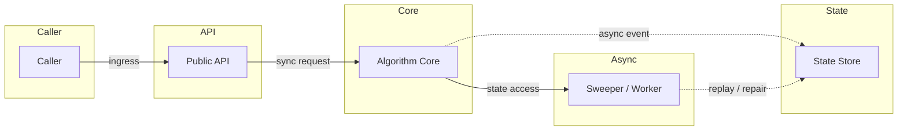
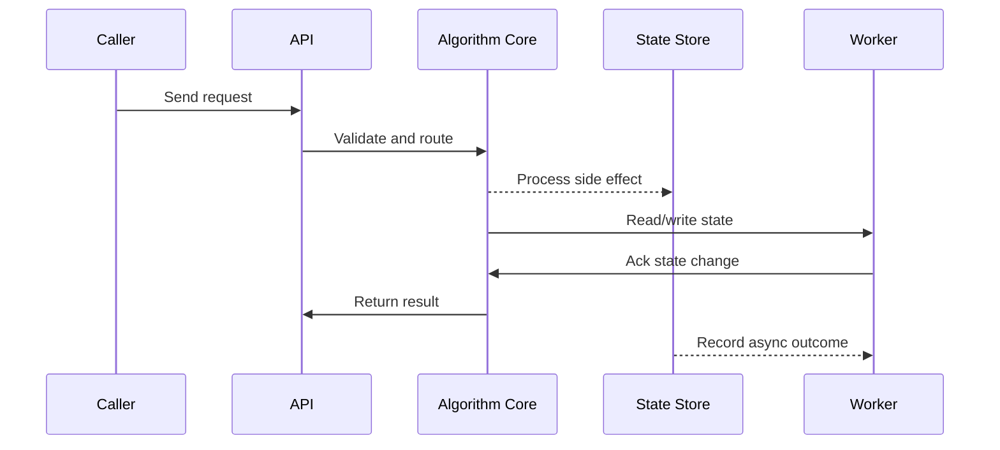

# Load Balancing - L4/L7, Algorithms & Health Checks

Source: `src/modules/topics/sysdesign/sd-load-balancing.js`
Tag: `Infrastructure`
Doc path: `docs/system-design/sd-load-balancing.md`

## Concept
A **load balancer** distributes incoming traffic across multiple backend instances to maximise throughput, minimise latency, and avoid overloading any single server.

**L4 vs L7:**
- **L4 (Transport layer)** - routes by IP + TCP/UDP port. Doesn't inspect HTTP content. Very fast (< 0.1ms overhead). Example: AWS NLB.
- **L7 (Application layer)** - inspects HTTP headers, URL path, cookies. Can route by content, inject headers, terminate TLS. Example: AWS ALB, nginx.

**Algorithms:**
| Algorithm | Best for | Drawback |
|---|---|---|
| Round-robin | Homogeneous servers | Ignores server load |
| Weighted round-robin | Mixed capacity servers | Static weights |
| Least connections | Long-lived connections (WebSocket) | Needs connection tracking |
| Least response time | Latency-sensitive | Requires active probing |
| IP hash | Session affinity without cookies | Uneven if few IPs |
| Consistent hashing | Distributed caches | Rebalancing on change |
| Random | Simplest | No load awareness |

**Health checks:**
- **Passive** - detect failure from response codes/timeouts on real traffic
- **Active** - probe /health endpoint on interval (e.g., 5s); remove from pool after N failures; re-add after M successes
- **Graceful drain** - on scale-in, stop sending new requests but complete in-flight (connection draining, 30-60 s default in AWS)

## Production Architecture
Load balancing is what makes horizontal scaling possible. Without it, you have one server. With it, you have unlimited theoretical throughput. Algorithm choice directly impacts p99 latency.

## Architecture Checklist
- Caller / Caller: Sends operation with idempotency key, timeout, and retry policy.
- API / Public API: Validates request, enforces contract, and routes to algorithm core.
- Core / Algorithm Core: Owns data structure invariants and concurrency rules.
- State / State Store: Persists counters, locks, cache entries, tasks, or ownership metadata.
- Async / Sweeper / Worker: Expires stale state, retries delayed jobs, and records metrics.

## Mermaid Architecture

## UML Sequence

## Animation Plan
Interactive app sections for this concept:

- Flow lab: highlights request path step by step.
- UML sequence simulation: animates actor-to-actor messages.
- Architecture map: clickable nodes and sync/async links.
- Canvas visual: existing topic-specific live diagram remains available in app.

Flow steps:

1. Active health check - LB probes GET /health on each upstream every 5s. 2 consecutive failures -> removed from pool. 3 successes -> re-added.
2. Server 3 marked unhealthy - Server 3 returned 503 twice. Removed from upstream pool. No traffic sent until it recovers.
3. Client sends request - Client connects to LB virtual IP. TLS terminated here. HTTP/2 stream opened.
4. Routed to Server 1 (least-conn) - Server 1 has fewest active connections. LB forwards request, increments connection counter.
5. Response returned - Server 1 responds. LB decrements connection counter. Result flows back to client.

## Interview Drills
1. Why use consistent hashing in a load balancer for a caching layer?
   When load balancing to a distributed cache (e.g. Memcached cluster), you want the same key to always go to the same node for maximum cache utilisation. Round-robin would send `user:42` to any of 10 nodes - the key would need to be in all 10 nodes or you'd get misses.
   
   Consistent hashing places servers on a hash ring. A request key is hashed and routes clockwise to the nearest server. On adding/removing a node, only ~K/N keys need to remapped (K=keys, N=nodes) - vs hash-mod which remaps nearly all keys.
   
   **Virtual nodes (vnodes)** - each physical server gets 150 virtual positions on the ring for uniform distribution.
   Follow-ups: How do you handle hot spots in consistent hashing?; What is a bounded-load consistent hash?

2. What is connection draining and why is it important?
   When a server is removed from the LB pool (scale-in, deployment), in-flight requests must complete. Connection draining (AWS calls it "deregistration delay") tells the LB to stop sending new requests to the deregistering target but keep the existing connections alive until they complete or a timeout (30-60s) elapses.
   
   Without draining: mid-flight requests receive TCP RST -> user sees errors. With draining: zero-downtime deployments and scale-in events.
   Follow-ups: How do you implement graceful shutdown in a Go/Java service?

## Trade-offs
Pros:
- Enables horizontal scaling
- Eliminates single points of failure
- Algorithms can optimize for latency or fairness

Cons:
- L7 LB adds ~1-5ms per request
- Sticky sessions complicate stateless design
- Health check intervals introduce detection lag

When to use:
Always. L4 for raw TCP throughput (gaming, DB). L7 for HTTP APIs with routing/auth needs. Least-conn for WebSocket. Consistent hash for cache clusters.

## Gotchas
_No gotchas yet._

