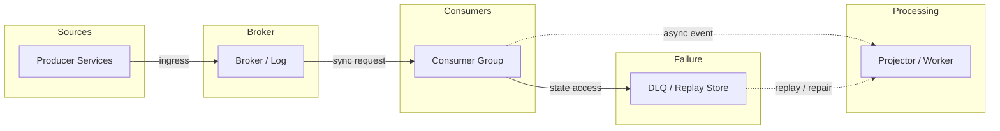
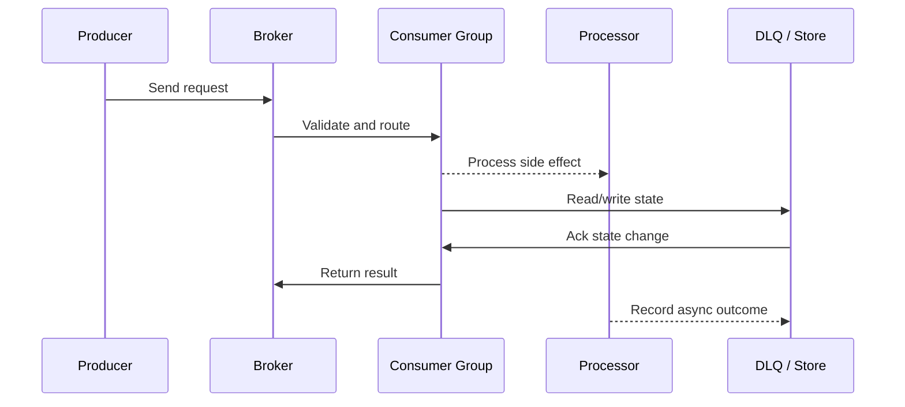

# Messaging Patterns - Queue, Pub/Sub, Outbox & Dead Letter

Source: `src/modules/topics/sysdesign/sd-messaging-patterns.js`
Tag: `Messaging`
Doc path: `docs/system-design/sd-messaging-patterns.md`

## Concept
**Point-to-point queue:** Message goes to exactly one consumer. Work queue pattern. RabbitMQ/SQS.
**Pub/sub:** Publisher sends to topic; all subscribers receive a copy. SNS, Kafka consumer groups, Redis pub/sub.

**Delivery guarantees:**
- **At-most-once** - fire and forget. No ack, no retry. May lose messages. Best throughput.
- **At-least-once** - ack required; on failure retry. May duplicate. Consumer must be idempotent.
- **Exactly-once** - idempotent producer + transactional consumer. Kafka EOS, SQS FIFO + deduplication ID.

**Outbox pattern** - solve dual-write problem (DB + message broker in one atomic operation):
1. Write event to `outbox` table in same DB transaction as business data
2. Background process (Debezium CDC or polling) reads outbox table and publishes to broker
3. On success, mark outbox row as processed

**Dead Letter Queue (DLQ):**
Messages that fail after N retries are moved to a DLQ. Allows inspection, replay, and alerting without blocking the main queue.

**Fan-out pattern (SNS + SQS):**
SNS topic -> multiple SQS queues. Each queue serves a different downstream service. Fully decoupled.

**Competing consumers:** Multiple workers read from one queue. Throughput scales horizontally. Auto-scaling based on queue depth (SQS + Lambda / ECS).

## Production Architecture
Messaging is the glue of distributed systems. Understanding delivery guarantees and the outbox pattern is critical for building correct async services.

## Architecture Checklist
- Sources / Producer Services: Publish domain events with idempotency keys and schema versions.
- Broker / Broker / Log: Stores ordered partitions, applies retention, and isolates producer from consumers.
- Consumers / Consumer Group: Scales by partition or queue concurrency and commits progress after processing.
- Processing / Projector / Worker: Updates read models, calls downstream services, and retries transient failures.
- Failure / DLQ / Replay Store: Captures failed messages with reason, payload, and replay controls.

## Mermaid Architecture

## UML Sequence

## Animation Plan
Interactive app sections for this concept:

- Flow lab: highlights request path step by step.
- UML sequence simulation: animates actor-to-actor messages.
- Architecture map: clickable nodes and sync/async links.
- Canvas visual: existing topic-specific live diagram remains available in app.

Flow steps:

1. Atomic DB write - Order + OutboxEvent written in one DB transaction. No dual-write risk.
2. CDC captures change - Debezium reads PostgreSQL WAL (logical replication). Detects new outbox row.
3. Publish to Kafka - Debezium publishes event to Kafka topic. Reliable - Kafka is durable.
4. Consumer reads event - Inventory consumer reads OrderCreated. Checks idempotency key. Reserves stock.
5. On failure -> DLQ - If consumer fails after 3 retries, message moved to DLQ for inspection and manual replay.

## Interview Drills
1. How would you design a notification system for 100M users?
   1. **Event bus:** User actions publish events to Kafka topic `user.events`
   2. **Notification service:** Kafka consumer group reads events, applies notification rules (preferences, quiet hours, dedup)
   3. **Fan-out to channels:** SNS topic per channel type -> SQS queues for push (FCM/APNs), email (SES), SMS (Twilio)
   4. **Workers per channel:** ECS/Lambda workers drain queues, call third-party APIs with retry + DLQ
   5. **Rate limiting:** Per-user rate limits to avoid notification spam (Redis sorted set sliding window)
   6. **Deduplication:** Notification ID stored in Redis/DB; skip if already sent within dedup window
   
   **Scale:** Kafka can handle 10M events/s. Each SQS queue auto-scales workers. At 100M users, push notifications batch via FCM's batch API (1000/request).
   Follow-ups: How do you handle FCM/APNs delivery failures?; How would you implement quiet hours per timezone?

## Trade-offs
Pros:
- Decouples services - producer and consumer evolve independently
- Async processing improves throughput
- DLQ prevents poisoned messages from blocking processing

Cons:
- Eventual consistency - consumer may lag
- At-least-once requires idempotent consumers
- Debugging async flows is harder than synchronous

When to use:
Use async messaging for: notifications, email, audit logs, inter-service events, workflow orchestration. Keep synchronous for: payment confirmation, inventory reservation (need immediate response).

## Gotchas
_No gotchas yet._

