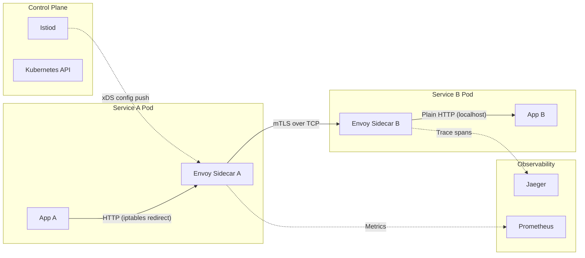
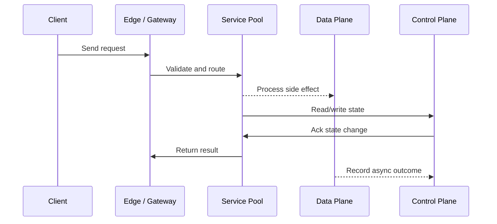

# Reverse Proxy, Service Mesh & Sidecar Pattern

## Quick Facts
- Area: System Design
- Tag: Infrastructure
- Source: `src/modules/topics/sysdesign/sd-proxies-mesh.js`
- Tags: `reverse proxy`, `service mesh`, `istio`, `linkerd`, `envoy`, `sidecar`, `mtls`, `xds`
- Visual coverage: live visual, flow lab, UML lab, architecture map

## Concept
**Reverse proxy:** sits between clients and servers; clients talk to the proxy, not directly to servers. Provides: load balancing, SSL termination, caching, compression, DDoS mitigation.

**Forward proxy:** sits between client and internet; client explicitly uses it (VPN, corporate firewall). Clients know they're going through a proxy.

**Service mesh:** a dedicated infrastructure layer for service-to-service communication. Implemented as **sidecar proxies** co-located with every service instance.

**Sidecar pattern:**
```
[Service Pod]
   App container (your code)
   Envoy sidecar (auto-injected by Istio)
          mTLS between all services
          Distributed tracing (Jaeger headers)
          Circuit breaking
          Retries + timeouts
          Traffic shaping (canary, A/B)
          Telemetry (metrics to Prometheus)
```

**Control plane vs data plane:**
- **Data plane** - Envoy sidecars; handle actual traffic
- **Control plane** - Istiod; pushes config to sidecars via xDS API (no restart needed)

**Popular service meshes:** Istio (Envoy), Linkerd (micro-proxy, Rust), Consul Connect, AWS App Mesh.

## Why It Matters
At 50+ microservices, implementing mTLS and observability per-service is untenable. Service mesh moves this to infrastructure, giving you a uniform security and observability baseline for free.

## Architecture / Mental Model


## Runtime / Sequence


## Animation Plan
- Flow lab available: step-by-step path highlighting.
- UML sequence simulation available: actor messages animate in order.
- Architecture map available: clickable nodes and sync/async links.
- Live visual exists in app: topic-specific canvas/ReactViz animation.

Flow steps:

1. Enter system - Request crosses trust boundary and gets normalized before core handling.
2. Execute core path - Gateway routes to owning capability with timeout, auth context, and trace id.
3. Offload slow work - Async path absorbs retries, fanout, indexing, notifications, or heavy processing.
4. Persist state - System writes durable state, cache entries, offsets, or audit evidence.
5. Return or recover - Response returns when sync work succeeds; failure path uses retry, fallback, or replay.

## Example
```yaml
# Istio VirtualService - traffic splitting for canary deploy
apiVersion: networking.istio.io/v1alpha3
kind: VirtualService
metadata:
  name: order-service
spec:
  hosts: ["order-service"]
  http:
    - match:
        - headers:
            x-canary:
              exact: "true"
      route:
        - destination:
            host: order-service
            subset: v2          # canary: 100% of x-canary traffic
    - route:
        - destination:
            host: order-service
            subset: v1
          weight: 95            # stable: 95%
        - destination:
            host: order-service
            subset: v2
          weight: 5             # canary: 5% of baseline traffic

---
apiVersion: networking.istio.io/v1alpha3
kind: DestinationRule
metadata:
  name: order-service
spec:
  host: order-service
  trafficPolicy:
    connectionPool:
      tcp:
        maxConnections: 100
    outlierDetection:
      consecutive5xxErrors: 5
      interval: 30s
      baseEjectionTime: 30s    # circuit breaker at mesh level
  subsets:
    - name: v1
      labels: { version: v1 }
    - name: v2
      labels: { version: v2 }
```

Notes:
DestinationRule outlierDetection is a mesh-level circuit breaker - automatically ejects hosts returning 5xx errors.

## Complexity And Performance
- Time/space complexity depends on input size, data volume, and implementation choices.
- Track latency, throughput, memory, saturation, error rate, and correctness invariants.

## Interview Drills
1. What problems does a service mesh solve that an API gateway doesn't?
   Answer: API Gateway handles **north-south** traffic (client -> cluster). Service mesh handles **east-west** traffic (service -> service).
   
   Service mesh provides:
   - **mTLS everywhere** - all internal traffic encrypted and mutually authenticated without code changes
   - **Uniform observability** - traces/metrics for every internal call, not just edge
   - **Traffic policies** - retries, timeouts, circuit breaking at infra level
   - **Zero-trust networking** - services can only call what their policy allows
   
   You typically need both: API Gateway for the edge, service mesh for internal communication.
   Follow-ups: What is mTLS and how does it differ from regular TLS?; How does Istio inject sidecars automatically?

## Trade-offs
Pros:
- Uniform mTLS without app code changes
- Traffic shaping (canary, A/B) without redeployments
- Centralized observability for all service calls

Cons:
- Sidecar adds ~10ms latency + ~50MB RAM per pod
- Complex control plane (Istio is notorious for steep learning curve)
- Debug difficulty - two network hops instead of one

When to use:
Use service mesh at 20+ microservices or when compliance requires encrypted internal traffic. For simpler setups, use direct service calls with app-level circuit breaking (Resilience4j, go-resilience).

## Gotchas
_No gotchas configured._

