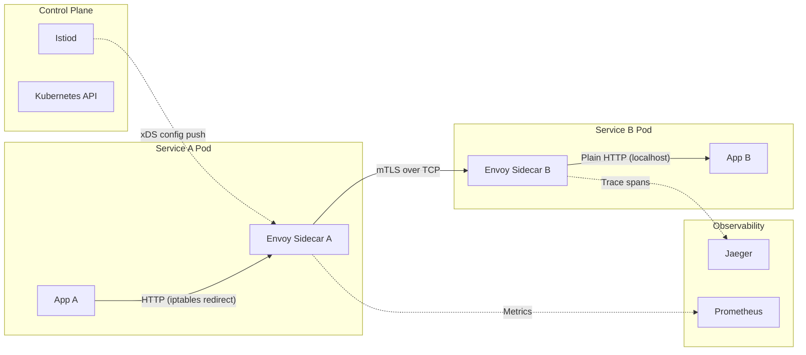
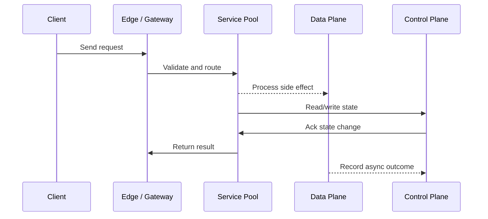

# Reverse Proxy, Service Mesh & Sidecar Pattern

Source: `src/modules/topics/sysdesign/sd-proxies-mesh.js`
Tag: `Infrastructure`
Doc path: `docs/system-design/sd-proxies-mesh.md`

## Concept
**Reverse proxy:** sits between clients and servers; clients talk to the proxy, not directly to servers. Provides: load balancing, SSL termination, caching, compression, DDoS mitigation.

**Forward proxy:** sits between client and internet; client explicitly uses it (VPN, corporate firewall). Clients know they're going through a proxy.

**Service mesh:** a dedicated infrastructure layer for service-to-service communication. Implemented as **sidecar proxies** co-located with every service instance.

**Sidecar pattern:**
```
[Service Pod]
   App container (your code)
   Envoy sidecar (auto-injected by Istio)
          mTLS between all services
          Distributed tracing (Jaeger headers)
          Circuit breaking
          Retries + timeouts
          Traffic shaping (canary, A/B)
          Telemetry (metrics to Prometheus)
```

**Control plane vs data plane:**
- **Data plane** - Envoy sidecars; handle actual traffic
- **Control plane** - Istiod; pushes config to sidecars via xDS API (no restart needed)

**Popular service meshes:** Istio (Envoy), Linkerd (micro-proxy, Rust), Consul Connect, AWS App Mesh.

## Production Architecture
At 50+ microservices, implementing mTLS and observability per-service is untenable. Service mesh moves this to infrastructure, giving you a uniform security and observability baseline for free.

## Architecture Checklist
- Control Plane / Istiod: Istiod is the Istio control plane. It pushes Envoy configuration (routes, clusters, listeners) to all sidecars via xDS API. No traffic flows through it.
- Control Plane / Kubernetes API: Istiod watches K8s Service and Endpoint resources to build its service registry.
- Service A Pod / App A: Makes an outbound call to Service B. Doesn't know about mTLS or retries - Envoy handles it transparently.
- Service A Pod / Envoy Sidecar A: Envoy iptables rules redirect all traffic through sidecar. Adds mTLS, traces, retries before forwarding.
- Service B Pod / Envoy Sidecar B: Receives mTLS connection from Envoy A. Verifies certificate, decrypts, forwards to App B on localhost.
- Service B Pod / App B: App B sees plain HTTP on localhost - no TLS handling required in application code.
- Observability / Prometheus: Each Envoy sidecar exposes /metrics. Prometheus scrapes all sidecars for RED metrics (Rate, Errors, Duration).
- Observability / Jaeger: Envoy propagates trace headers (B3/W3C). Jaeger collects and visualizes end-to-end request traces.

## Mermaid Architecture


## UML Sequence


## Animation Plan
Interactive app sections for this concept:

- Flow lab: highlights request path step by step.
- UML sequence simulation: animates actor-to-actor messages.
- Architecture map: clickable nodes and sync/async links.
- Canvas visual: existing topic-specific live diagram remains available in app.

Flow steps:

1. Enter system - Request crosses trust boundary and gets normalized before core handling.
2. Execute core path - Gateway routes to owning capability with timeout, auth context, and trace id.
3. Offload slow work - Async path absorbs retries, fanout, indexing, notifications, or heavy processing.
4. Persist state - System writes durable state, cache entries, offsets, or audit evidence.
5. Return or recover - Response returns when sync work succeeds; failure path uses retry, fallback, or replay.

## Interview Drills
1. What problems does a service mesh solve that an API gateway doesn't?
   API Gateway handles **north-south** traffic (client -> cluster). Service mesh handles **east-west** traffic (service -> service).
   
   Service mesh provides:
   - **mTLS everywhere** - all internal traffic encrypted and mutually authenticated without code changes
   - **Uniform observability** - traces/metrics for every internal call, not just edge
   - **Traffic policies** - retries, timeouts, circuit breaking at infra level
   - **Zero-trust networking** - services can only call what their policy allows
   
   You typically need both: API Gateway for the edge, service mesh for internal communication.
   Follow-ups: What is mTLS and how does it differ from regular TLS?; How does Istio inject sidecars automatically?

## Trade-offs
Pros:
- Uniform mTLS without app code changes
- Traffic shaping (canary, A/B) without redeployments
- Centralized observability for all service calls

Cons:
- Sidecar adds ~10ms latency + ~50MB RAM per pod
- Complex control plane (Istio is notorious for steep learning curve)
- Debug difficulty - two network hops instead of one

When to use:
Use service mesh at 20+ microservices or when compliance requires encrypted internal traffic. For simpler setups, use direct service calls with app-level circuit breaking (Resilience4j, go-resilience).

## Gotchas
_No gotchas yet._

