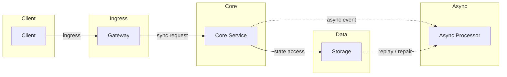
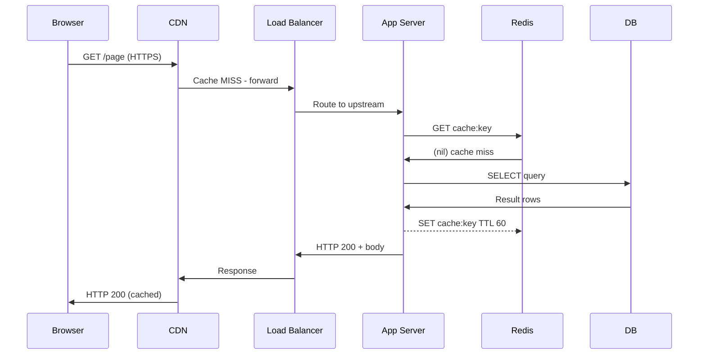

# Full Request Lifecycle: Browser -> Server -> DB

## Quick Facts
- Area: System Design
- Tag: Networking
- Source: `src/modules/topics/sysdesign/sd-request-lifecycle.js`
- Tags: `dns`, `tcp`, `tls`, `http`, `request lifecycle`, `networking`
- Visual coverage: live visual, flow lab, UML lab, architecture map

## Concept
When a user types a URL and hits Enter, at least **12 distinct steps** happen before pixels appear.

**Layer breakdown:**
- **DNS resolution** - recursive lookup: browser cache -> OS cache -> resolver -> root -> TLD -> authoritative
- **TCP 3-way handshake** - SYN -> SYN-ACK -> ACK (adds ~1 RTT)
- **TLS 1.3 handshake** - 1 RTT (vs TLS 1.2's 2 RTT); negotiates cipher suite, exchanges certs
- **HTTP request** - verb + path + headers + optional body sent over the established connection
- **CDN/proxy interception** - edge PoP may serve cached response before reaching origin
- **Load balancer** - L7 terminates TLS, routes to healthy upstream by algorithm
- **App server** - framework parses request, runs middleware chain, hits service layer
- **Cache check** - Redis/Memcached checked before DB
- **DB query** - index scan -> row fetch -> result set
- **Response path** - JSON serialized -> compressed (gzip/br) -> chunked transfer -> rendered

**Key latency contributors:** DNS (~20-120ms first time), TCP+TLS (~60-150ms), TTFB, DB query time.

## Why It Matters
Every senior interview starts here. Knowing the full path lets you pinpoint bottlenecks at any layer and propose targeted optimisations (pre-connect, HTTP/2 push, connection pooling, read replicas, CDN caching).

## Architecture / Mental Model


## Runtime / Sequence


## Animation Plan
- Flow lab available: step-by-step path highlighting.
- UML sequence simulation available: actor messages animate in order.
- Architecture map available: clickable nodes and sync/async links.
- Live visual exists in app: topic-specific canvas/ReactViz animation.

Flow steps:

1. DNS Resolution - Browser resolves hostname -> IP via recursive DNS. Cached for TTL (often 60-300 s).
2. TCP + TLS to CDN - Browser opens TCP connection to CDN edge IP; TLS 1.3 handshake completes in 1 RTT.
3. CDN Cache Miss -> Origin - If CDN has no cached response it forwards to origin load balancer.
4. LB routes to App Server - L7 LB picks upstream by algorithm (least-conn / round-robin), forwards HTTP/2.
5. Cache-aside read - App checks Redis for cached result. HIT returns immediately (< 1 ms).
6. Cache miss -> DB query - On cache miss, app queries primary DB. Result is written back to cache.
7. Response flows back - DB -> App -> LB -> CDN (cached for next caller) -> Browser. Compressed JSON rendered.

## Example
```go
// Minimal Go HTTP server - shows what happens on the server side
package main

import (
    "encoding/json"
    "log"
    "net/http"
    "time"
)

type Response struct {
    Message   string    `json:"message"`
    Timestamp time.Time `json:"ts"`
}

func handler(w http.ResponseWriter, r *http.Request) {
    // middleware: auth, rate-limit, tracing would wrap here
    w.Header().Set("Content-Type", "application/json")
    w.Header().Set("Cache-Control", "public, max-age=30")
    json.NewEncoder(w).Encode(Response{
        Message:   "ok",
        Timestamp: time.Now(),
    })
}

func main() {
    mux := http.NewServeMux()
    mux.HandleFunc("/api/data", handler)
    srv := &http.Server{
        Addr:         ":8080",
        Handler:      mux,
        ReadTimeout:  5 * time.Second,
        WriteTimeout: 10 * time.Second,
        IdleTimeout:  120 * time.Second,
    }
    log.Fatal(srv.ListenAndServe())
}
```

Notes:
Timeouts on every server are non-negotiable - missing them causes Goroutine/thread leaks under slow-client attacks.

## Complexity And Performance
- Time/space complexity depends on input size, data volume, and implementation choices.
- Track latency, throughput, memory, saturation, error rate, and correctness invariants.

## Interview Drills
1. Walk me through what happens when a user types https://example.com in a browser.
   Answer: 1. Browser checks DNS cache (TTL-based). If miss -> OS resolver -> recursive DNS -> root -> TLD -> authoritative. Returns IP.
   2. TCP SYN to IP:443. Server SYN-ACK. Client ACK.
   3. TLS 1.3 handshake - 1 RTT. Certificate verified, session keys derived.
   4. HTTP/2 GET / sent multiplexed on single connection.
   5. CDN edge may respond from cache (HIT) - no origin contact.
   6. On MISS: LB receives, TLS terminates, picks upstream (round-robin / least-conn).
   7. App server runs middleware (auth JWT, rate-limit), controller, service, cache-aside check.
   8. Cache miss -> DB query -> result cached -> response serialised -> gzip compressed.
   9. HTTP 200 with headers (ETag, Cache-Control, Content-Encoding).
   10. Browser renders - parse HTML, fetch sub-resources (CSS/JS/images), execute JS.
   Follow-ups: What is TTFB and how do you reduce it?; How does HTTP/2 multiplexing reduce latency vs HTTP/1.1?; What happens during a TLS resumption?

2. How would you reduce page load time from 3 s to under 1 s?
   Answer: - **CDN** closer edge PoPs -> reduces DNS + TCP RTT
   - **HTTP/2 or HTTP/3** -> multiplexing, header compression, 0-RTT (QUIC)
   - **Pre-connect / DNS prefetch** link hints in HTML head
   - **Cache-Control** headers -> browser & CDN cache static assets
   - **DB read replicas + Redis** -> cut TTFB by removing DB hot-path
   - **Gzip/Brotli** compression -> smaller payloads
   - **Lazy-load** below-fold images, code-split JS bundles
   Follow-ups: What is the critical rendering path?; When would you use server-sent events vs WebSockets?

## Trade-offs
Pros:
- Full understanding enables precise bottleneck identification
- Layered model - each layer independently optimisable

Cons:
- Each added layer (LB, CDN, cache) adds operational complexity
- Distributed caching introduces consistency challenges

When to use:
Use this mental model in every system-design session as the starting framework.

## Gotchas
_No gotchas configured._

