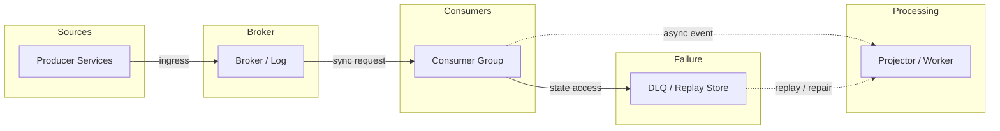
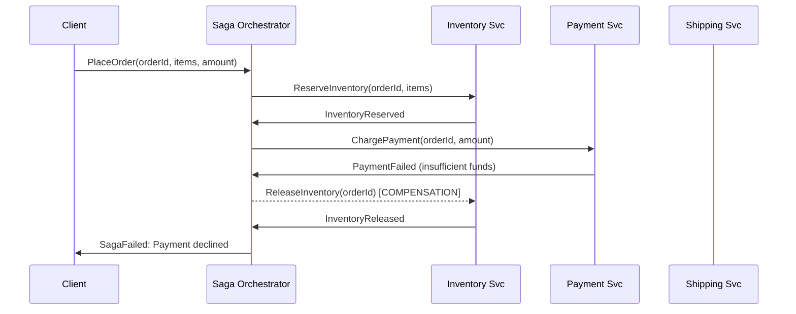

# Saga Pattern - Distributed Transactions Without 2PC

Source: `src/modules/topics/sysdesign/sd-saga-patterns.js`
Tag: `Architecture`
Doc path: `docs/system-design/sd-saga-patterns.md`

## Concept
**The problem:** When an operation spans multiple microservices (order placement = create order + reserve inventory + charge payment), you need atomicity - but each service has its own DB, so traditional 2PC is impractical.

**2PC problems:** Coordinator is a single point of failure; all participants must be synchronously available; holds locks during prepare phase (deadly for performance).

**Saga pattern:** Break the distributed transaction into a sequence of local transactions. Each step publishes an event. If a step fails, execute **compensating transactions** to undo previous steps.

**Choreography saga:** Services react to events from each other. No central coordinator.
- Pros: simple, no SPOF, loose coupling
- Cons: hard to track workflow state, circular dependencies, hard to debug

**Orchestration saga:** A central **Saga Orchestrator** coordinates the sequence, calls each service, and manages compensation on failure.
- Pros: workflow visible in one place, easier to add steps, centralized error handling
- Cons: orchestrator can become a bottleneck, extra service to deploy

**Compensation example (order cancellation):**
```
Forward:      CreateOrder -> ReserveInventory -> ChargePayment -> ShipOrder
Compensation: CancelOrder <- ReleaseInventory <- RefundPayment <- CancelShipment
```

**Idempotency:** Each step must be idempotent - retrying a compensating transaction must be safe.

## Production Architecture
Saga is the go-to pattern for distributed transactions in microservices. Every e-commerce, fintech, and logistics system uses it. Understanding choreography vs orchestration trade-offs is a senior-level expectation.

## Architecture Checklist
- Sources / Producer Services: Publish domain events with idempotency keys and schema versions.
- Broker / Broker / Log: Stores ordered partitions, applies retention, and isolates producer from consumers.
- Consumers / Consumer Group: Scales by partition or queue concurrency and commits progress after processing.
- Processing / Projector / Worker: Updates read models, calls downstream services, and retries transient failures.
- Failure / DLQ / Replay Store: Captures failed messages with reason, payload, and replay controls.

## Mermaid Architecture


## UML Sequence


## Animation Plan
Interactive app sections for this concept:

- Flow lab: highlights request path step by step.
- UML sequence simulation: animates actor-to-actor messages.
- Architecture map: clickable nodes and sync/async links.
- Canvas visual: existing topic-specific live diagram remains available in app.

Flow steps:

1. Enter system - Request crosses trust boundary and gets normalized before core handling.
2. Execute core path - Gateway routes to owning capability with timeout, auth context, and trace id.
3. Offload slow work - Async path absorbs retries, fanout, indexing, notifications, or heavy processing.
4. Persist state - System writes durable state, cache entries, offsets, or audit evidence.
5. Return or recover - Response returns when sync work succeeds; failure path uses retry, fallback, or replay.

## Interview Drills
1. When would you choose choreography saga over orchestration saga?
   **Choreography:** Each service listens for events and decides what to do next.
   - Choose when: few steps (2-3), loose coupling priority, team autonomy important, simple linear flow
   - Problem: as steps grow, workflow becomes a distributed state machine spread across services - hard to understand and debug. "What is the current state of order 42?" requires querying all services.
   
   **Orchestration:** Central orchestrator controls the flow.
   - Choose when: complex workflows (5+ steps), need centralized monitoring and visibility, conditional logic needed, team wants explicit failure handling
   - Problem: orchestrator knows about all services - creates coupling. Must be deployed and operated.
   
   **Hybrid:** Use orchestration for complex workflows but keep services autonomous (they don't know they're in a saga - just respond to commands).
   Follow-ups: How do you handle retries in a saga when a step fails intermittently?; What is the difference between a saga and a workflow engine (Temporal)?

## Trade-offs
Pros:
- Achieves distributed atomicity without distributed locks
- Each service owns its local transaction
- Compensations are business-meaningful operations (not technical rollbacks)

Cons:
- Eventual consistency - order may be visible as partially created during saga
- Compensation logic must be carefully designed for every failure scenario
- Debugging failures across services is hard

When to use:
Use when you need atomicity across services that own different databases. For read-heavy flows, prefer eventual consistency with idempotent consumers instead.

## Gotchas
_No gotchas yet._

