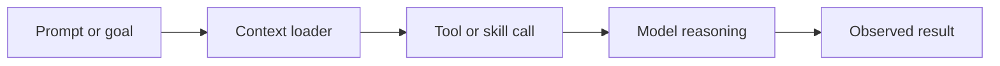
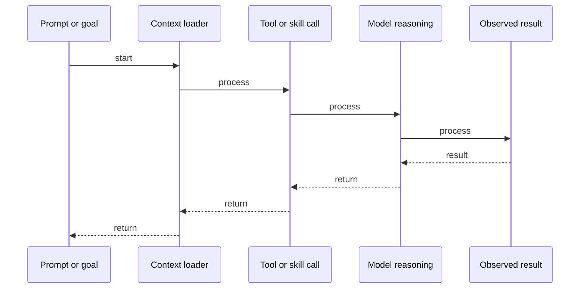

# MCP: Model Context Protocol

## Quick Facts
- Area: AI Agents
- Tag: Protocol
- Source: `src/modules/topics/agents/agent-mcp-protocol.js`
- Tags: `mcp`, `anthropic`, `context`, `protocol`, `interoperability`
- Visual coverage: generated diagrams only

## Concept
**Model Context Protocol (MCP)** is an open standard that enables AI models to connect seamlessly to data sources and tools. 
- **MCP Servers**: Expose resources (files, DBs) and tools (APIs, functions).
- **MCP Clients**: (like IDEs or Agents) consume these servers.
It standardizes how context is fetched, allowing one "Skill" to work across different AI models (Claude, GPT, Gemini). It's essentially "USB for AI models".

## Why It Matters
Before MCP, every integration was custom (e.g., a specific plugin for ChatGPT). MCP allows developers to build a **capability once** and use it everywhere. It solves the "context fragmentation" problem in agentic workflows. For SDEs, it's the standard for building "pluggable" AI features.

## Architecture / Mental Model


## Runtime / Sequence


## Animation Plan
- Flow lab can use generated mental model steps above.
- UML sequence can use generated sequence diagram above.
- Architecture map can use generated area mental model above.

Flow steps:

1. Prompt or goal
2. Context loader
3. Tool or skill call
4. Model reasoning
5. Observed result

## Example
```javascript
// Example MCP Server (Conceptual)
import { McpServer } from "@modelcontextprotocol/sdk";

const server = new McpServer({
  name: "StudyLabTools",
  version: "1.0.0"
});

// Register a "Tool" (Skill)
server.tool(
  "search_java_topics",
  { query: "string" },
  async ({ query }) => {
    const results = await db.search(query);
    return {
      content: [{ type: "text", text: JSON.stringify(results) }]
    };
  }
);

// MCP clients can now 'discover' and 'call' this tool
server.start();
```

Notes:
MCP is heavily used in IDEs like **Cursor** or **Windsurf** to give the AI access to the filesystem and terminal in a standardized way.

## Complexity And Performance
- Time/space complexity depends on input size, data volume, and implementation choices.
- Track latency, throughput, memory, saturation, error rate, and correctness invariants.

## Interview Drills
1. How does MCP differ from traditional REST APIs?
   Answer: REST is for human-to-machine or machine-to-machine. **MCP** is optimized for **machine-to-model**. It includes metadata specifically for LLMs: descriptions of tools, resource schemas, and structured prompts. It's a higher-level abstraction that encompasses discovery, context fetching, and tool execution in one protocol.
   Follow-ups: What are 'Resources' in MCP?; How do 'Prompts' work as a feature in MCP?

## Trade-offs
Pros:
- Interoperability: build once, use across multiple AI models.
- Standardized discovery: agents can 'browse' available skills.
- Security: standard ways to handle permissions and auth.

Cons:
- New standard, ecosystem still maturing.
- Adds another layer of abstraction/latency.
- Requires specific SDK support in the client.

When to use:
Use **MCP** when building tools that need to be shared across different AI clients or when building a platform that hosts many pluggable AI capabilities.

## Gotchas
_No gotchas configured._

