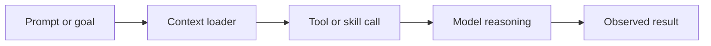
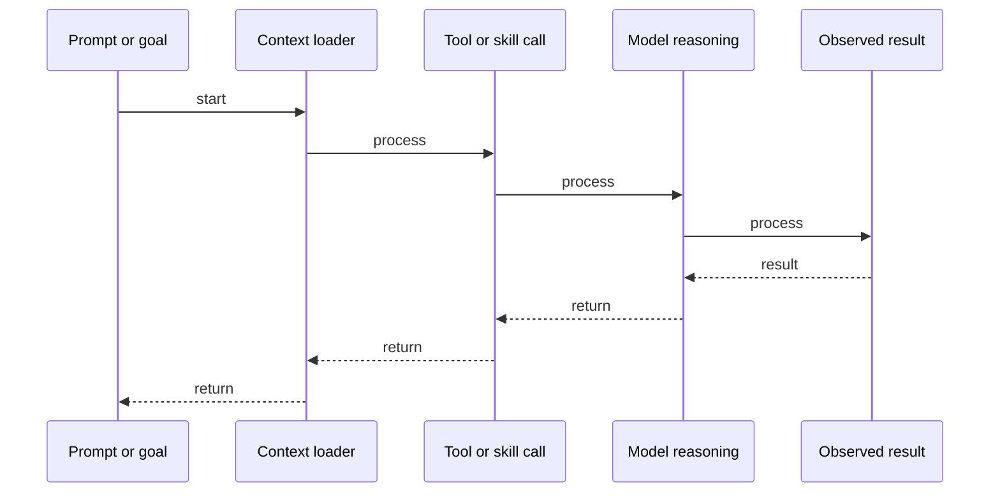

# Agent Reasoning: ReAct Pattern (Reason + Act)

## Quick Facts
- Area: AI Agents
- Tag: Reasoning
- Source: `src/modules/topics/agents/agent-reasoning-react.js`
- Tags: `agent`, `react`, `llm`, `reasoning`, `chain of thought`
- Visual coverage: generated diagrams only

## Concept
The **ReAct** (Reason + Act) pattern is the foundation of modern autonomous agents. It combines:
- **Reasoning**: The LLM generates a "Thought" describing what it needs to do.
- **Acting**: The LLM selects a "Tool" to execute based on the thought.
- **Observing**: The result of the action is fed back into the prompt as an "Observation".
The loop repeats until the LLM decides it has the final answer. This prevents the LLM from "hallucinating" facts by forcing it to verify information via tools.

## Why It Matters
LLMs are excellent at language but lack real-time data or computational precision. ReAct allows them to **interact with the world** (search, APIs, databases). It turns a "static" model into a "dynamic" problem solver. For Senior SDEs, understanding the control loop of an agent is key to building reliable AI systems.

## Architecture / Mental Model


## Runtime / Sequence


## Animation Plan
- Flow lab can use generated mental model steps above.
- UML sequence can use generated sequence diagram above.
- Architecture map can use generated area mental model above.

Flow steps:

1. Prompt or goal
2. Context loader
3. Tool or skill call
4. Model reasoning
5. Observed result

## Example
```python
# Simplified ReAct Loop in Python
import json

class Agent:
    def __init__(self, model, tools):
        self.model = model
        self.tools = tools

    def run(self, task):
        history = [f"Task: {task}"]
        for _ in range(5):  # Max 5 iterations
            prompt = "
".join(history) + "
Thought:"
            response = self.model.generate(prompt) # "Thought: ... Action: {tool: 'X', input: 'Y'}"
            
            thought, action = self.parse_response(response)
            print(f"Agent Thought: {thought}")
            
            if not action:
                return thought # Final Answer

            # Execute Tool
            tool_name = action['tool']
            tool_input = action['input']
            observation = self.tools[tool_name](tool_input)
            
            print(f"Action: {tool_name}({tool_input}) -> {observation}")
            history.append(f"Thought: {thought}
Action: {json.dumps(action)}
Observation: {observation}")

# Example Tool
def get_weather(city):
    return "22C, Partly Cloudy"

agent = Agent(model_stub, {"get_weather": get_weather})
agent.run("What is the weather in London?")
```

Notes:
In production, use frameworks like **LangChain**, **CrewAI**, or **AutoGPT** which provide robust ReAct implementations and error handling for malformed actions.

## Complexity And Performance
- Time/space complexity depends on input size, data volume, and implementation choices.
- Track latency, throughput, memory, saturation, error rate, and correctness invariants.

## Interview Drills
1. How do you prevent an agent from getting into an infinite loop?
   Answer: 1. **Max Iterations**: Hard limit on the number of ReAct loops (e.g., 5-10). 
   2. **Context Window Management**: As history grows, old observations must be summarized or truncated to stay within token limits. 
   3. **Loop Detection**: Check if the agent is repeating the same Thought/Action pair and inject a "System Message" to nudge it towards a different path.
   Follow-ups: What is the cost implication of long ReAct loops?; How does self-correction work in agents?

## Trade-offs
Pros:
- Grounds LLM responses in real-world data (Observation).
- Transparent reasoning process (Thought) for debugging.
- Modular: tools can be added or removed without retraining.

Cons:
- Higher latency due to multiple LLM calls.
- Token usage increases with every loop iteration.
- Fragile: Malformed tool outputs can break the reasoning chain.

When to use:
Use **ReAct** when the task requires multi-step logic and external data. Use simple **Zero-Shot** prompting if the task is purely linguistic or the data is already in context.

## Gotchas
_No gotchas configured._

