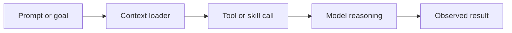
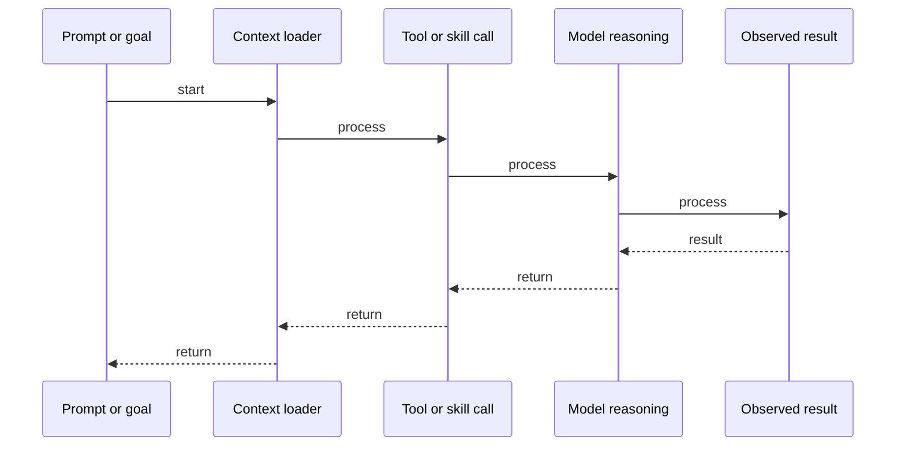

# Skills & Tool Definition

## Quick Facts

- Area: AI Agents
- Tag: Skills
- Source: `src/modules/topics/agents/agent-skills-tools.js`
- Tags: `skills`, `function calling`, `tool definition`, `json schema`
- Visual coverage: generated diagrams only

## Concept

**Skills** (or Tools) are functions provided to an LLM. A skill definition usually includes:

- **Name**: Unique identifier.
- **Description**: Highly detailed text explaining _when_ and _how_ to use the tool.
- **Parameters**: JSON Schema defining the expected inputs.
  The LLM doesn't "run" the code; it generates a **Structured Call** (JSON) which the system then executes.

## Why It Matters

The **Description** is the most important part of a skill. If the description is vague, the LLM will misapply the tool. Senior SDEs must treat Tool Definitions as "Prompt Engineering for Functions". Well-defined skills make agents reliable and predictable.

## Architecture / Mental Model



## Runtime / Sequence



## Animation Plan

- Flow lab can use generated mental model steps above.
- UML sequence can use generated sequence diagram above.
- Architecture map can use generated area mental model above.

Flow steps:

1. Prompt or goal
2. Context loader
3. Tool or skill call
4. Model reasoning
5. Observed result

## Example

```javascript
// Skill Definition for an LLM
const SEARCH_SKILL = {
  name: "search_knowledge_base",
  description:
    "Search the study lab for topics related to Java, Go, or Python. Use this when the user asks for concepts, interview questions, or code examples.",
  parameters: {
    type: "object",
    properties: {
      topic: {
        type: "string",
        description: "The main topic to search for (e.g., 'Garbage Collection').",
      },
      limit: {
        type: "number",
        description: "Max results to return.",
        default: 3,
      },
    },
    required: ["topic"],
  },
};

// Response from LLM when it wants to use this skill:
// { "tool": "search_knowledge_base", "parameters": { "topic": "JVM", "limit": 5 } }
```

Notes:
Always include 'examples' in the parameter descriptions to help the LLM understand the expected format of inputs (e.g., date formats, ID types).

## Complexity And Performance

- Time/space complexity depends on input size, data volume, and implementation choices.
- Track latency, throughput, memory, saturation, error rate, and correctness invariants.

## Interview Drills

1. What is 'Tool Fatigue' in agents?
   Answer: **Tool Fatigue** occurs when an agent is provided with too many tools (e.g., 50+). The LLM's performance degrades: it gets confused about which tool to pick, hallucinate tool names, or forgets to use tools entirely. **Solution**: Use 'Tool Discovery' or group tools into 'Skillsets' that are injected into the prompt only when relevant.
   Follow-ups: How do you handle tool execution errors?; What is 'Self-Healing' tool calling?

## Trade-offs

Pros:

- Extends LLM capabilities infinitely.
- Allows for strict input validation via JSON Schema.
- Enables clear separation of concerns: LLM plans, Code executes.

Cons:

- Depends heavily on the quality of the 'Description'.
- LLMs can still 'hallucinate' tool calls if the prompt is weak.
- Complexity in managing tool dependencies and auth.

When to use:
Use **Function Calling** (Skills) whenever the LLM needs to interact with an external system, perform a calculation, or access private data.

## Gotchas

Watch for edge cases, assumptions, and hidden performance costs that can make this topic fail in production if handled incorrectly.
