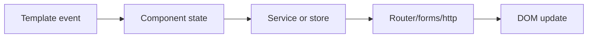
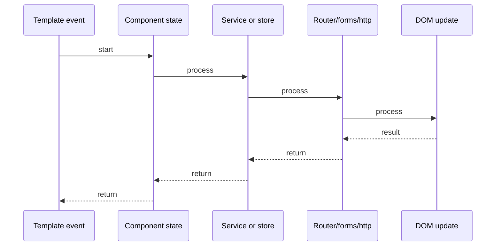

# Angular Change Detection

## Quick Facts

- Area: Angular
- Tag: Performance
- Source: `src/modules/topics/angular/ng-change-detection.js`
- Tags: `angular`, `change-detection`, `zonejs`, `onpush`, `zone`, `performance`
- Visual coverage: live visual

## Concept

Angular's **Change Detection (CD)** is the mechanism that synchronizes component state with the DOM.

**Zone.js** monkey-patches all async APIs (setTimeout, Promises, XHR, Events). When any async task completes, Zone.js notifies Angular -> CD cycle runs.

**Two CD Strategies:**

**Default (CheckAlways):** Every CD cycle checks EVERY component top-down, regardless of whether their inputs changed. Safe but expensive with large trees.

**OnPush:** Angular only checks a component when:

1. An @Input() reference changes (not deep equality)
2. An event originates inside the component
3. An Observable via `async` pipe emits
4. `ChangeDetectorRef.markForCheck()` called manually

**CD Cycle steps:**

1. Zone.js detects async event
2. Angular enters CD from root
3. Each component: check inputs -> run template expression -> update DOM
4. Repeat down the tree (Default) OR skip unchanged OnPush subtrees

**ChangeDetectorRef API:**

- `markForCheck()` - marks OnPush component as dirty (check it this cycle)
- `detectChanges()` - run CD for this component + children immediately
- `detach()` - remove from CD tree entirely (manual control)
- `reattach()` - add back to CD tree

## Why It Matters

OnPush is the #1 Angular performance optimization. With Default CD, a 200-component tree gets fully checked on every click. OnPush reduces that to only changed subtrees. Combined with immutable data and async pipe, it eliminates most unnecessary DOM checks.

## Architecture / Mental Model



## Runtime / Sequence



## Animation Plan

- Flow lab can use generated mental model steps above.
- UML sequence can use generated sequence diagram above.
- Architecture map can use generated area mental model above.
- Live visual exists in app: topic-specific canvas/ReactViz animation.

Flow steps:

1. Template event
2. Component state
3. Service or store
4. Router/forms/http
5. DOM update

## Example

```typescript
// Default CD - all components checked every cycle
@Component({ selector: "app-user-list", template: "..." })
export class UserListComponent {
  @Input() users: User[]; // mutable array - CD checks every render
}

// OnPush - only checked when input reference changes
@Component({
  selector: "app-user-card",
  changeDetection: ChangeDetectionStrategy.OnPush,
  template: `
    <div>{{ user.name }}</div>
    <div>{{ lastLogin | async }}</div>
  `,
})
export class UserCardComponent {
  @Input() user: User; // only re-checks when new User object passed

  lastLogin$ = this.userSvc.getLastLogin(this.user.id); // async pipe auto-marks

  constructor(
    private cdr: ChangeDetectorRef,
    private userSvc: UserService
  ) {}

  // Manual trigger when needed
  refreshManually() {
    this.cdr.markForCheck();
  }
}

// WRONG - mutating existing object doesn't trigger OnPush
this.user.name = "New Name"; // same reference -> OnPush skips x

// CORRECT - new object reference triggers OnPush
this.user = { ...this.user, name: "New Name" }; // new ref -> OnPush checks check
```

## Complexity And Performance

- Time/space complexity depends on input size, data volume, and implementation choices.
- Track latency, throughput, memory, saturation, error rate, and correctness invariants.

## Interview Drills

1. What is the difference between Default and OnPush change detection?

2. How does Zone.js trigger Angular change detection?

3. When would you use ChangeDetectorRef.detach()?

4. Why does mutating an object not trigger OnPush re-render?

5. How does the async pipe work with OnPush?

6. What is the CD cycle order in Angular - top-down or bottom-up?

## Trade-offs

Pros:

- OnPush massively reduces CD checks in large component trees
- Predictable: OnPush components only update on explicit triggers
- Works perfectly with immutable data patterns (NgRx, Immer)
- async pipe auto-handles subscription + markForCheck + unsubscribe

Cons:

- OnPush requires immutable data - mutating objects breaks it silently
- Zone.js adds ~50KB bundle and patches ALL async APIs globally
- Requires discipline - easy to forget to emit new reference
- Debugging CD issues is non-obvious without Angular DevTools

## Gotchas

- Mutating input object (this.user.name = x) does NOT trigger OnPush - must create new reference
- setTimeout inside an OnPush component still triggers CD via Zone.js
- markForCheck() marks ancestors up to root - detectChanges() only goes down
- detach() stops ALL CD including children - reattach() to resume
- Angular 17+ signals bypass Zone.js entirely - no async task needed to trigger update
