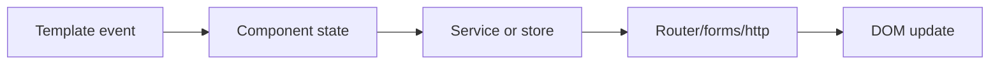
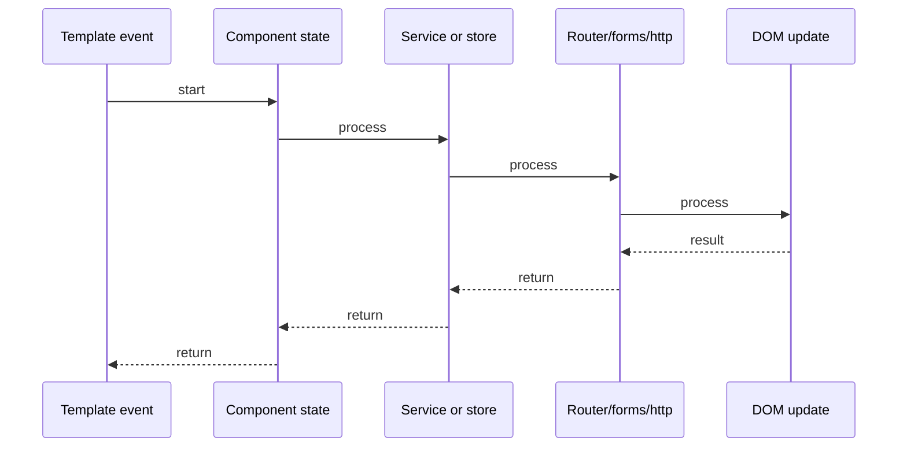

# Angular DI & Services

## Quick Facts
- Area: Angular
- Tag: Core
- Source: `src/modules/topics/angular/ng-di-services.js`
- Tags: `angular`, `dependency-injection`, `services`, `providers`, `injector`
- Visual coverage: live visual

## Concept
Angular's **Dependency Injection (DI)** manages service instantiation through a hierarchical injector tree.

**Injector Hierarchy (top -> bottom):**
1. **Platform Injector** - browser tab singleton
2. **Root Injector** - `providedIn: 'root'` - app-wide singleton, tree-shakeable
3. **Module Injector** - lazy-loaded feature modules get their own
4. **Component Injector** - `providers:[]` in @Component - new instance per component

**Token lookup:** Angular walks UP the injector tree. First match wins. Not found anywhere -> NullInjectorError.

**Provider types:** `useClass` / `useFactory` / `useValue` / `useExisting`

**Angular 14+ inject() function** - DI outside constructor (guards, factories, interceptors).

## Why It Matters
DI controls service scopes: root singleton vs per-feature vs per-component. Critical for: avoiding shared state bugs, testability (inject mocks), memory management (component-scoped services destroyed with component), and multi-tenant isolation.

## Architecture / Mental Model


## Runtime / Sequence


## Animation Plan
- Flow lab can use generated mental model steps above.
- UML sequence can use generated sequence diagram above.
- Architecture map can use generated area mental model above.
- Live visual exists in app: topic-specific canvas/ReactViz animation.

Flow steps:

1. Template event
2. Component state
3. Service or store
4. Router/forms/http
5. DOM update

## Example
```typescript
// Root singleton - tree-shaken if unused
@Injectable({ providedIn: 'root' })
export class AuthService {
  private token$ = new BehaviorSubject<string | null>(null);
}

// Component-scoped: new instance per component
@Component({
  selector: 'app-cart',
  providers: [CartService],  // destroyed with component
})
export class CartComponent {
  constructor(private cart: CartService) {}
}

// InjectionToken for non-class values
const API_URL = new InjectionToken<string>('API_URL');
providers: [{ provide: API_URL, useValue: 'https://api.example.com' }]

// Angular 14+ inject() - no constructor needed
export const authGuard = () => {
  const auth = inject(AuthService);
  return auth.isLoggedIn() ? true : inject(Router).navigate(['/login']);
};
```

## Complexity And Performance
- Time/space complexity depends on input size, data volume, and implementation choices.
- Track latency, throughput, memory, saturation, error rate, and correctness invariants.

## Interview Drills
1. What is the Angular injector hierarchy?

2. Difference between providedIn root vs component providers?

3. How does Angular resolve a token not found in current injector?

4. What is tree-shaking in Angular DI context?

5. When use useFactory vs useClass?

6. What is inject() function - when to use over constructor injection?

## Trade-offs
Pros:
- Hierarchical scoping: singleton vs per-component instances
- providedIn root auto tree-shakes unused services from bundle
- Testable: inject mocks without changing production code
- inject() enables functional patterns (standalone guards, interceptors)

Cons:
- Component-scoped providers create new instance - forgetting causes state duplication
- Services in @NgModule providers are NOT tree-shaken - prefer providedIn root
- NullInjectorError debugging is non-obvious without Angular DevTools
- Circular dependency errors hard to trace in large apps

## Gotchas
- providedIn root = one instance app-wide; component providers = one per component instance
- Services in @NgModule providers NOT tree-shaken - prefer providedIn root for leaf services
- Injecting in component-level provider creates NEW instance - siblings do NOT share it
- NullInjectorError = token not registered at any injector level above requester
- inject() only works inside injection context (constructor, factory, guard, interceptor)

