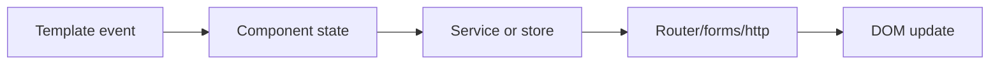
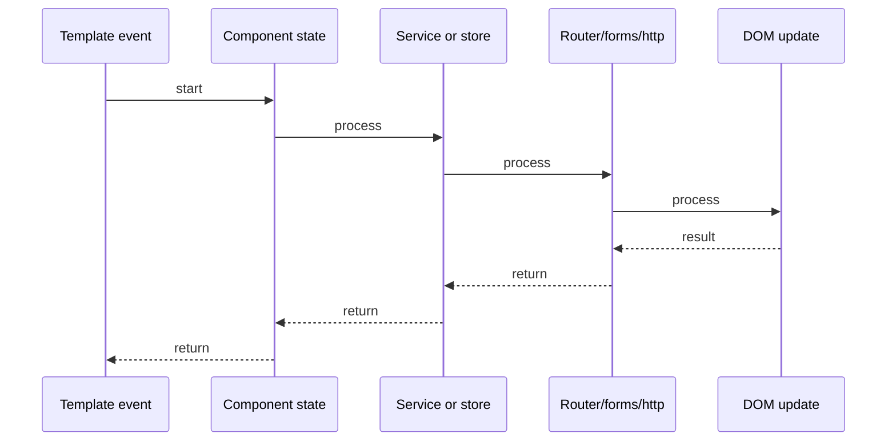

# NgRx State Management

## Quick Facts
- Area: Angular
- Tag: State
- Source: `src/modules/topics/angular/ng-ngrx.js`
- Tags: `angular`, `ngrx`, `redux`, `actions`, `reducers`, `effects`, `selectors`, `store`
- Visual coverage: live visual

## Concept
**NgRx** is Angular's Redux implementation - unidirectional data flow for predictable state.

**Core pieces:**
- **Action** - plain object describing WHAT happened: `{ type: '[Cart] Add Item', item }`
- **Reducer** - pure function: `(state, action) => newState`. Never mutates.
- **Store** - single immutable state tree. Source of truth.
- **Selector** - memoized projector: `createSelector(featureSlice, s => s.items)`. Re-runs only when inputs change.
- **Effect** - handles side effects (HTTP, routing). Listens for actions, dispatches new ones. Uses RxJS.

**Data flow:**
`Component -> dispatch(Action) -> Reducer -> Store -> Selector -> Component`

**With Effects:**
`dispatch(loadItems) -> Effect -> HTTP call -> dispatch(loadItemsSuccess) -> Reducer -> Store`

**NgRx Signals Store** (NgRx 17+): lighter alternative using Angular signals instead of RxJS.

## Why It Matters
NgRx shines in large apps with complex shared state, time-travel debugging (Redux DevTools), and teams that need predictability. Every state change is an action - full audit trail. Selectors prevent unnecessary re-renders by memoizing derived state.

## Architecture / Mental Model


## Runtime / Sequence


## Animation Plan
- Flow lab can use generated mental model steps above.
- UML sequence can use generated sequence diagram above.
- Architecture map can use generated area mental model above.
- Live visual exists in app: topic-specific canvas/ReactViz animation.

Flow steps:

1. Template event
2. Component state
3. Service or store
4. Router/forms/http
5. DOM update

## Example
```typescript
// Actions
export const addToCart = createAction('[Cart] Add Item',
  props<{ item: CartItem }>());
export const loadOrders = createAction('[Orders] Load');
export const loadOrdersSuccess = createAction('[Orders] Load Success',
  props<{ orders: Order[] }>());

// Reducer - pure, no side effects
export const cartReducer = createReducer(
  initialState,
  on(addToCart, (state, { item }) => ({
    ...state,
    items: [...state.items, item],
  })),
);

// Selector - memoized, composes
export const selectCartItems = createSelector(
  selectCartState,           // input selector
  (cart) => cart.items,      // projector - only re-runs when cart changes
);
export const selectCartTotal = createSelector(
  selectCartItems,
  (items) => items.reduce((sum, i) => sum + i.price, 0),
);

// Effect - side effects via RxJS
@Injectable()
export class OrderEffects {
  loadOrders$ = createEffect(() =>
    this.actions$.pipe(
      ofType(loadOrders),
      switchMap(() => this.http.get<Order[]>('/api/orders').pipe(
        map(orders => loadOrdersSuccess({ orders })),
        catchError(err => of(loadOrdersFailed({ error: err.message }))),
      )),
    ),
  );
  constructor(private actions$: Actions, private http: HttpClient) {}
}
```

## Complexity And Performance
- Time/space complexity depends on deployment, data size, and chosen implementation.
- Track p50/p95/p99 latency, throughput, memory, saturation, and error rate for production topics.

## Interview Drills
1. What is the NgRx data flow - Action to Store?

2. Why must reducers be pure functions?

3. What is a selector and why does memoization matter?

4. When use NgRx vs Angular service with BehaviorSubject?

5. How do Effects handle side effects without polluting reducers?

6. What is the difference between ofType and filter in Effects?

## Trade-offs
Pros:
- Single source of truth - no conflicting service states
- Time-travel debugging with Redux DevTools
- Selectors memoize derived state - no unnecessary re-renders
- Effects isolate side effects - reducers remain pure and testable

Cons:
- Massive boilerplate for small apps - actions/reducers/selectors/effects per feature
- Learning curve: RxJS + Redux mental model together
- Over-engineered for local component state - use component state or service BehaviorSubject instead
- NgRx bundle ~50KB gzipped

## Gotchas
- Reducers must return new state objects - mutating state breaks change detection and DevTools
- Selectors memoize by reference equality - spreading creates new ref even if values same
- Effects must always return an observable - missing catchError causes Effect to die silently
- dispatch() is synchronous - the store updates synchronously but effects are async
- Avoid subscribing to store inside effects - use withLatestFrom or concatLatestFrom instead

