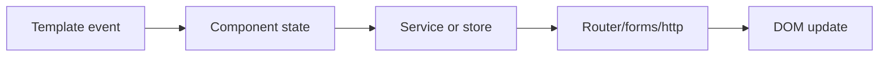
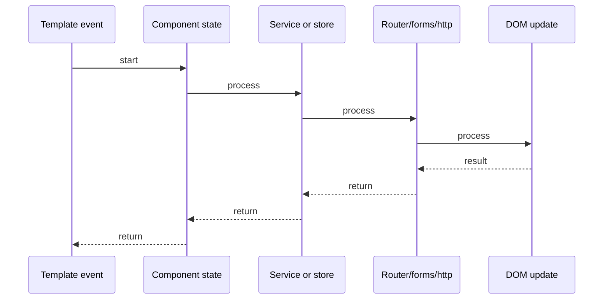

# Angular Routing & Guards

## Quick Facts
- Area: Angular
- Tag: Navigation
- Source: `src/modules/topics/angular/ng-routing-guards.js`
- Tags: `angular`, `routing`, `guards`, `canactivate`, `resolver`, `lazy-loading`, `navigation`
- Visual coverage: live visual

## Concept
Angular **Router** maps URL paths to components. **Guards** intercept navigation to control access.

**Guard types:**
- `canActivate` - can user enter this route?
- `canActivateChild` - can user enter child routes?
- `canDeactivate` - can user leave? (unsaved changes warning)
- `canMatch` - should this route even be matched? (Angular 14+)
- `resolve` - pre-fetch data before activating route

**Navigation lifecycle:**
`URL change -> Router matching -> canMatch -> canActivate -> canActivateChild -> resolve -> component activate -> canDeactivate (on leave)`

**Lazy loading:** `loadComponent` / `loadChildren` - load feature module only when route activated. Reduces initial bundle.

**Angular 14+ functional guards:** plain functions with `inject()` - no class needed.

**Route data:** `route.data`, `route.params`, `route.queryParams`, `route.snapshot` vs `paramMap` observable.

## Why It Matters
Guards are the security layer of Angular SPA navigation. Without them, users can navigate to /admin by typing the URL. Resolvers prevent loading spinners by fetching data before the component renders. Lazy loading is critical for large apps - split bundle by feature route.

## Architecture / Mental Model


## Runtime / Sequence


## Animation Plan
- Flow lab can use generated mental model steps above.
- UML sequence can use generated sequence diagram above.
- Architecture map can use generated area mental model above.
- Live visual exists in app: topic-specific canvas/ReactViz animation.

Flow steps:

1. Template event
2. Component state
3. Service or store
4. Router/forms/http
5. DOM update

## Example
```typescript
// Angular 14+ functional guard (preferred)
export const authGuard = () => {
  const auth = inject(AuthService);
  const router = inject(Router);
  return auth.isLoggedIn()
    ? true
    : router.createUrlTree(['/login']);
};

// Resolver - pre-fetch data
export const userResolver = (route: ActivatedRouteSnapshot) => {
  return inject(UserService).getUser(route.params['id']);
};

// Routes with guards + lazy loading
export const routes: Routes = [
  {
    path: 'admin',
    canActivate: [authGuard],
    canActivateChild: [roleGuard('ADMIN')],
    loadChildren: () => import('./admin/admin.routes'),
    // loadChildren = lazy-loads entire feature module
  },
  {
    path: 'user/:id',
    resolve: { user: userResolver },
    // component receives pre-fetched data via route.data['user']
    component: UserDetailComponent,
  },
  {
    path: 'editor',
    component: EditorComponent,
    canDeactivate: [(comp: EditorComponent) => comp.canLeave()],
  },
];

// In component: access resolved data
ngOnInit() {
  this.user = this.route.snapshot.data['user'];
  // or reactive:
  this.route.data.pipe(map(d => d['user'])).subscribe(...);
}
```

## Complexity And Performance
- Time/space complexity depends on deployment, data size, and chosen implementation.
- Track p50/p95/p99 latency, throughput, memory, saturation, and error rate for production topics.

## Interview Drills
1. What is the difference between canActivate and canActivateChild?

2. How does canDeactivate work for unsaved-changes warning?

3. What is the navigation lifecycle order in Angular?

4. What is the difference between route.snapshot and route.paramMap observable?

5. How does lazy loading reduce bundle size?

6. When use resolve vs loading data inside ngOnInit?

## Trade-offs
Pros:
- Guards prevent unauthorized access at the navigation layer
- Resolvers eliminate loading spinners - component mounts with data ready
- Lazy loading reduces initial bundle - features loaded on demand
- Functional guards (Angular 14+) are simpler - no class, no boilerplate

Cons:
- Guards returning false with no redirect leaves user stuck - always redirect
- Resolvers block navigation until data loads - use skeleton screens for slow APIs
- canDeactivate is client-side only - refreshing browser bypasses it
- Deep route nesting can make guard debugging complex

## Gotchas
- Guard returning false without router.navigate() leaves user at blank/old URL
- resolve pre-fetches before component loads - if resolve errors, route activation fails
- route.snapshot.params is static - use route.paramMap observable for same-route navigation
- canMatch (Angular 14+) prevents route from being matched - different from canActivate which blocks activation
- Lazy loaded routes have their own injector - services provided there are not root-level singletons
- Guards run in ORDER: canMatch -> canActivate -> canActivateChild -> resolve

