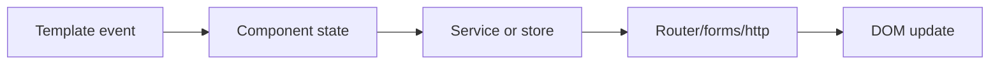
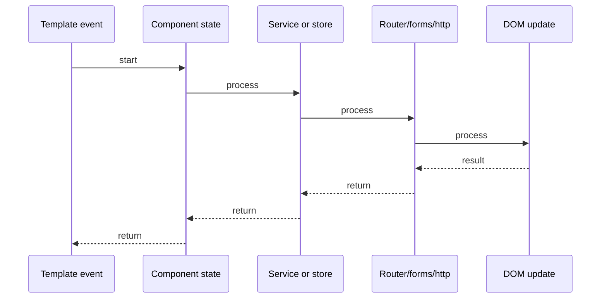

# Angular Signals

## Quick Facts
- Area: Angular
- Tag: Reactivity
- Source: `src/modules/topics/angular/ng-signals.js`
- Tags: `angular`, `signals`, `computed`, `effect`, `v17`, `v18`, `reactivity`
- Visual coverage: live visual

## Concept
Angular **Signals** (Angular 16+) are a reactive primitive that eliminates Zone.js for change detection.

**Core APIs:**
- `signal(initialValue)` - writable reactive value. Read: `count()`, Write: `count.set(5)`, Update: `count.update(v => v + 1)`
- `computed(() => expr)` - derived value, re-evaluated lazily only when dependencies changed
- `effect(() => { ... })` - runs when any signal read inside changes. Auto-tracks dependencies.
- `toSignal(observable$)` - wraps RxJS Observable as a signal
- `toObservable(signal)` - converts signal back to Observable

**Angular 17+ Signal Inputs:**
`@Input() name = input<string>()` - signal-based input, reactive

**Angular 17+ model() - two-way binding:**
`name = model('default')` - writable signal input/output pair

**No Zone.js required:** signal changes trigger fine-grained DOM updates without CD cycle.

## Why It Matters
Signals replace Zone.js's coarse "check everything on any event" with precise "update only what depends on this value." They compose naturally with RxJS via toSignal/toObservable. Angular 18+ fully supports zoneless applications with signals.

## Architecture / Mental Model


## Runtime / Sequence


## Animation Plan
- Flow lab can use generated mental model steps above.
- UML sequence can use generated sequence diagram above.
- Architecture map can use generated area mental model above.
- Live visual exists in app: topic-specific canvas/ReactViz animation.

Flow steps:

1. Template event
2. Component state
3. Service or store
4. Router/forms/http
5. DOM update

## Example
```typescript
import { signal, computed, effect, input, model } from '@angular/core';

@Component({
  template: `
    <p>Count: {{ count() }}</p>
    <p>Double: {{ double() }}</p>
    <button (click)="increment()">+1</button>
  `,
})
export class CounterComponent {
  count = signal(0);           // WritableSignal<number>
  double = computed(() => this.count() * 2);  // auto-tracks count

  logEffect = effect(() => {
    // runs whenever count() changes - auto-tracked
    console.log('count changed to', this.count());
  });

  increment() {
    this.count.update(v => v + 1);  // triggers computed + effect
  }
}

// Angular 17+ signal inputs
@Component({ ... })
export class UserCardComponent {
  name = input<string>();        // signal input (read-only)
  theme = input('dark');         // with default
  onNameChange = model<string>(); // model: two-way bindable signal
}

// Parent template:
// <app-user-card [(onNameChange)]="userName" [name]="fullName()" />
```

## Complexity And Performance
- Time/space complexity depends on deployment, data size, and chosen implementation.
- Track p50/p95/p99 latency, throughput, memory, saturation, and error rate for production topics.

## Interview Drills
1. What is the difference between signal, computed, and effect?

2. How do signals replace Zone.js change detection?

3. What is the difference between signal() and computed() writability?

4. How does effect() track its dependencies?

5. What is model() and how does it enable two-way binding?

6. How do you interop signals with existing RxJS observables?

## Trade-offs
Pros:
- Fine-grained reactivity - only dependent components/expressions re-evaluate
- No Zone.js needed - smaller bundle, predictable performance
- Lazy evaluation - computed only re-runs when dependencies changed AND value is read
- Cleaner interop with RxJS via toSignal/toObservable

Cons:
- effect() must be called in injection context or passed injector
- Cannot use signals in constructor before injection context available
- Mixing signals + Zone.js (hybrid mode) adds mental overhead
- effect() creates subscriptions - must manage cleanup in long-lived services

## Gotchas
- computed() is lazy - it only re-computes when a consumer reads it after a dependency change
- effect() tracks ALL signals read during its execution - no explicit dependency list needed
- set() vs update(): set(5) overwrites; update(v => v+1) derives from current value
- Signal inputs (input()) are read-only - parent controls the value, component cannot set()
- model() creates a writable signal + output pair - use for two-way binding scenarios
- effect() in a service needs explicit injector or must be called in injection context

