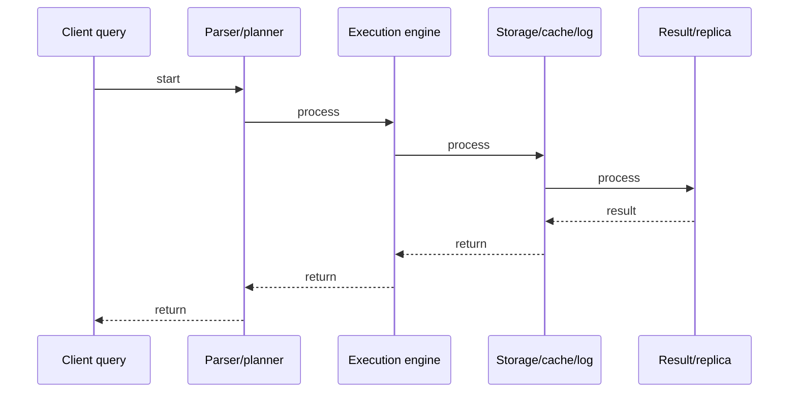

# Redis Internals

## Quick Facts

- Area: Databases
- Tag: Redis
- Source: `src/modules/topics/databases/db-redis-internals.js`
- Tags: `redis`, `skiplist`, `ziplist`, `rdb`, `aof`, `lru`, `eviction`
- Visual coverage: live visual

## Concept

This topic covers redis internals. It explains the concept, why it matters, and how it fits into production systems.
## Why It Matters

Understanding this topic helps you build more efficient, reliable, and maintainable systems. It explains the practical impact of the design or algorithm in production.
## Architecture / Mental Model

## Runtime / Sequence

## Animation Plan

- Flow lab can use generated mental model steps above.
- UML sequence can use generated sequence diagram above.
- Architecture map can use generated area mental model above.
- Live visual exists in app: topic-specific canvas/ReactViz animation.

Flow steps:

1. Client query
2. Parser/planner
3. Execution engine
4. Storage/cache/log
5. Result/replica

## Example

Example code, configuration, or architecture depends on the concrete problem. Use the implementation in the linked source file as a starting point.
## Complexity And Performance

- Time/space complexity depends on input size, data volume, and implementation choices.
- Track latency, throughput, memory, saturation, error rate, and correctness invariants.

## Interview Drills

- What is the core problem this topic solves?
- What trade-offs are involved in this design or algorithm?
- How does this concept behave under load or at scale?
## Trade-offs

This topic has trade-offs between simplicity, performance, correctness, and operational complexity. Choose the right approach based on system requirements.
## Gotchas

Watch for edge cases, assumptions, and hidden performance costs that can make this topic fail in production if handled incorrectly.
