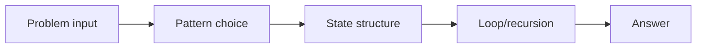
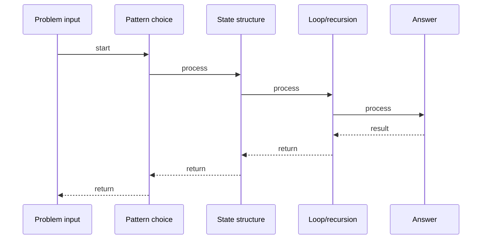

# Find Min in Rotated Array

## Quick Facts

- Area: DSA
- Tag: Binary Search
- Source: `src/modules/topics/dsa/dsa-bs-find-min-rotated.js`
- Tags: `binary search`, `array`, `rotated`, `pivot`, `faang`, `premium`, `lc153`
- Visual coverage: live visual

## Concept

Find the minimum element in a rotated sorted array in O(log n).

**Kid explanation:** A sorted array was spun like a clock. The smallest number is at the "seam" where it wrapped. Each step of binary search: if the middle value is bigger than the rightmost value, the seam (and minimum) is in the RIGHT half. Otherwise it's in the LEFT half (including middle). Zoom in until you find it!

**Pattern:** Binary search on rotation pivot - O(log n)
**Key insight:** Compare mid to the rightmost element. If mid > right, minimum is right of mid. Else minimum is left of or at mid.
**Scenario:** Find the rotation point in a circular log ring buffer.

## Why It Matters

Understanding this topic helps you build more efficient, reliable, and maintainable systems. It explains the practical impact of the design or algorithm in production.
## Architecture / Mental Model

## Runtime / Sequence

## Animation Plan

- Flow lab can use generated mental model steps above.
- UML sequence can use generated sequence diagram above.
- Architecture map can use generated area mental model above.
- Live visual exists in app: topic-specific canvas/ReactViz animation.

Flow steps:

1. Problem input
2. Pattern choice
3. State structure
4. Loop/recursion
5. Answer

## Example

Example code, configuration, or architecture depends on the concrete problem. Use the implementation in the linked source file as a starting point.
## Complexity And Performance

- O(log n)

## Interview Drills

- What is the core problem this topic solves?
- What trade-offs are involved in this design or algorithm?
- How does this concept behave under load or at scale?
## Trade-offs

This topic has trade-offs between simplicity, performance, correctness, and operational complexity. Choose the right approach based on system requirements.
## Gotchas

Watch for edge cases, assumptions, and hidden performance costs that can make this topic fail in production if handled incorrectly.
