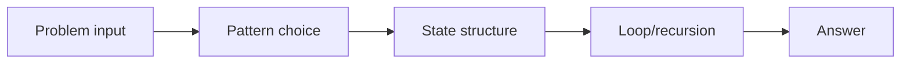
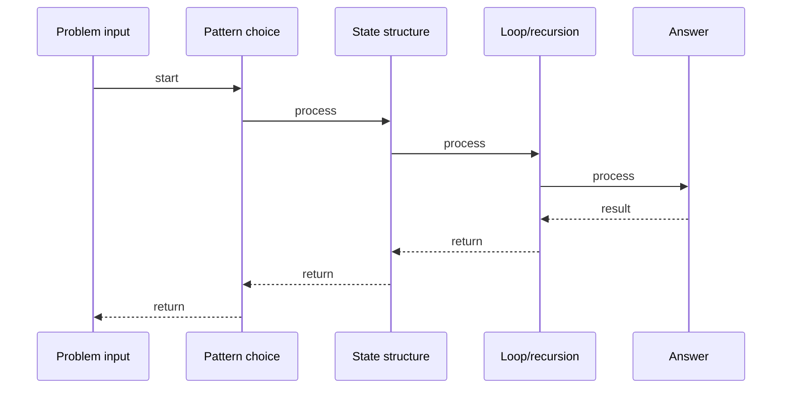

# Koko Eating Bananas

## Quick Facts

- Area: DSA
- Tag: Binary Search
- Source: `src/modules/topics/dsa/dsa-bs-koko-bananas.js`
- Tags: `binary search`, `search on answer`, `array`, `faang`, `premium`, `lc875`
- Visual coverage: live visual

## Concept

Find the minimum eating speed k so Koko finishes all banana piles within h hours.

**Kid explanation:** Koko can eat k bananas per hour from each pile (one pile at a time). We need to find the SLOWEST speed she can eat and still finish in time. Instead of trying every speed 1,2,3..., do binary search on the speed! If speed k works, maybe k-1 also works. If k doesn't work, we need faster.

**Pattern:** Binary search on the answer - O(n log m) where m = max pile size
**Key insight:** The answer space (1 to max pile) is sorted. Valid speeds form a suffix. Find the first valid speed using binary search.
**Scenario:** Rate throttling - find the slowest acceptable processing rate to finish within a deadline.

## Why It Matters

_No notes yet._

## Architecture / Mental Model

## Runtime / Sequence

## Animation Plan

- Flow lab can use generated mental model steps above.
- UML sequence can use generated sequence diagram above.
- Architecture map can use generated area mental model above.
- Live visual exists in app: topic-specific canvas/ReactViz animation.

Flow steps:

1. Problem input
2. Pattern choice
3. State structure
4. Loop/recursion
5. Answer

## Example

_No code example configured._

## Complexity And Performance

- O(n log m)

## Interview Drills

_No interview drills configured._

## Trade-offs

_No trade-offs configured._

## Gotchas

_No gotchas configured._
