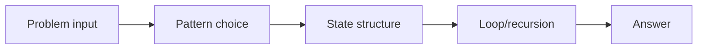
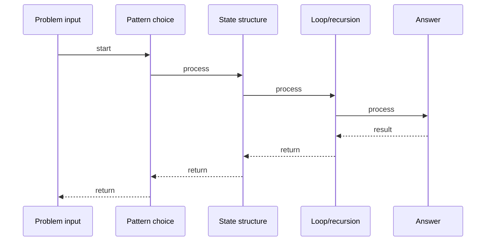

# Search in Rotated Sorted Array

## Quick Facts
- Area: DSA
- Tag: Binary Search
- Source: `src/modules/topics/dsa/dsa-bs-search-rotated.js`
- Tags: `binary search`, `array`, `rotated`, `faang`, `premium`, `lc33`
- Visual coverage: live visual

## Concept
Search a sorted array that was rotated at an unknown pivot. Return the index or -1.

 **Kid explanation:** Imagine a sorted row of lockers: 1,2,3,4,5,6,7. Someone spun it like a wheel and now it reads: 4,5,6,7,1,2,3. You still have a secret weapon - binary search! Even though it's rotated, ONE HALF is always in perfect sorted order. Figure out which half, check if your target is in it, then search only that half!

**Pattern:** Binary search with half-sorted check - O(log n)
**Key insight:** At any midpoint, either the left half or right half is perfectly sorted. Use that to decide which side to search.
**Scenario:** Circular buffer lookup - data wrapped around a ring buffer.

## Why It Matters
_No notes yet._

## Architecture / Mental Model

## Runtime / Sequence

## Animation Plan
- Flow lab can use generated mental model steps above.
- UML sequence can use generated sequence diagram above.
- Architecture map can use generated area mental model above.
- Live visual exists in app: topic-specific canvas/ReactViz animation.

Flow steps:

1. Problem input
2. Pattern choice
3. State structure
4. Loop/recursion
5. Answer

## Example
_No code example configured._

## Complexity And Performance
- O(log n)

## Interview Drills
_No interview drills configured._

## Trade-offs
_No trade-offs configured._

## Gotchas
_No gotchas configured._

