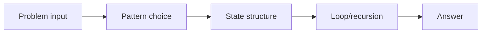
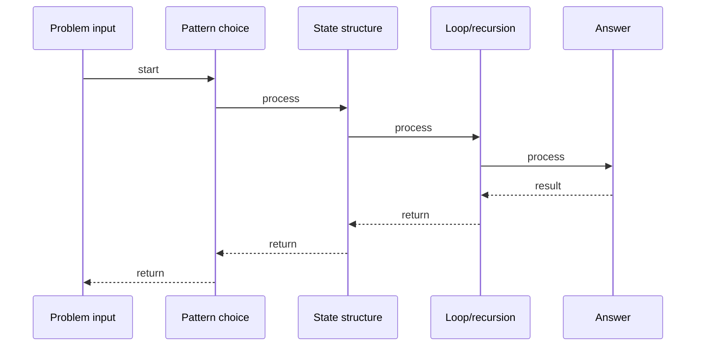

# Subsets (Power Set)

## Quick Facts

- Area: DSA
- Tag: Backtracking
- Source: `src/modules/topics/dsa/dsa-bt-subsets.js`
- Tags: `backtracking`, `recursion`, `power set`, `bit manipulation`, `faang`, `lc78`
- Visual coverage: live visual

## Concept

Return all possible subsets (the power set) of a set of distinct integers.

**Kid explanation:** You have 3 toys: [1, 2, 3]. The power set is ALL possible bags you could pack - including the empty bag! For each toy, you decide: pack it or leave it. That gives you 2x2x2 = 8 bags. We explore both choices (include/exclude) for every toy using recursion.

**Pattern:** Include/exclude backtracking - O(2^n x n)
**Key insight:** At each element, branch into two paths: include it in current subset, or skip it. Both paths recurse on the remaining elements.
**Scenario:** Feature toggle combinations - generate all ON/OFF combinations of feature flags.

## Why It Matters

_No notes yet._

## Architecture / Mental Model

## Runtime / Sequence

## Animation Plan

- Flow lab can use generated mental model steps above.
- UML sequence can use generated sequence diagram above.
- Architecture map can use generated area mental model above.
- Live visual exists in app: topic-specific canvas/ReactViz animation.

Flow steps:

1. Problem input
2. Pattern choice
3. State structure
4. Loop/recursion
5. Answer

## Example

_No code example configured._

## Complexity And Performance

- O(2^n x n)

## Interview Drills

_No interview drills configured._

## Trade-offs

_No trade-offs configured._

## Gotchas

_No gotchas configured._
