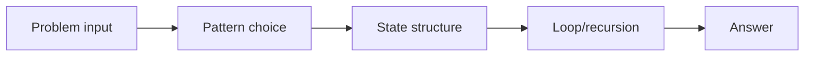
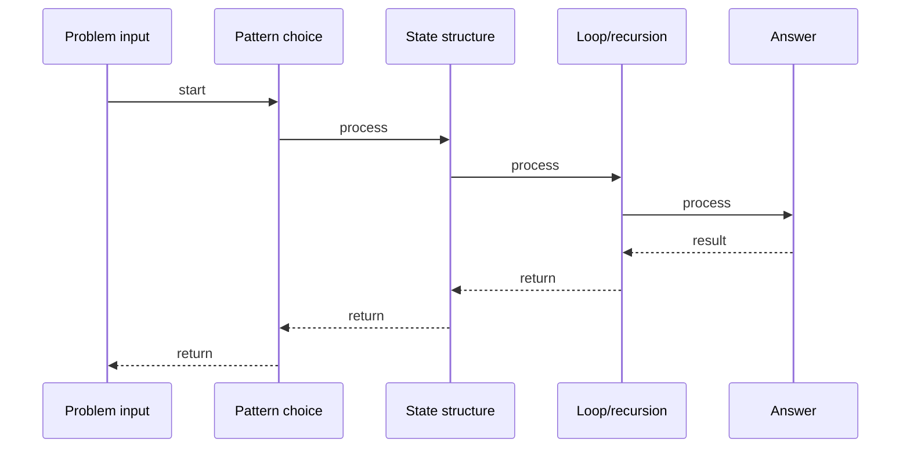

# Fibonacci - DP Intro

## Quick Facts

- Area: DSA
- Tag: Dynamic Programming
- Source: `src/modules/topics/dsa/dsa-dp-fibonacci.js`
- Tags: `dp`, `fibonacci`, `tabulation`, `memoization`, `recursion`
- Visual coverage: live visual

## Concept

Compute the nth Fibonacci number. F(0)=0, F(1)=1, F(n)=F(n-1)+F(n-2).

Kid explanation: Staircase tiles. Each tile value = sum of previous two tiles. Build from tile 0 upward - never recompute.

**Pattern:** DP tabulation - O(n) time, O(n) space. Optimizable to O(1) space with two vars.
**Key insight:** Naive recursion recomputes F(k) exponentially many times. Tabulation computes each subproblem exactly once.

## Why It Matters

Gateway to DP thinking. Every DP problem: identify subproblem -> write recurrence -> fill table bottom-up -> read answer.

## Architecture / Mental Model



## Runtime / Sequence



## Animation Plan

- Flow lab can use generated mental model steps above.
- UML sequence can use generated sequence diagram above.
- Architecture map can use generated area mental model above.
- Live visual exists in app: topic-specific canvas/ReactViz animation.

Flow steps:

1. Problem input
2. Pattern choice
3. State structure
4. Loop/recursion
5. Answer

## Example

```javascript
function fib(n) {
  const dp = [0, 1];
  for (let i = 2; i <= n; i++) dp[i] = dp[i - 1] + dp[i - 2];
  return dp[n];
}
// O(1) space variant
function fibOpt(n) {
  let prev = 0,
    curr = 1;
  for (let i = 2; i <= n; i++) [prev, curr] = [curr, prev + curr];
  return curr;
}
```

Notes:
Space optimization: only keep last two values since dp[i] depends only on dp[i-1] and dp[i-2].

## Complexity And Performance

- O(n)
- O(1)

## Interview Drills

1. Time complexity of naive recursive Fibonacci?
   Answer: O(2^n) - each call branches into two, creating exponential recursion tree with repeated subproblems.
   Follow-ups: How does memoization fix this?

2. How to reduce space from O(n) to O(1)?
   Answer: Since dp[i] depends only on dp[i-1] and dp[i-2], maintain two variables (prev, curr) and update each iteration.
   Follow-ups: Does this change time complexity?

## Trade-offs

Pros:

- O(n) time vs O(2^n) naive
- Simple recurrence
- O(1) space variant exists

Cons:

- Integer overflow for large n - need BigInt
- Teaching example - not a hard problem

When to use:
Use DP tabulation when subproblems overlap and optimal substructure holds.

## Gotchas

- dp[0]=0, dp[1]=1 - initialize both base cases
- Loop starts at i=2 not i=1
- For n>70 use BigInt
