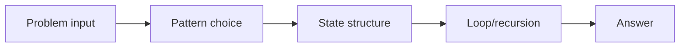
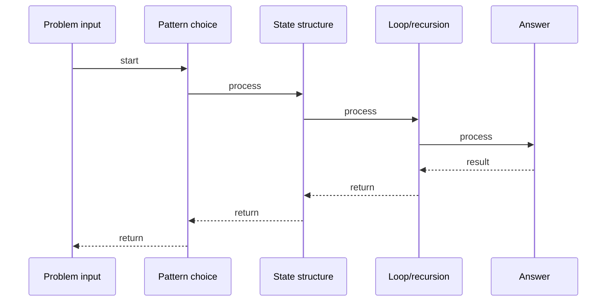

# Decode Ways

## Quick Facts

- Area: DSA
- Tag: DP Extended
- Source: `src/modules/topics/dsa/dsa-dpx-decode-ways.js`
- Tags: `dp`, `string`, `counting`, `digits`, `faang`, `lc91`
- Visual coverage: live visual

## Concept

Count the number of ways to decode a digit string where A=1...Z=26.

**Kid explanation:** "226" could mean: 2-2-6 = BBF, 22-6 = VF, or 2-26 = BZ. Three ways! At each position, you can decode ONE digit (if it's 1-9) or TWO digits (if the pair is 10-26). It's exactly like Climbing Stairs but with validity checks - some "steps" are forbidden (0, 00, 27, etc.)!

**Pattern:** 1D counting DP (Fibonacci-style with guards) - O(n)
**Key insight:** dp[i] = (1-digit decode of s[i-1] valid ? dp[i-1] : 0) + (2-digit decode of s[i-2..i-1] [10,26] ? dp[i-2] : 0).
**Scenario:** SMS decoder - count how many English-word interpretations a compressed digit string has.

## Why It Matters

_No notes yet._

## Architecture / Mental Model

## Runtime / Sequence

## Animation Plan

- Flow lab can use generated mental model steps above.
- UML sequence can use generated sequence diagram above.
- Architecture map can use generated area mental model above.
- Live visual exists in app: topic-specific canvas/ReactViz animation.

Flow steps:

1. Problem input
2. Pattern choice
3. State structure
4. Loop/recursion
5. Answer

## Example

_No code example configured._

## Complexity And Performance

- O(n)

## Interview Drills

_No interview drills configured._

## Trade-offs

_No trade-offs configured._

## Gotchas

_No gotchas configured._
