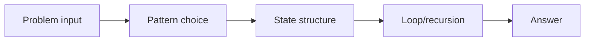
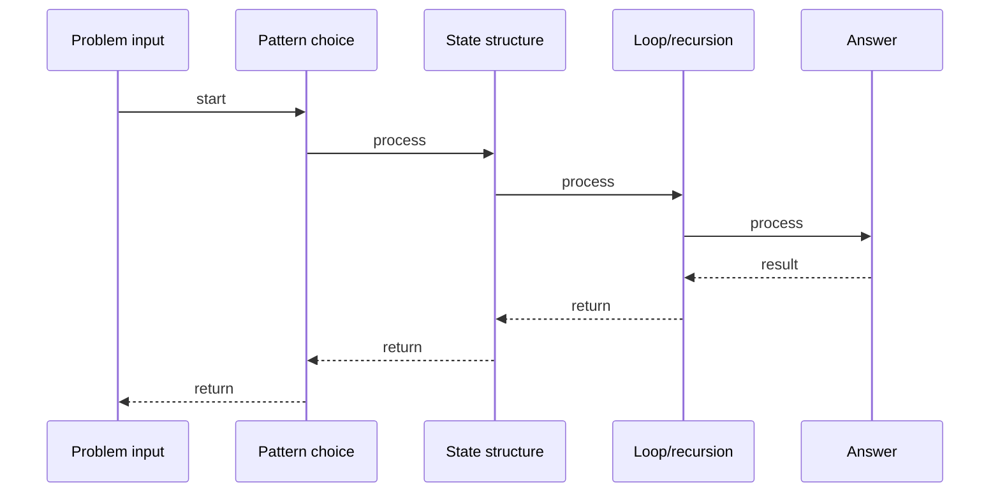

# Graph BFS - Breadth-First Search

## Quick Facts
- Area: DSA
- Tag: Graph
- Source: `src/modules/topics/dsa/dsa-graph-bfs.js`
- Tags: `graph`, `bfs`, `queue`, `shortest path`, `level order`
- Visual coverage: live visual

## Concept
Explore a graph layer by layer using a queue. Visits all nodes at depth d before any at depth d+1.

 Ripples in a pond. Drop a stone (start node). First ring = neighbors. BFS = ripple order.

**Pattern:** Queue-based layer traversal - O(V+E)
**Key insight:** FIFO queue guarantees shortest path in unweighted graphs.

## Why It Matters
BFS finds shortest path in unweighted graphs. Used in: social network degrees, web crawlers, maze solving, level-order traversal, Bipartite check.

## Architecture / Mental Model


## Runtime / Sequence


## Animation Plan
- Flow lab can use generated mental model steps above.
- UML sequence can use generated sequence diagram above.
- Architecture map can use generated area mental model above.
- Live visual exists in app: topic-specific canvas/ReactViz animation.

Flow steps:

1. Problem input
2. Pattern choice
3. State structure
4. Loop/recursion
5. Answer

## Example
```javascript
function bfs(graph, start) {
  const visited = new Set([start]);
  const queue = [start];
  const order = [];
  while (queue.length) {
    const node = queue.shift();
    order.push(node);
    for (const neighbor of (graph[node] || [])) {
      if (!visited.has(neighbor)) {
        visited.add(neighbor);
        queue.push(neighbor);
      }
    }
  }
  return order;
}
```

Notes:
Mark visited when ENQUEUED - not dequeued - prevents duplicate entries in queue.

## Complexity And Performance
- O(V+E)

## Interview Drills
1. Why does BFS guarantee shortest path in unweighted graphs?
   Answer: BFS processes nodes level by level. First time a node is reached it is via shortest path.
   Follow-ups: Does this hold for weighted graphs?; What handles weighted shortest path?

2. BFS vs DFS - when to use each?
   Answer: BFS: shortest path, level-order. DFS: cycle detection, topological sort, backtracking. BFS uses more memory; DFS uses stack depth.
   Follow-ups: Space complexity of each?

## Trade-offs
Pros:
- Shortest path in unweighted graph
- Level-order processing
- Finds all reachable nodes

Cons:
- O(V) space for queue
- Not for weighted shortest path

When to use:
Use BFS when you need shortest path (unweighted) or level-by-level processing.

## Gotchas
- Mark visited when ENQUEUED not dequeued
- queue.shift() is O(n) - use deque for large inputs
- Handle disconnected graphs by looping all nodes

