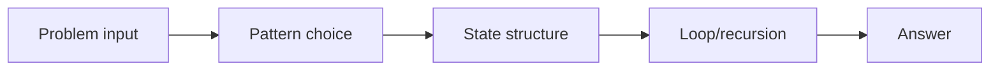
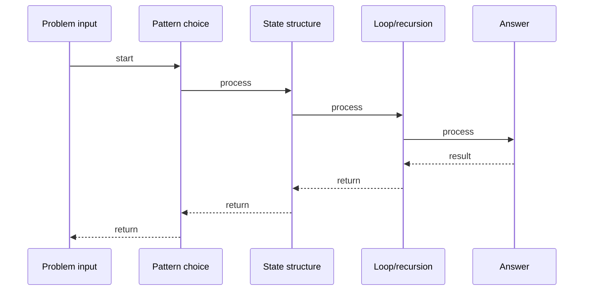

# Number of Islands

## Quick Facts

- Area: DSA
- Tag: Graph
- Source: `src/modules/topics/dsa/dsa-graph-num-islands.js`
- Tags: `graph`, `bfs`, `dfs`, `grid`, `flood fill`, `faang`, `lc200`
- Visual coverage: live visual

## Concept

Count the number of islands in a 2D grid of 1s (land) and 0s (water).

**Kid explanation:** Look at a treasure map from above. Every connected group of land squares (1s) is one island. Your job: count the islands! Walk across the map. When you find a land square no one has visited, it's a new island - start a fire and burn all connected land (BFS/DFS). Count how many fires you started!

**Pattern:** BFS/DFS grid flood-fill - O(rows x cols)
**Key insight:** For each unvisited land cell, do BFS to mark the entire connected component as visited. Each BFS start = one island.
**Scenario:** Map analysis - count distinct connected land regions. Used in: geography apps, game maps, image segmentation.

## Why It Matters

_No notes yet._

## Architecture / Mental Model

## Runtime / Sequence

## Animation Plan

- Flow lab can use generated mental model steps above.
- UML sequence can use generated sequence diagram above.
- Architecture map can use generated area mental model above.
- Live visual exists in app: topic-specific canvas/ReactViz animation.

Flow steps:

1. Problem input
2. Pattern choice
3. State structure
4. Loop/recursion
5. Answer

## Example

_No code example configured._

## Complexity And Performance

- O(rows x cols)

## Interview Drills

_No interview drills configured._

## Trade-offs

_No trade-offs configured._

## Gotchas

_No gotchas configured._
