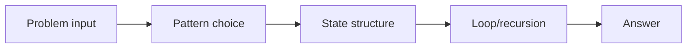
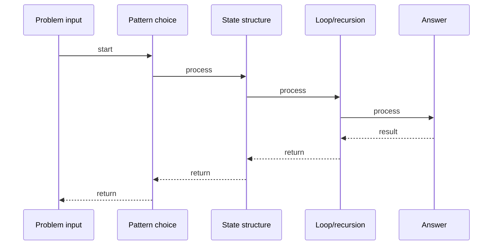

# Activity Selection

## Quick Facts

- Area: DSA
- Tag: Greedy
- Source: `src/modules/topics/dsa/dsa-greedy-activity.js`
- Tags: `greedy`, `activity selection`, `intervals`, `scheduling`
- Visual coverage: live visual

## Concept

Select the maximum number of non-overlapping activities from start/end times.

**Pattern:** Greedy by earliest finish time - O(n log n)
**Hint:** Sort by end time; an earlier finish leaves maximum room for future choices.
**Scenario:** Calendar optimizer - fit the most meetings into one room.

## Why It Matters

_No notes yet._

## Architecture / Mental Model

## Runtime / Sequence

## Animation Plan

- Flow lab can use generated mental model steps above.
- UML sequence can use generated sequence diagram above.
- Architecture map can use generated area mental model above.
- Live visual exists in app: topic-specific canvas/ReactViz animation.

Flow steps:

1. Problem input
2. Pattern choice
3. State structure
4. Loop/recursion
5. Answer

## Example

_No code example configured._

## Complexity And Performance

- O(n log n)

## Interview Drills

_No interview drills configured._

## Trade-offs

_No trade-offs configured._

## Gotchas

_No gotchas configured._
