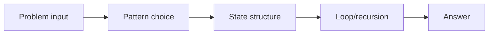
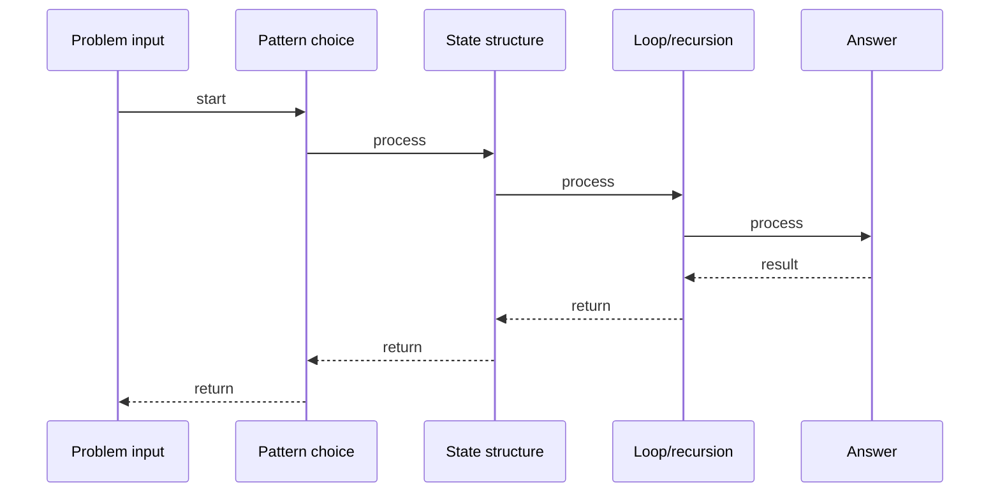

# Daily Temperatures

## Quick Facts
- Area: DSA
- Tag: Stack
- Source: `src/modules/topics/dsa/dsa-stk-daily-temps.js`
- Tags: `stack`, `monotonic stack`, `array`, `next greater element`, `faang`, `lc739`
- Visual coverage: live visual

## Concept
For each day, return how many days you have to wait for a warmer temperature.

 **Kid explanation:** Imagine you're waiting for a sunny day. You have a list of temperatures. For each day you're still waiting, keep it in a "waiting list" (stack). When a warm day arrives, EVERYONE who was waiting for a warmer day finally gets their answer - the number of days they waited. Cross them off the list!

**Pattern:** Monotonic decreasing stack storing indices - O(n)
**Key insight:** Store indices on stack. When current temp beats stack-top's temp, pop it and record gap = current_index  popped_index.
**Scenario:** Stock ticker - how many days until a stock price rises above today's closing price?

## Why It Matters
_No notes yet._

## Architecture / Mental Model

## Runtime / Sequence

## Animation Plan
- Flow lab can use generated mental model steps above.
- UML sequence can use generated sequence diagram above.
- Architecture map can use generated area mental model above.
- Live visual exists in app: topic-specific canvas/ReactViz animation.

Flow steps:

1. Problem input
2. Pattern choice
3. State structure
4. Loop/recursion
5. Answer

## Example
_No code example configured._

## Complexity And Performance
- O(n)

## Interview Drills
_No interview drills configured._

## Trade-offs
_No trade-offs configured._

## Gotchas
_No gotchas configured._

