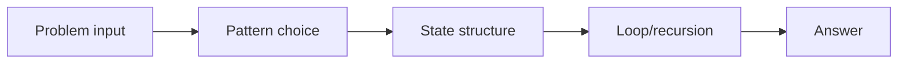
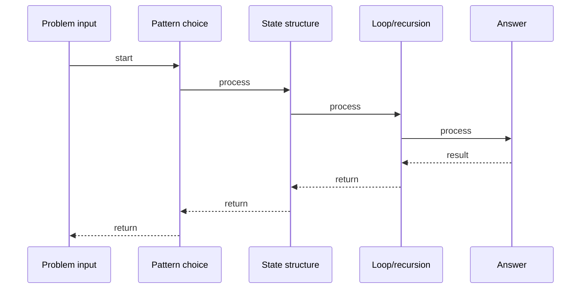

# Largest Rectangle in Histogram

## Quick Facts

- Area: DSA
- Tag: Stack
- Source: `src/modules/topics/dsa/dsa-stk-largest-rect.js`
- Tags: `stack`, `monotonic stack`, `array`, `histogram`, `hard`, `faang`, `lc84`
- Visual coverage: live visual

## Concept

Find the area of the largest rectangle that fits inside a histogram.

**Kid explanation:** Imagine building a giant flat billboard using bars of a city skyline. You want the biggest rectangular billboard possible. Each bar can be the SHORTEST bar in its rectangle - so how wide can it extend? Use a stack to track bars waiting to find their right boundary. When a shorter bar appears, the waiting bars know their rectangle just ended!

**Pattern:** Monotonic increasing stack - O(n)
**Key insight:** When a shorter bar arrives, pop all taller bars and compute their max possible rectangle (height x span between remaining stack and current index).
**Scenario:** Billboard placement - largest rectangular space in a city skyline.

## Why It Matters

Understanding this topic helps you build more efficient, reliable, and maintainable systems. It explains the practical impact of the design or algorithm in production.
## Architecture / Mental Model

## Runtime / Sequence

## Animation Plan

- Flow lab can use generated mental model steps above.
- UML sequence can use generated sequence diagram above.
- Architecture map can use generated area mental model above.
- Live visual exists in app: topic-specific canvas/ReactViz animation.

Flow steps:

1. Problem input
2. Pattern choice
3. State structure
4. Loop/recursion
5. Answer

## Example

Example code, configuration, or architecture depends on the concrete problem. Use the implementation in the linked source file as a starting point.
## Complexity And Performance

- O(n)

## Interview Drills

- What is the core problem this topic solves?
- What trade-offs are involved in this design or algorithm?
- How does this concept behave under load or at scale?
## Trade-offs

This topic has trade-offs between simplicity, performance, correctness, and operational complexity. Choose the right approach based on system requirements.
## Gotchas

Watch for edge cases, assumptions, and hidden performance costs that can make this topic fail in production if handled incorrectly.
