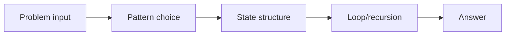
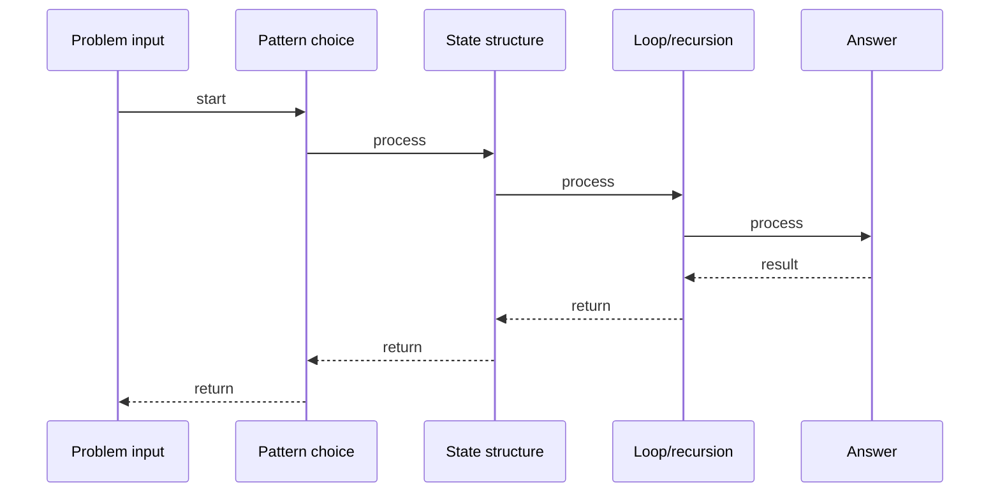

# Max Sum Subarray (fixed k)

## Quick Facts
- Area: DSA
- Tag: Sliding Window
- Source: `src/modules/topics/dsa/dsa-sw-max-sum-fixed.js`
- Tags: `sliding window`, `fixed window`, `array`, `subarray`, `sum`
- Visual coverage: live visual

## Concept
Given an integer array and k, find the maximum sum of any contiguous subarray of size k.

**Pattern:** Fixed sliding window - O(n)
**Hint:** Build first window once, then slide right: add new element, remove old element.
**Scenario:** Traffic dashboard - find busiest exact k-minute interval.

## Why It Matters
Classic first sliding window problem. Instead of recomputing sum from scratch for each window O(n*k), maintain a running sum and update in O(1) per slide.

## Architecture / Mental Model


## Runtime / Sequence


## Animation Plan
- Flow lab can use generated mental model steps above.
- UML sequence can use generated sequence diagram above.
- Architecture map can use generated area mental model above.
- Live visual exists in app: topic-specific canvas/ReactViz animation.

Flow steps:

1. Problem input
2. Pattern choice
3. State structure
4. Loop/recursion
5. Answer

## Example
```javascript
function maxSumSubarray(arr, k) {
  let windowSum = 0;
  for (let i = 0; i < k; i++) windowSum += arr[i];
  let maxSum = windowSum;
  for (let i = k; i < arr.length; i++) {
    windowSum = windowSum + arr[i] - arr[i - k];
    if (windowSum > maxSum) maxSum = windowSum;
  }
  return maxSum;
}
// arr=[2,1,5,1,3,2], k=3 -> 9  (window [5,1,3])
```

Notes:
Add arr[i], subtract arr[i-k]. Window slides in O(1) per step.

## Complexity And Performance
- O(n)
- O(n*k)
- O(1)

## Interview Drills
1. Why is sliding window faster than brute force here?
   Answer: Brute force recomputes each window sum from scratch -> O(n*k). Sliding window maintains running sum, updating in O(1) per step -> O(n) total.
   Follow-ups: What if k > arr.length?; Handle negative numbers?

2. What changes for a variable-size window?
   Answer: Fixed window: move both ends together. Variable window: expand right until condition breaks, shrink left to restore it.
   Follow-ups: Give example of variable window problem

## Trade-offs
Pros:
- O(n) time - single pass
- O(1) space
- Easy to implement

Cons:
- Only works for fixed k
- Does not handle all constraint types

When to use:
Use when window size is fixed and you need aggregate (sum/max/avg) over it.

## Gotchas
- k must be <= arr.length - check before running
- Do not re-initialize windowSum inside the second loop

