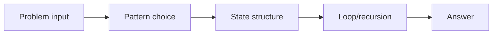
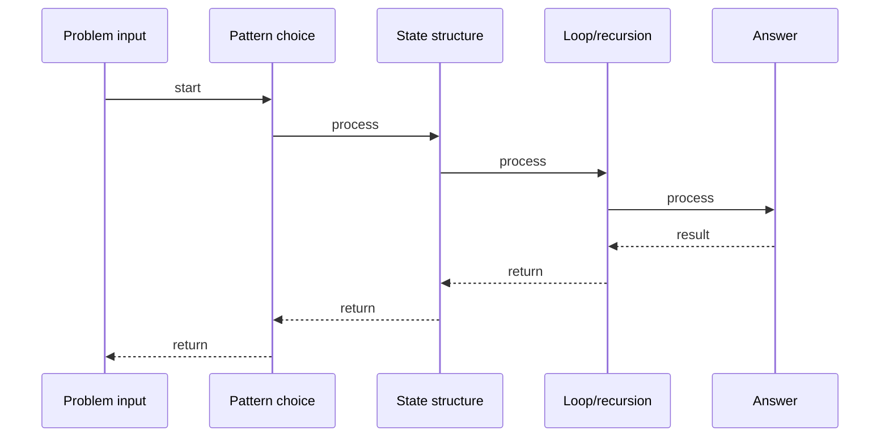

# Minimum Window Substring

## Quick Facts
- Area: DSA
- Tag: Sliding Window II
- Source: `src/modules/topics/dsa/dsa-sw2-min-window.js`
- Tags: `sliding window`, `two pointers`, `hash map`, `string`, `faang`, `premium`, `lc76`
- Visual coverage: live visual

## Concept
Find the smallest substring of s that contains ALL characters of t.

 **Kid explanation:** Imagine you're reading a book and you need to find all letters of the word "ABC". Slide a magnifying glass across - expand it right until you see all the letters, then shrink it from the left to get the shortest possible view. That shortest view is your answer!

**Pattern:** Variable sliding window + two frequency maps - O(n+m)
**Hint:** Expand right until all chars covered, shrink left to minimize, track global minimum.
**Scenario:** Log search - find the shortest log excerpt that contains all required keywords.

## Why It Matters
_No notes yet._

## Architecture / Mental Model

## Runtime / Sequence

## Animation Plan
- Flow lab can use generated mental model steps above.
- UML sequence can use generated sequence diagram above.
- Architecture map can use generated area mental model above.
- Live visual exists in app: topic-specific canvas/ReactViz animation.

Flow steps:

1. Problem input
2. Pattern choice
3. State structure
4. Loop/recursion
5. Answer

## Example
_No code example configured._

## Complexity And Performance
- O(n+m)

## Interview Drills
_No interview drills configured._

## Trade-offs
_No trade-offs configured._

## Gotchas
_No gotchas configured._

