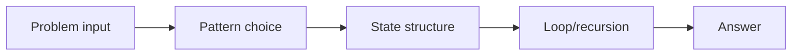
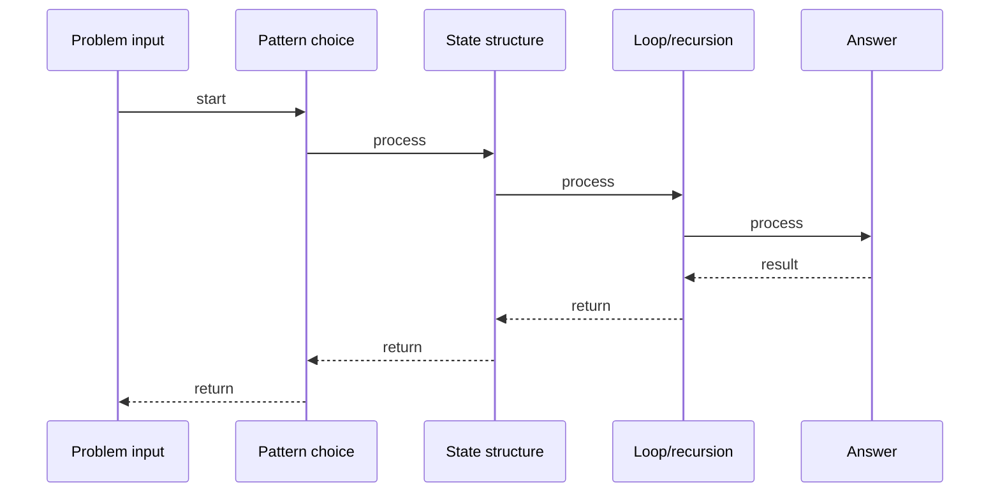

# Container With Most Water

## Quick Facts

- Area: DSA
- Tag: Two Pointers
- Source: `src/modules/topics/dsa/dsa-tp-container-water.js`
- Tags: `two pointers`, `array`, `greedy`, `faang`, `premium`, `lc11`
- Visual coverage: live visual

## Concept

Given heights of vertical lines, find two lines that hold the most water.

**Kid explanation:** You have a row of fence posts of different heights. If you fill water between two posts, the water level is limited by the shorter post. Area = shorter post height x distance between posts. Start with the widest pair (leftmost + rightmost), then move the shorter one inward - you might find a taller pair!

**Pattern:** Two-pointer shrink from both ends - O(n)
**Key insight:** Always move the pointer with the shorter height inward. Moving the taller one can only make things worse.
**Scenario:** Tank designer - pick two walls to maximize water volume.

## Why It Matters

Understanding this topic helps you build more efficient, reliable, and maintainable systems. It explains the practical impact of the design or algorithm in production.
## Architecture / Mental Model

## Runtime / Sequence

## Animation Plan

- Flow lab can use generated mental model steps above.
- UML sequence can use generated sequence diagram above.
- Architecture map can use generated area mental model above.
- Live visual exists in app: topic-specific canvas/ReactViz animation.

Flow steps:

1. Problem input
2. Pattern choice
3. State structure
4. Loop/recursion
5. Answer

## Example

Example code, configuration, or architecture depends on the concrete problem. Use the implementation in the linked source file as a starting point.
## Complexity And Performance

- O(n)

## Interview Drills

- What is the core problem this topic solves?
- What trade-offs are involved in this design or algorithm?
- How does this concept behave under load or at scale?
## Trade-offs

This topic has trade-offs between simplicity, performance, correctness, and operational complexity. Choose the right approach based on system requirements.
## Gotchas

Watch for edge cases, assumptions, and hidden performance costs that can make this topic fail in production if handled incorrectly.
