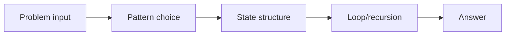
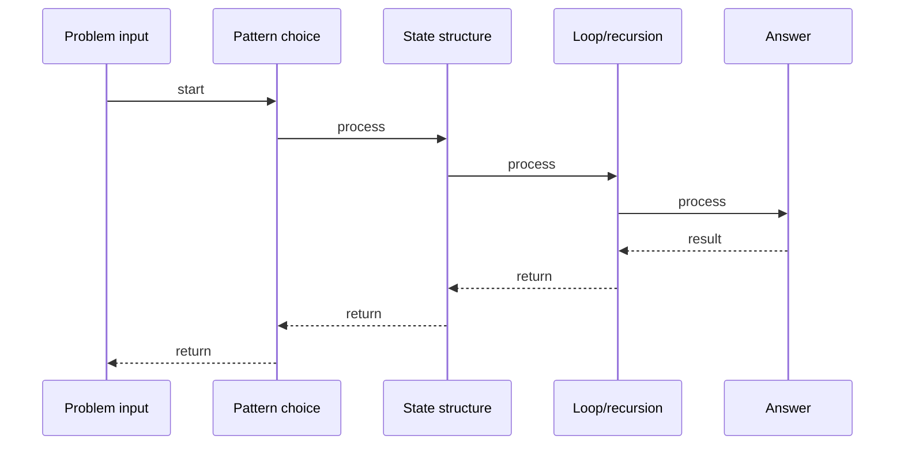

# 3Sum

## Quick Facts

- Area: DSA
- Tag: Two Pointers
- Source: `src/modules/topics/dsa/dsa-tp-three-sum.js`
- Tags: `two pointers`, `sorting`, `array`, `deduplication`, `faang`, `premium`, `lc15`
- Visual coverage: live visual

## Concept

Find all unique triplets in the array that sum to zero.

**Kid explanation:** Sort the numbers in order. Pick one number and pretend it's fixed. Now use two friends (left pointer and right pointer) to find two other numbers that cancel it out. If the three numbers are too big, move the right friend left. Too small, move the left friend right. Skip duplicates to avoid repeats!

**Pattern:** Sort + fix one element + two-pointer on remaining - O(n)
**Key insight:** Sorting enables skipping duplicates and the two-pointer technique.
**Scenario:** Financial reconciliation - find three transactions that exactly cancel each other out.

## Why It Matters

Understanding this topic helps you build more efficient, reliable, and maintainable systems. It explains the practical impact of the design or algorithm in production.
## Architecture / Mental Model

## Runtime / Sequence

## Animation Plan

- Flow lab can use generated mental model steps above.
- UML sequence can use generated sequence diagram above.
- Architecture map can use generated area mental model above.
- Live visual exists in app: topic-specific canvas/ReactViz animation.

Flow steps:

1. Problem input
2. Pattern choice
3. State structure
4. Loop/recursion
5. Answer

## Example

Example code, configuration, or architecture depends on the concrete problem. Use the implementation in the linked source file as a starting point.
## Complexity And Performance

- O(n)

## Interview Drills

- What is the core problem this topic solves?
- What trade-offs are involved in this design or algorithm?
- How does this concept behave under load or at scale?
## Trade-offs

This topic has trade-offs between simplicity, performance, correctness, and operational complexity. Choose the right approach based on system requirements.
## Gotchas

Watch for edge cases, assumptions, and hidden performance costs that can make this topic fail in production if handled incorrectly.
