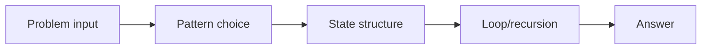
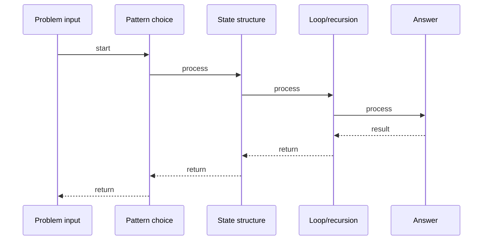

# Trapping Rain Water

## Quick Facts
- Area: DSA
- Tag: Two Pointers
- Source: `src/modules/topics/dsa/dsa-tp-trap-rain.js`
- Tags: `two pointers`, `stack`, `array`, `hard`, `faang`, `premium`, `lc42`
- Visual coverage: live visual

## Concept
Given elevation heights, compute how much rain water gets trapped between the bars.

 **Kid explanation:** Imagine a row of cups of different sizes. After rain, water pools in the low spots between tall cups. At any spot, water depth = (tallest cup on the left, tallest cup on the right - whichever is shorter) minus the cup at that spot. Two pointers track the running max from each side!

**Pattern:** Two-pointer running max from each side - O(n) time O(1) space
**Key insight:** water[i] = min(maxLeft, maxRight)  height[i]. Process from whichever side has the smaller max.
**Scenario:** Civil engineering - calculate water retention in a terrain cross-section.

## Why It Matters
_No notes yet._

## Architecture / Mental Model

## Runtime / Sequence

## Animation Plan
- Flow lab can use generated mental model steps above.
- UML sequence can use generated sequence diagram above.
- Architecture map can use generated area mental model above.
- Live visual exists in app: topic-specific canvas/ReactViz animation.

Flow steps:

1. Problem input
2. Pattern choice
3. State structure
4. Loop/recursion
5. Answer

## Example
_No code example configured._

## Complexity And Performance
- O(n)
- O(1)

## Interview Drills
_No interview drills configured._

## Trade-offs
_No trade-offs configured._

## Gotchas
_No gotchas configured._

