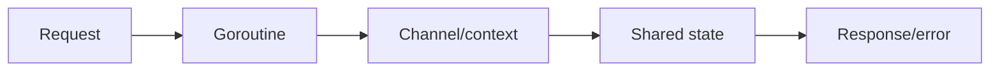
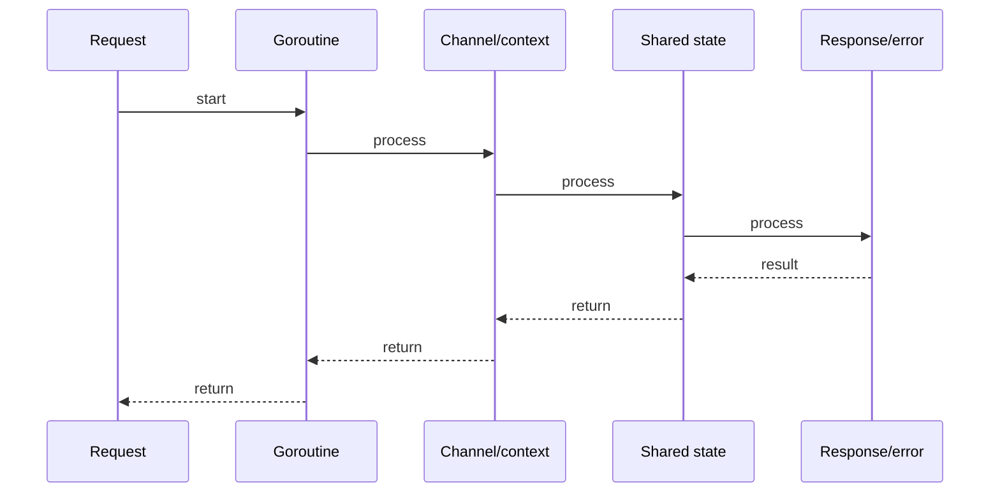

# Context: Cancellation, Deadlines & Values

## Quick Facts

- Area: Go
- Tag: Context
- Source: `src/modules/topics/golang/go-context.js`
- Tags: `context`, `cancellation`, `deadline`, `timeout`, `propagation`
- Visual coverage: generated diagrams only

## Concept

This topic covers context: cancellation, deadlines & values. It explains the concept, why it matters, and how it fits into production systems.
## Why It Matters

Without context, you can't cleanly cancel in-flight requests when a client disconnects or a timeout fires. In microservices, context propagates **distributed traces** (OpenTelemetry injects span IDs via `context.WithValue`). Goroutines that ignore context leak resources until the process dies.

## Architecture / Mental Model



## Runtime / Sequence



## Animation Plan

- Flow lab can use generated mental model steps above.
- UML sequence can use generated sequence diagram above.
- Architecture map can use generated area mental model above.

Flow steps:

1. Request
2. Goroutine
3. Channel/context
4. Shared state
5. Response/error

## Example

```go
package main

import (
    "context"
    "database/sql"
    "fmt"
    "net/http"
    "time"
)

type contextKey string
const traceIDKey contextKey = "traceID"

// Middleware: inject trace ID
func withTraceID(next http.Handler) http.Handler {
    return http.HandlerFunc(func(w http.ResponseWriter, r *http.Request) {
        tid := r.Header.Get("X-Trace-Id")
        ctx := context.WithValue(r.Context(), traceIDKey, tid)
        next.ServeHTTP(w, r.WithContext(ctx))
    })
}

// Handler: 500ms budget for the whole operation
func handler(w http.ResponseWriter, r *http.Request) {
    ctx, cancel := context.WithTimeout(r.Context(), 500*time.Millisecond)
    defer cancel()

    tid, _ := ctx.Value(traceIDKey).(string)
    fmt.Fprintf(w, "trace=%s result=%s", tid, fetchData(ctx))
}

func fetchData(ctx context.Context) string {
    // Pass ctx to all blocking calls
    db, _ := sql.Open("postgres", "")
    row := db.QueryRowContext(ctx, "SELECT 1")
    var n int
    if err := row.Scan(&n); err != nil {
        if ctx.Err() != nil {
            return "timeout"
        }
        return "error"
    }
    return fmt.Sprint(n)
}

func main() {
    mux := http.NewServeMux()
    mux.HandleFunc("/", handler)
    http.ListenAndServe(":8080", withTraceID(mux))
}
```

Notes:
Never store contexts in structs - pass them as the first function argument. Use typed unexported keys for context values to prevent key collisions across packages.

## Complexity And Performance

- Time/space complexity depends on input size, data volume, and implementation choices.
- Track latency, throughput, memory, saturation, error rate, and correctness invariants.

## Interview Drills

- What is the core problem this topic solves?
- What trade-offs are involved in this design or algorithm?
- How does this concept behave under load or at scale?
## Trade-offs

Pros:

- Uniform cancellation and deadline propagation across stdlib (http, sql, grpc).
- No global state - context carries request-scoped metadata cleanly.
- Context.Err() distinguishes cancellation from deadline exceeded.

Cons:

- context.WithValue is untyped - runtime panics on bad casts, not compile errors.
- Verbose to plumb through every function signature in large codebases.
- Cannot add context to callback-style or event-driven APIs retro-actively.

When to use:
Pass context to every function that does I/O, sleeps, or spawns goroutines. Use context values only for request-scoped metadata (trace IDs, auth), never for optional function arguments.

## Gotchas

Watch for edge cases, assumptions, and hidden performance costs that can make this topic fail in production if handled incorrectly.
