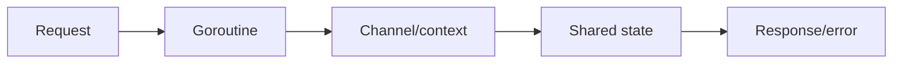
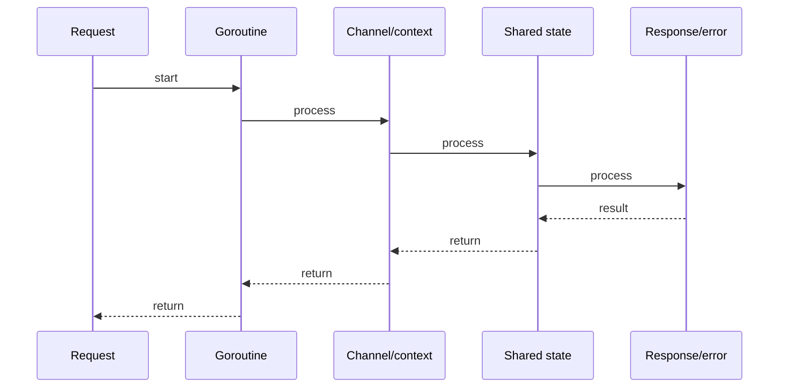

# Error Handling, Wrapping & Sentinel Errors

## Quick Facts
- Area: Go
- Tag: Errors
- Source: `src/modules/topics/golang/go-error-handling.js`
- Tags: `errors`, `wrapping`, `sentinel`, `Is`, `As`, `panic`, `recover`
- Visual coverage: generated diagrams only

## Concept
Go errors are values - `error` is an interface with one method: `Error() string`.
Patterns:
- **Sentinel errors**: `var ErrNotFound = errors.New("not found")` - compare with `==` or `errors.Is`.
- **Custom error types**: structs implementing `error` - unwrap with `errors.As`.
- **Wrapping**: `fmt.Errorf("open config: %w", err)` - preserves cause chain; `errors.Is` / `errors.As` traverse the chain.
- **`panic` / `recover`**: for truly unrecoverable programmer errors; recover only in boundary code (HTTP handler, main goroutine).

## Why It Matters
Explicit error propagation means every call site decides how to handle the error - no invisible exception stack unwinding. Go 1.13 wrapping allows libraries to add context without hiding the cause. Sentinel errors let callers make branching decisions (`if errors.Is(err, sql.ErrNoRows)`) without depending on internal error types.

## Architecture / Mental Model


## Runtime / Sequence


## Animation Plan
- Flow lab can use generated mental model steps above.
- UML sequence can use generated sequence diagram above.
- Architecture map can use generated area mental model above.

Flow steps:

1. Request
2. Goroutine
3. Channel/context
4. Shared state
5. Response/error

## Example
```go
package main

import (
    "errors"
    "fmt"
)

// Sentinel error
var ErrNotFound = errors.New("not found")

// Custom typed error
type ValidationError struct {
    Field   string
    Message string
}
func (e *ValidationError) Error() string {
    return fmt.Sprintf("validation failed on %s: %s", e.Field, e.Message)
}

// Wrapping for context - callers can still inspect cause
func loadUser(id string) error {
    if id == "" {
        return fmt.Errorf("loadUser: %w", &ValidationError{Field: "id", Message: "must not be empty"})
    }
    if id == "ghost" {
        return fmt.Errorf("loadUser %q: %w", id, ErrNotFound)
    }
    return nil
}

func main() {
    err := loadUser("ghost")

    // errors.Is traverses the chain
    if errors.Is(err, ErrNotFound) {
        fmt.Println("handle 404:", err)
    }

    err2 := loadUser("")
    var ve *ValidationError
    // errors.As finds the first matching type in the chain
    if errors.As(err2, &ve) {
        fmt.Printf("bad field=%s msg=%s
", ve.Field, ve.Message)
    }

    // panic/recover at boundary
    defer func() {
        if r := recover(); r != nil {
            fmt.Println("recovered:", r)
        }
    }()
    panic("unexpected state") // recovered above
}
```

Notes:
Use `%w` (not `%v`) when you want callers to be able to inspect the wrapped error. Don't wrap errors that shouldn't be inspected by callers - it couples them to internal types.

## Complexity And Performance
- Time/space complexity depends on input size, data volume, and implementation choices.
- Track latency, throughput, memory, saturation, error rate, and correctness invariants.

## Interview Drills
1. What is the difference between errors.Is and errors.As?
   Answer: `errors.Is(err, target)` checks if **any error in the chain** equals `target` (using `==` or a custom `Is` method). `errors.As(err, &target)` finds the **first error in the chain** that can be assigned to the target type. Use `Is` for sentinel values; `As` when you need to access fields on a typed error.
   Follow-ups: How do you make a custom Is method?; What if a library wraps errors with %v instead of %w?

2. When is it appropriate to panic?
   Answer: Panic for **programmer errors**: nil dereference, out-of-bounds that indicate a bug (not user input), or a package-level invariant that's impossible to violate with correct usage. Library code almost never panics - it returns errors. At HTTP handler or main boundaries, `recover` turns panics into 500 responses and alert signals. Never panic for user input issues.
   Follow-ups: How does recover interact with defer ordering?; What happens if recover is not in a direct defer?

## Trade-offs
Pros:
- Explicit errors at every call site - reviewers see all failure paths.
- Error wrapping gives rich context without try/catch nesting.
- No checked exceptions friction - no forced catch blocks for every callee.

Cons:
- Verbose: if err != nil boilerplate at every call.
- Easy to silently ignore: _ = doThing().
- No stack trace by default - add with golang.org/x/xerrors or pkg/errors.

When to use:
Return `error` for expected failure modes. Panic only for invariant violations. Use structured custom error types when callers need to branch on error fields. Add `%w` context at each layer boundary.

## Gotchas
_No gotchas configured._

