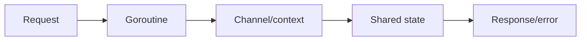
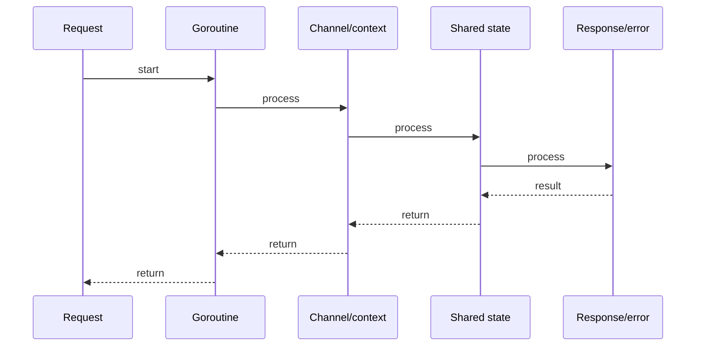

# Generics (Go 1.18+): Type Parameters & Constraints

## Quick Facts
- Area: Go
- Tag: Generics
- Source: `src/modules/topics/golang/go-generics.js`
- Tags: `generics`, `type parameters`, `constraints`, `comparable`, `any`
- Visual coverage: generated diagrams only

## Concept
Go 1.18 introduced **type parameters**. Syntax: `func Map[T, R any](s []T, fn func(T) R) []R`.
- **Constraints** restrict what types a type param can be. `any` = `interface{}`, `comparable` = types that support `==`.
- **Union constraints**: `type Number interface { int | int64 | float64 }`.
- **Type inference**: compiler infers type args at call sites in most cases.
- Generic functions can be used with concrete types at compile time - no runtime reflection.

## Why It Matters
Before generics, Go developers used `interface{}` with runtime type assertions (losing type safety) or code generation (`go generate`) for typed collections. Generics eliminate both: `slices.Sort`, `maps.Keys`, and custom data structures are now type-safe without codegen.

## Architecture / Mental Model


## Runtime / Sequence


## Animation Plan
- Flow lab can use generated mental model steps above.
- UML sequence can use generated sequence diagram above.
- Architecture map can use generated area mental model above.

Flow steps:

1. Request
2. Goroutine
3. Channel/context
4. Shared state
5. Response/error

## Example
```go
package main

import (
    "cmp"
    "fmt"
)

// Generic Map - transforms a slice
func Map[T, R any](s []T, fn func(T) R) []R {
    out := make([]R, len(s))
    for i, v := range s {
        out[i] = fn(v)
    }
    return out
}

// Generic Filter
func Filter[T any](s []T, pred func(T) bool) []T {
    var out []T
    for _, v := range s {
        if pred(v) {
            out = append(out, v)
        }
    }
    return out
}

// Ordered constraint from cmp package (Go 1.21)
func Min[T cmp.Ordered](a, b T) T {
    if a < b { return a }
    return b
}

// Generic Stack
type Stack[T any] struct{ items []T }
func (s *Stack[T]) Push(v T)        { s.items = append(s.items, v) }
func (s *Stack[T]) Pop() (T, bool) {
    if len(s.items) == 0 {
        var zero T
        return zero, false
    }
    n := len(s.items) - 1
    v := s.items[n]
    s.items = s.items[:n]
    return v, true
}

func main() {
    nums := []int{1, 2, 3, 4, 5}
    doubled := Map(nums, func(n int) int { return n * 2 })
    evens   := Filter(nums, func(n int) bool { return n%2 == 0 })
    fmt.Println(doubled, evens)          // [2 4 6 8 10] [2 4]
    fmt.Println(Min(3.14, 2.71))         // 2.71

    var s Stack[string]
    s.Push("a"); s.Push("b")
    v, _ := s.Pop()
    fmt.Println(v)                       // b
}
```

Notes:
Prefer standard library `slices` and `maps` packages (Go 1.21) over reimplementing generic utilities. Generic code compiles to dictionaries/GC shapes - not C++ templates; one instantiation per GC shape, not per type.

## Complexity And Performance
- Time/space complexity depends on deployment, data size, and chosen implementation.
- Track p50/p95/p99 latency, throughput, memory, saturation, and error rate for production topics.

## Interview Drills
1. When would you NOT use generics?
   Answer: Three cases: (1) **Simple functions** where `interface{}` and a type switch is clearer. (2) **Runtime polymorphism** where you need dynamic dispatch - interfaces are the right tool. (3) **Readability cost** exceeds benefit - complex constraint expressions hurt newcomers. Generics shine for **collections, algorithms, and container types** where you lose type safety otherwise.
   Follow-ups: What is a GC shape?; What are the performance implications of generics vs interfaces?

2. How are Go generics different from Java generics?
   Answer: Java uses **type erasure** - generic type info is lost at runtime, and `List<int>` is boxed to `List<Integer>`. Go uses **GC shapes** - one code path per memory layout, no boxing for value types. Go generics can constrain with union types (`int | float64`); Java uses bounded wildcards. Go has no raw types.
   Follow-ups: What is monomorphisation?; Can you use generics with methods?

## Trade-offs
Pros:
- Type-safe generic collections without codegen or interface{}.
- Single implementation, multiple types - DRY without losing safety.
- Integrates with stdlib: slices.SortFunc, maps.Keys, etc.

Cons:
- Complex constraints hurt readability.
- Cannot parameterize methods (only functions and types).
- Compile times increase with many instantiations.

When to use:
Use generics for **data structures, algorithms, and utility functions** where type matters but logic is identical. Keep business logic in concrete types - generics for infrastructure code.

## Gotchas
_No gotchas configured._

