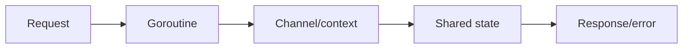
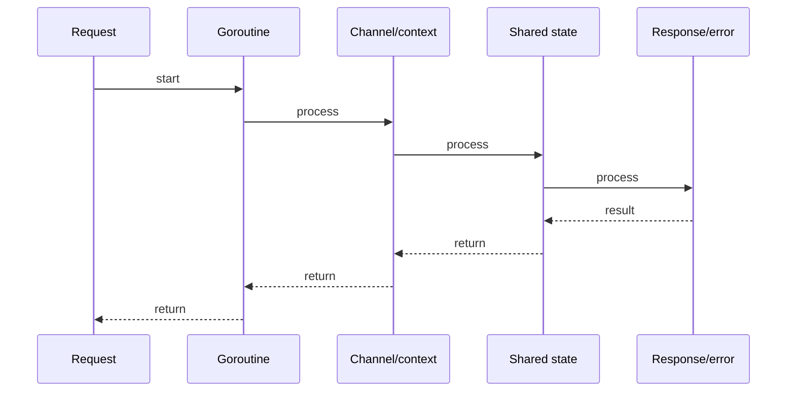

# Goroutines, Channels & the Go Scheduler

## Quick Facts
- Area: Go
- Tag: Concurrency
- Source: `src/modules/topics/golang/go-goroutines-channels.js`
- Tags: `goroutines`, `channels`, `scheduler`, `gmp`, `select`
- Visual coverage: generated diagrams only

## Concept
Go concurrency is built on **goroutines** (cheap green threads, ~2 KB initial stack) scheduled by the **GMP model**:
- **G** (goroutine) - unit of work with its own stack.
- **M** (OS thread) - executes goroutines.
- **P** (processor) - logical CPU, holds a run queue; `GOMAXPROCS` controls how many Ps exist.

**Channels** are typed, goroutine-safe conduits. Unbuffered channels rendezvous synchronously; buffered channels decouple sender from receiver up to cap.
**`select`** multiplexes channel ops - first ready case wins (random tie-break).

## Why It Matters
Go's scheduler performs **work-stealing** (idle Ps steal from busy Ps) and **goroutine preemption** (safe points since Go 1.14). This means a CPU-bound goroutine won't starve others. Channel-based communication favors **"share memory by communicating"** - reducing lock contention bugs common in Java/C++ codebases.

## Architecture / Mental Model


## Runtime / Sequence


## Animation Plan
- Flow lab can use generated mental model steps above.
- UML sequence can use generated sequence diagram above.
- Architecture map can use generated area mental model above.

Flow steps:

1. Request
2. Goroutine
3. Channel/context
4. Shared state
5. Response/error

## Example
```go
package main

import (
    "context"
    "fmt"
    "sync"
    "time"
)

// Fan-out / fan-in pipeline
func generate(ctx context.Context, nums ...int) <-chan int {
    out := make(chan int)
    go func() {
        defer close(out)
        for _, n := range nums {
            select {
            case out <- n:
            case <-ctx.Done():
                return
            }
        }
    }()
    return out
}

func square(ctx context.Context, in <-chan int) <-chan int {
    out := make(chan int)
    go func() {
        defer close(out)
        for n := range in {
            select {
            case out <- n * n:
            case <-ctx.Done():
                return
            }
        }
    }()
    return out
}

// Merge multiple channels into one (fan-in)
func merge(ctx context.Context, cs ...<-chan int) <-chan int {
    var wg sync.WaitGroup
    out := make(chan int)
    output := func(c <-chan int) {
        defer wg.Done()
        for n := range c {
            select {
            case out <- n:
            case <-ctx.Done():
                return
            }
        }
    }
    wg.Add(len(cs))
    for _, c := range cs {
        go output(c)
    }
    go func() { wg.Wait(); close(out) }()
    return out
}

func main() {
    ctx, cancel := context.WithTimeout(context.Background(), 2*time.Second)
    defer cancel()

    gen := generate(ctx, 2, 3, 4, 5)
    sq1 := square(ctx, gen)
    sq2 := square(ctx, gen) // demonstrates fan-out would need separate channels

    for n := range merge(ctx, sq1, sq2) {
        fmt.Println(n)
    }
}
```

Notes:
Always propagate **context** for cancellation. Never leak goroutines - ensure every goroutine has an exit path. Buffered channels for fire-and-forget; unbuffered when synchronisation is the goal.

## Complexity And Performance
- Time/space complexity depends on input size, data volume, and implementation choices.
- Track latency, throughput, memory, saturation, error rate, and correctness invariants.

## Interview Drills
1. What happens when you send on a closed channel?
   Answer: **Panic.** Receiving from a closed channel returns the zero value immediately (second return is `false`). Rule: only the sender should close; consumers use `range` or test the comma-ok idiom. Use a `sync.Once` or dedicated done channel to coordinate closure across multiple senders.
   Follow-ups: How do you safely close a channel with multiple producers?; What is the difference between nil channel and closed channel?

2. Explain GOMAXPROCS and when you'd change it.
   Answer: `GOMAXPROCS` sets the number of OS threads (Ps) that execute Go code in parallel - defaults to `runtime.NumCPU()`. Lower it when running CPU-bound Go alongside a latency-sensitive C library on the same core. Raise it (rarely needed) isn't useful beyond `NumCPU`. In containers, read `runtime/debug.SetMaxProcs` or use `automaxprocs` which reads cgroup CPU quota.
   Follow-ups: How does Go detect CPU quota in containers?; What is the scheduler's work-stealing algorithm?

3. Goroutine leak - how do you detect and fix it?
   Answer: Use `runtime.NumGoroutine()` in tests, or **goleak** package. Common causes: (1) goroutine blocked on unbuffered channel nobody reads; (2) goroutine looping without a context exit; (3) `http.Client` response body not closed. Fix: always pass `ctx` and `select` on `ctx.Done()`. In tests, `defer goleak.VerifyNone(t)`.
   Follow-ups: How do you test for goroutine leaks in unit tests?; What does pprof goroutine profile show?

## Trade-offs
Pros:
- Goroutines are ~1000x cheaper than OS threads - millions in a single process.
- CSP model eliminates most shared-state bugs.
- Built-in race detector (`go test -race`) finds data races at test time.

Cons:
- No goroutine identity - no ThreadLocal equivalent; use context.Value carefully.
- Goroutine leaks are silent and hard to trace without tooling.
- Buffered channel sizing requires capacity analysis (back-pressure is manual).

When to use:
**Goroutines** for any concurrent work. **Channels** for ownership transfer or signalling. **sync.Mutex** when shared state mutation is truly local and brief. Avoid channels when a simple mutex+condition-variable would be clearer.

## Gotchas
_No gotchas configured._

