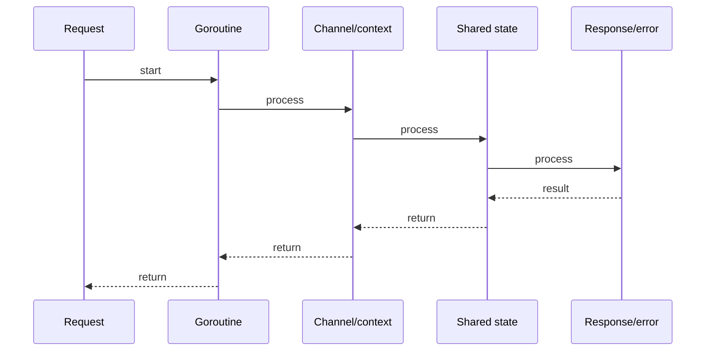

# HTTP Servers, Middleware & net/http

## Quick Facts

- Area: Go
- Tag: HTTP
- Source: `src/modules/topics/golang/go-http-rest.js`
- Tags: `http`, `net/http`, `middleware`, `handler`, `mux`, `chi`, `gin`
- Visual coverage: generated diagrams only

## Concept

Go's `net/http` is production-grade and used directly without a framework for many services. Key types:

- **`http.Handler`** - interface: `ServeHTTP(ResponseWriter, *Request)`.
- **`http.ServeMux`** - built-in path router (Go 1.22+ supports method+wildcard patterns).
- **Middleware** - a function that wraps a `Handler` returning another `Handler`.
- **`http.Client`** - default client has no timeout - always configure one.
  Third-party: **Chi** (composable middleware, stdlib-compatible), **Gin** (performance, familiar API).

## Why It Matters

Go's HTTP server is one of the fastest in any GC language. Understanding `net/http` internals - connection lifecycle, `http.Transport` keep-alives, body draining - is essential for high-throughput services. Incorrectly not reading a response body causes connection pool exhaustion.

## Architecture / Mental Model


## Runtime / Sequence



## Animation Plan

- Flow lab can use generated mental model steps above.
- UML sequence can use generated sequence diagram above.
- Architecture map can use generated area mental model above.

Flow steps:

1. Request
2. Goroutine
3. Channel/context
4. Shared state
5. Response/error

## Example

```go
package main

import (
    "encoding/json"
    "log/slog"
    "net/http"
    "time"
)

// Middleware: logging + recovery
func logging(next http.Handler) http.Handler {
    return http.HandlerFunc(func(w http.ResponseWriter, r *http.Request) {
        start := time.Now()
        lw := &statusWriter{ResponseWriter: w, status: http.StatusOK}
        next.ServeHTTP(lw, r)
        slog.Info("request",
            "method", r.Method,
            "path", r.URL.Path,
            "status", lw.status,
            "dur", time.Since(start).String(),
        )
    })
}

type statusWriter struct {
    http.ResponseWriter
    status int
}
func (sw *statusWriter) WriteHeader(code int) {
    sw.status = code
    sw.ResponseWriter.WriteHeader(code)
}

// Handler
func orderHandler(w http.ResponseWriter, r *http.Request) {
    id := r.PathValue("id")  // Go 1.22 wildcard
    w.Header().Set("Content-Type", "application/json")
    json.NewEncoder(w).Encode(map[string]string{"id": id, "status": "ok"})
}

// Client with proper timeout
var httpClient = &http.Client{
    Timeout: 5 * time.Second,
    Transport: &http.Transport{
        MaxIdleConns:    100,
        IdleConnTimeout: 90 * time.Second,
    },
}

func main() {
    mux := http.NewServeMux()
    mux.HandleFunc("GET /orders/{id}", orderHandler)  // Go 1.22 method+wildcard

    srv := &http.Server{
        Addr:         ":8080",
        Handler:      logging(mux),
        ReadTimeout:  5 * time.Second,
        WriteTimeout: 10 * time.Second,
        IdleTimeout:  120 * time.Second,
    }
    slog.Info("listening", "addr", srv.Addr)
    if err := srv.ListenAndServe(); err != nil {
        slog.Error("server", "err", err)
    }
}
```

Notes:
Always set `ReadTimeout`, `WriteTimeout`, and `IdleTimeout` on `http.Server`. Always `io.Copy(io.Discard, resp.Body); resp.Body.Close()` on client responses to enable connection reuse.

## Complexity And Performance

- Time/space complexity depends on input size, data volume, and implementation choices.
- Track latency, throughput, memory, saturation, error rate, and correctness invariants.

## Interview Drills

1. Why should you never use the default http.Client in production?
   Answer: The default `http.Client` has **no timeout** - a slow server holds the goroutine (and potentially a connection) forever. Also, the default `Transport` has a limited idle connection pool. Always configure `Timeout`, `MaxIdleConns`, and `IdleConnTimeout` for production clients.
   Follow-ups: What is connection draining?; How does http.Transport handle keep-alive?

2. How do you implement graceful shutdown?
   Answer: Listen for `SIGINT`/`SIGTERM`, then call `srv.Shutdown(ctx)` with a deadline context. `Shutdown` stops accepting new connections, waits for in-flight requests to complete, then returns. Combine with a `WaitGroup` if you have background workers that also need draining.
   Follow-ups: What is the difference between Shutdown and Close?; How do you drain Kafka consumers before shutdown?

## Trade-offs

Pros:

- net/http is production-grade with zero dependencies.
- Go 1.22 mux handles method+wildcard - frameworks less necessary.
- http.Server is trivially embeddable in tests via httptest.

Cons:

- Built-in mux lacks middleware chaining - use Chi/Gin for large apps.
- No built-in request validation, rate limiting, or auth - compose manually.
- HTTP/2 push and HTTP/3 require extra setup.

When to use:
**net/http** for small services and CLIs. **Chi** when middleware composition is needed. **Gin** for maximum ecosystem and familiar API. Avoid frameworks with invasive code generation.

## Gotchas

_No gotchas configured._
