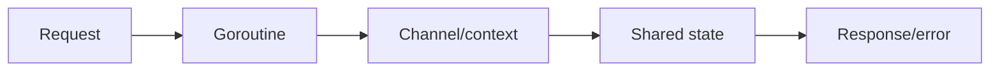
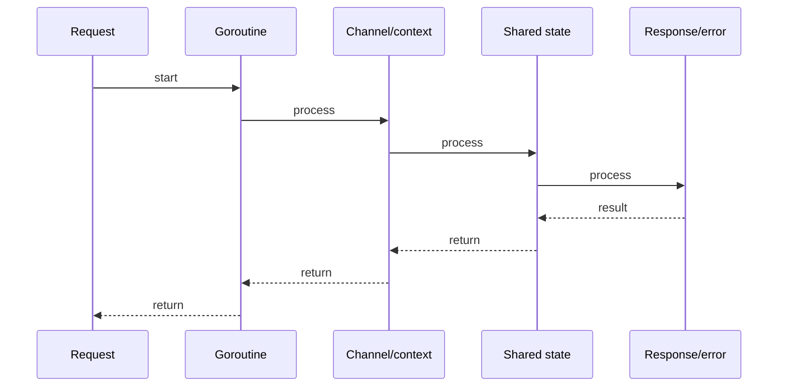

# Interfaces, Embedding & Composition

## Quick Facts

- Area: Go
- Tag: Design
- Source: `src/modules/topics/golang/go-interfaces-embedding.js`
- Tags: `interfaces`, `embedding`, `composition`, `duck typing`, `polymorphism`
- Visual coverage: generated diagrams only

## Concept

Go interfaces are **implicitly satisfied** - no `implements` keyword. A type satisfies an interface by having the right method set.

- **Small interfaces** are idiomatic: `io.Reader`, `io.Writer`, `error` (one method each).
- **Embedding** composes interfaces and structs: an embedded field's methods are promoted.
- **Interface vs concrete type**: accept interfaces, return concrete types (Postel's law for Go).
- **`interface{}` / `any`**: escape hatch; prefer generics (Go 1.18+) for typed collections.

## Why It Matters

Go's implicit interfaces eliminate the coupling between package A (defines the interface) and package B (implements it). Libraries define small interfaces consumers implement without depending on the library. This is the key to testability - swap real implementations with test doubles without a mocking framework.

## Architecture / Mental Model



## Runtime / Sequence



## Animation Plan

- Flow lab can use generated mental model steps above.
- UML sequence can use generated sequence diagram above.
- Architecture map can use generated area mental model above.

Flow steps:

1. Request
2. Goroutine
3. Channel/context
4. Shared state
5. Response/error

## Example

```go
package main

import (
    "fmt"
    "strings"
)

// Small interfaces - testable by design
type Storer interface {
    Save(id string, data []byte) error
    Load(id string) ([]byte, error)
}

type Notifier interface {
    Notify(msg string) error
}

// Compose via embedding
type StorerNotifier interface {
    Storer
    Notifier
}

// Concrete implementation
type MemStore struct{ m map[string][]byte }
func (s *MemStore) Save(id string, data []byte) error { s.m[id] = data; return nil }
func (s *MemStore) Load(id string) ([]byte, error) {
    d, ok := s.m[id]
    if !ok { return nil, fmt.Errorf("not found: %s", id) }
    return d, nil
}

// Struct embedding - promotes fields and methods
type LoggingStore struct {
    Storer                   // promoted: LoggingStore.Save delegates here
    log []string
}
func (l *LoggingStore) Save(id string, data []byte) error {
    l.log = append(l.log, "save:"+id)
    return l.Storer.Save(id, data) // explicit call to embedded
}

// Accept interface, return concrete
func NewLogging(s Storer) *LoggingStore {
    return &LoggingStore{Storer: s}
}

func main() {
    base := &MemStore{m: make(map[string][]byte)}
    ls := NewLogging(base)
    _ = ls.Save("k1", []byte("hello"))
    fmt.Println(strings.Join(ls.log, ", ")) // save:k1
}
```

Notes:
Interface satisfaction is checked at compile time when you assign a concrete type to an interface variable. Use `var _ Storer = (*MemStore)(nil)` as a compile-time assertion.

## Complexity And Performance

- Time/space complexity depends on input size, data volume, and implementation choices.
- Track latency, throughput, memory, saturation, error rate, and correctness invariants.

## Interview Drills

1. What is an interface nil trap?
   Answer: An interface value is nil only if both its **type** and **value** are nil. A `(*MyErr)(nil)` assigned to `error` is non-nil (type is set). Classic bug: returning a typed nil pointer as `error`. Fix: return `nil` directly, or use a helper `if err != nil { return err }` discipline.
   Follow-ups: How do you introspect an interface's dynamic type?; When would you use reflect vs type switch?

2. How do you test code that depends on external services in Go without a mock framework?
   Answer: Define a small interface for the external dependency in the package that uses it, then provide a test double (fake struct) in the test file that satisfies the interface. No Mockery or gomock required for simple cases. For complex interaction verification, `gomock` generates mocks from interfaces; for HTTP, `httptest.Server` spins up a real server.
   Follow-ups: Fake vs mock vs stub?; When does gomock add value over a hand-written fake?

## Trade-offs

Pros:

- Implicit satisfaction decouples packages - no circular import to share interfaces.
- Small interfaces are easy to satisfy -> highly composable test doubles.
- Embedding avoids boilerplate delegation code.

Cons:

- No compile-time 'I want to implement X' declaration - typos in method names fail silently.
- Embedding can expose internal methods unintentionally.
- Large interfaces (many methods) are hard to satisfy and violate ISP.

When to use:
Define interfaces **at the consumer site**, not the implementation site. Keep them to 1-3 methods. Use embedding to compose behavior, not to reuse code (Go favors composition over inheritance).

## Gotchas

Watch for edge cases, assumptions, and hidden performance costs that can make this topic fail in production if handled incorrectly.
