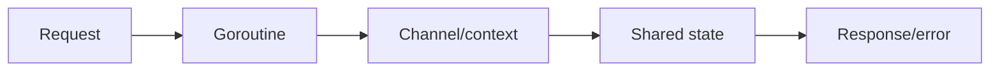
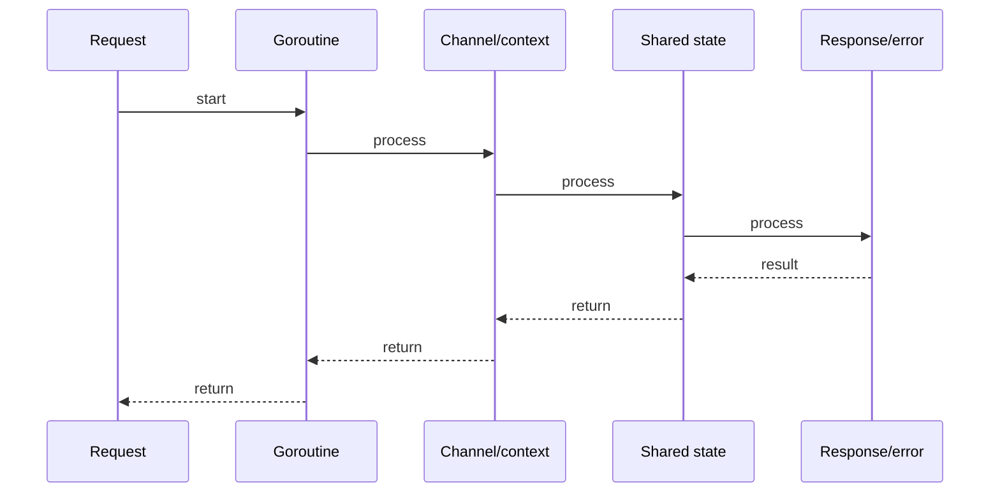

# Go Memory Model, sync & atomic

## Quick Facts
- Area: Go
- Tag: Sync
- Source: `src/modules/topics/golang/go-memory-model-sync.js`
- Tags: `memory model`, `sync`, `mutex`, `rwmutex`, `atomic`, `once`
- Visual coverage: generated diagrams only

## Concept
The **Go Memory Model** defines happens-before: a send on a channel happens-before the corresponding receive; `sync.Mutex` unlock happens-before a subsequent lock. Without synchronisation, the compiler and CPU can reorder reads/writes.

Key primitives:
- **`sync.Mutex` / `sync.RWMutex`** - exclusive / reader-writer lock.
- **`sync.WaitGroup`** - count-down latch.
- **`sync.Once`** - exactly-once initialization.
- **`sync.Map`** - concurrent map, optimised for read-heavy workloads.
- **`sync/atomic`** - lock-free load/store/CAS on int32/64, pointers, `atomic.Value`.

## Why It Matters
Go does **not** prevent data races by language design (unlike Rust). The race detector (`-race`) catches them at runtime but incurs 5-10x overhead. Production incidents commonly trace back to maps accessed concurrently without locks. `sync.Once` is the idiomatic singleton pattern; double-checked locking with `atomic` is fragile without it.

## Architecture / Mental Model


## Runtime / Sequence


## Animation Plan
- Flow lab can use generated mental model steps above.
- UML sequence can use generated sequence diagram above.
- Architecture map can use generated area mental model above.

Flow steps:

1. Request
2. Goroutine
3. Channel/context
4. Shared state
5. Response/error

## Example
```go
package main

import (
    "fmt"
    "sync"
    "sync/atomic"
)

// Thread-safe counter using atomic
type Counter struct{ n int64 }
func (c *Counter) Inc()       { atomic.AddInt64(&c.n, 1) }
func (c *Counter) Value() int64 { return atomic.LoadInt64(&c.n) }

// Lazy singleton with Once
type DB struct{ dsn string }
var (
    dbInstance *DB
    dbOnce     sync.Once
)
func GetDB(dsn string) *DB {
    dbOnce.Do(func() { dbInstance = &DB{dsn: dsn} })
    return dbInstance
}

// Read-heavy cache with RWMutex
type Cache struct {
    mu    sync.RWMutex
    items map[string]string
}
func (c *Cache) Get(k string) (string, bool) {
    c.mu.RLock()
    defer c.mu.RUnlock()
    v, ok := c.items[k]
    return v, ok
}
func (c *Cache) Set(k, v string) {
    c.mu.Lock()
    defer c.mu.Unlock()
    c.items[k] = v
}

func main() {
    var wg sync.WaitGroup
    ctr := &Counter{}
    for i := 0; i < 1000; i++ {
        wg.Add(1)
        go func() { defer wg.Done(); ctr.Inc() }()
    }
    wg.Wait()
    fmt.Println("count:", ctr.Value()) // always 1000
}
```

Notes:
Never copy a `sync.Mutex` after first use (vet catches this). Prefer `defer mu.Unlock()` immediately after `Lock()` to avoid forgetting under panics/returns.

## Complexity And Performance
- Time/space complexity depends on input size, data volume, and implementation choices.
- Track latency, throughput, memory, saturation, error rate, and correctness invariants.

## Interview Drills
1. When would you use sync.Map over a mutex-protected map?
   Answer: `sync.Map` is optimised for two patterns: (1) many goroutines reading the same keys (read-mostly), or (2) disjoint keys written by different goroutines. It uses an internal read-only shard for reads (lock-free) and a dirty map for writes. For high-write or iteration-heavy workloads, a `RWMutex` map is faster and easier to reason about.
   Follow-ups: How does sync.Map avoid starvation on promotion?; What is the cost of sync.Map.Range?

2. What is a data race vs a race condition?
   Answer: A **data race** is a specific memory safety violation: two goroutines access the same memory location concurrently, at least one writes, with no synchronisation. It causes undefined behaviour. A **race condition** is a logical bug where the outcome depends on interleaving - it can exist even with no data race (e.g., TOCTOU). The race detector finds data races; logical races require testing and analysis.
   Follow-ups: Can -race miss races?; What is the cost of -race in production?

## Trade-offs
Pros:
- atomic ops are lock-free and composable for simple counters/flags.
- sync.Once elegantly solves lazy init without error-prone double-checked locking.
- Race detector is off-by-default - production binaries pay no overhead.

Cons:
- sync.Mutex is not reentrant (unlike Java's synchronized) - deadlock on self-lock.
- sync.Map has no typed API, returns interface{}.
- Atomics alone cannot express multi-field transactions - still need locks.

When to use:
**Mutex** for general shared state. **RWMutex** when reads dominate. **atomic** for single-value counters/flags. **sync.Once** for singletons. **channels** when you're transferring ownership, not sharing state.

## Gotchas
_No gotchas configured._

